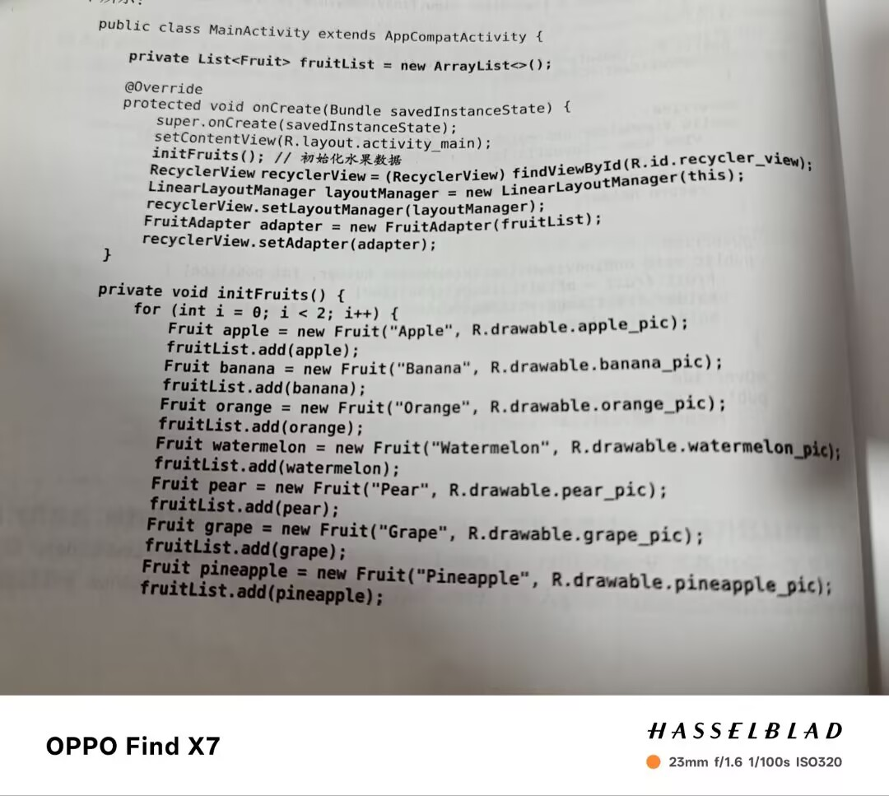

# 常用控件

### TextView

1.android:id定义唯一标识符
2.android:layout_width指定宽度有match_parent和wrap_content两个选项，第一个表示当前控件大小和父布局大小一样，第二个表示当前控件大小刚好能包住里面的内容
3.android:layout_height指定高度，选项和上相同
4.android:text指定文本显示的内容
5.android:gravity指定文字对齐方式可选值有top,bottom,left,right,center等，可以用“|”来指定多个值
6.android:textSize指定文字大小，用sp做单位
7.android:textColor指定文字颜色

```java
 <TextView
        android:id="@+id/text_view"
        android:layout_width="match_parent"
        android:layout_height="wrap_content"
        android:gravity="center"
        android:text="@string/this_is_textview"
        android:textColor="#00ff00"
        android:textSize="24sp"
       />
```

### Button

1.android:id确定唯一标识符
2.android:layout_width指定宽度
3.android:layout_height指定高度
4.android:text指定文本内容
5.android:textAllCaps是否对字母进行大写转换
**含有的板块与TextView中的差不多，其余的不再过多赘述**
**重点:设定完按钮后在活动中要给其注册一个相应的点击事件(注册一个监听器)**

```java
 <Button
        android:id="@+id/button"
        android:layout_width="match_parent"
        android:layout_height="wrap_content"
        android:text="@string/button"
        android:textAllCaps="false" />
```

```java
 Button button=(Button) findViewById(R.id.button);
 button.setOnClickListener(new View.OnClickListener() {
            @Override
            public void onClick(View view) {
                ProgressDialog dialog = new ProgressDialog(MainActivity.this);
               //此处添加逻辑代码
            }
        });
```

### EditText

1.android:id唯一标识符
2.android:layout-width确定宽度
3.android:layout_height高度
4.android:hint指定一段提示性文字，输入内容后文字会自己消失
5.android:maxLines指定文本输入的最大行数
6.EditText与Button可以结合使用，首先使用findViewById方法得到EditText的实例，然后在按钮点击事件里修改通过getText获取文本内容利用toString转换成字符串，最后利用Toast将内容通过按钮显示

```java
  <EditText
        android:id="@+id/edit_text"
        android:layout_width="match_parent"
        android:layout_height="wrap_content"
        android:hint="@string/type_something_here"
        android:textSize="20sp"
        android:maxLines="2"
        />
```

```java
 private EditText editText;
  @Override
    protected void onCreate(Bundle savedInstanceState) {
        super.onCreate(savedInstanceState);
        setContentView(R.layout.activity_main);
         Button button=(Button) findViewById(R.id.button);
        editText=(EditText) findViewById(R.id.edit_text);    
        button.setOnClickListener(new View.OnClickListener() {
            @Override
            public void onClick(View view) {
              String inputText=editText.getText().toString;
              Toast.makeText(MainActivity.this,inputText,Toast.LENGTH_SHORT).show();
            }
        });
    }
```

### ImageView

1.android:id
2.android:layout_width
3.android:layout_height
4.android:src选择显示的图片
5.可以和按钮一起使用动态的更改图片

```java
  <ImageView
        android:id="@+id/image_view"
        android:layout_width="wrap_content"
        android:layout_height="wrap_content"
        android:src="@drawable/img_1"
         />
```

```java
    private ImageView imageView;  
    @Override
    protected void onCreate(Bundle savedInstanceState) {
        super.onCreate(savedInstanceState);
        setContentView(R.layout.activity_main);
        Button button=(Button) findViewById(R.id.button);
         imageView=(ImageView) findViewById(R.id.image_view) ;
        button.setOnClickListener(new View.OnClickListener() {
            @Override
            public void onClick(View view) {
             imageView.setImageResource(R.drawable.img_2);
            }
        });
    }
```

### ProgressBar

用途:用于显示进度条
1.android:id
2.android:layout_width
3.android:layout_height
4.android:max设置进度条最大值
5.style设置进度条的种类
6.通过按钮可以实现，进度条可见变为不可见，不可见变为可见
7.通过按钮可以使进度条发生动态变化

```java
 <ProgressBar
        android:id="@+id/progress_bar"
        android:layout_width="match_parent"
        android:layout_height="wrap_content"
        style="?android:attr/progressBarStyleHorizontal"
        android:max="100"/>
```

```java
   private ProgressBar progressBar;
    @Override
    protected void onCreate(Bundle savedInstanceState) {
        super.onCreate(savedInstanceState);
        setContentView(R.layout.activity_main);
        Button button=(Button) findViewById(R.id.button);
         progressBar=(ProgressBar) findViewById(R.id.progress_bar);
        button.setOnClickListener(new View.OnClickListener() {
            @Override
            public void onClick(View view) {
              /*6.if(progressBar.getVisibility()==View.GONE){
              progressBar.setVisibility(View.VISIBLE);
              } else{
              progressBar.setVisibility(View.GONE);
              }
              */
              /*7.int progress = progressBar.getProgress();
                  progress=progress+10;
                  progressBar.setProgress(progress);
              */
            }
        });
    }
```

### AlertDialog

作用:弹出对话框，用于提示一些重要信息

```java
                AlertDialog.Builder dialog = new AlertDialog.Builder(MainActivity.this);
                dialog.setTitle("This is a dialog");//标题
                dialog.setMessage("Something important");//内容
                dialog.setCancelable(false);//是否可以通过点击其他区域来关闭对话框
                dialog.setPositiveButton("OK",new DialogInterface.OnClickListener(){
                    @Overrid
                    public void Click(DialogInterface dialogInterface,int i){}
                });
                dialog.setNegativeButton("No",new DialogInterface.OnClickListener(){
                    @Overrid
                    public void Click(DialogInterface dialogInterface,int i){}
                });
                dialog.show();
```

### ProgressDialog

作用:同AlertDialog相似，不过是在弹出的窗口中有一个进度条

```java
                ProgressDialog dialog = new ProgressDialog(MainActivity.this);
                dialog.setTitle("This is a dialog");//标题
                dialog.setMessage("Loading......");//内容
                dialog.setCancelable(true);//是否可以通过点击其他区域来关闭对话框
                dialog.show();
```

如果setCancelable()中传入的是false，此时无法通过back键退出，这时在数据加载完成之后一定要调用dismiss()方法关闭对话框

------


# 四种基本布局

### 线性布局

又叫做<LinearLayout>
1.android:orientation表示排列方向，有两个选择vertical垂直方向，如果排列方向是这个时高度不能是match_parent，horizontal表示水平方向，如果排列方向是这个时，控件宽度不能设置为match_parent,默认为horizontal
2.android:layout_width宽度
3.android:layout_height高度
4.android:layout_gravity指定控件在布局中的对齐方式，如果排列方式是horizontal是只有垂直方向上的对齐方式才会生效，排列方向是vertical时与之相同


5.android:layout_weight这个属性允许我们使用比例的方式来指定控件的大小。使用这个时要把layout_width的值设为“0dp”


使用这个属性时，也可以仅部分控件使用可以达到更好的效果

### 相对布局

RelativeLayout又称相对布局，也是一种非常常用的布局，它可以通过定位的方式让控件出现在布局的任意位置
1.相对于父布局进行定位


2.相对于控件进行定位:
android:layout_above一个控件在另一个控件上面
android:layout_below一个控件在另一个控件下面
android:layout_toLeft0f一个控件在另一个控件左侧
android:layout_toRight0f一个控件在另一个控件右侧
注:引用的控件应该放在前面


3.其他定位属性:
android:layout_alignLeft表示让一个控件的左边缘同另一个控件左边缘对齐
android:layout_alignRight表示让一个控件的右边缘同另一个控件右边缘对齐
android:layout_alignTop
android:layout_alignBottom

### 帧布局

FrameLayout又叫帧布局，应用场景较少，所有控件都会默认摆在布局左上角，也可以使用android:layout_gravity进行对齐操作，此方法应用场景过少，不做过多赘述

### 百分比布局

百分比布局是对帧布局和相对布局两种布局方式的扩展
重点:使用前要先添加百分比布局库的依赖


(1)帧布局的百分比布局
需要定义一个app空间

```java
xmlns:app=“http://schemas.android.com/apk/res-auto”
```

1.app:layout_widthPercent
2.app:layout_heightPercent
其余继承FrameLayout


(2)相对布局的百分比布局:与上述相似

------


# 创建自定义控件

### 引入布局

1.新建一个布局，在里面写需要的代码

```java
<include layout="@layout/title"/>
```

2.利用include语句引入
3.利用ActionBar隐藏自带标题

```java
ActionBar actionBar=getSupportActionBar();
if(actionBar!=null){
    actionBar.hide();
}
```

### 创建自定义控件

1.创建通用的布局代码。

2.新建一个类继承自LinearLayout

```java
public class TitleLayout extends LinearLayout {
    public TitleLayout(Context context, AttributeSet attrs){
        super(context,attrs);
        LayoutInflater.from(context).inflate(R.layout.title,this);
        }
```

3.将创建好的控件添加到布局文件中

```java
<com.example.uicustomviews.TitleLayout
     android:layout_width="match_parent"
     android:layout_height="wrap_content"/>

```

4.可以为按钮注册点击事件在新建那个类中

```java
public class TitleLayout extends LinearLayout {
    public TitleLayout(Context context, AttributeSet attrs){
        super(context,attrs);
        LayoutInflater.from(context).inflate(R.layout.title,this);
        Button titleBack = (Button) findViewById(R.id.title_back);
        Button titleEdit=(Button) findViewById(R.id.title_edit);
        titleBack.setOnClickListener(new View.OnClickListener(){
            @Override
            public void onClick(View view) {
                ( (Activity) getContext()).finish();
            }
        });
        titleEdit.setOnClickListener(new View.OnClickListener() {
            @Override
            public void onClick(View view) {
                Toast.makeText(getContext(), "You clicked ", Toast.LENGTH_SHORT).show();
            }
        });
    }
}
```

------


# ListView

### ListView的简单用法

以一个数组数据进行举例讲解
1.在布局中直接加入<ListView>布局
2.数组中的数据无法直接传给ListView,故需借助适配器完成，这里推荐使用ArrayAdapter,这里需要传入三个数据上下文，Listview子项布局id及适配数据
3.创建一个listview对象调用setAdapter传入适配器，这样就关联好了

```java
   <ListView
        android:id="@+id/list_view"
        android:layout_width="match_parent"
        android:layout_height="match_parent"/>
```


### 定制ListView界面

1.先定义一个实体类作为listview的适配类型


2.然后给listview的子项指定一个自定义的布局，用imageview显示图片，textview显示名字


3.接下来创建一个自定义适配器继承自ArrayAdapter,将上下文，子项布局的id和数据都传入进来，通过getItem方法获取实例，然后使用LayoutInflater来为子项加载布局，这里LayoutInflater中的inflate方法接收三个数据，第三个参数指定为false表示只让父布局中声明的layout属性失效，但不为这个View添加父布局，因为一旦View有了父布局，它就不能再添加到ListView中了


4.添加一个initFruits方法，对数据进行初始化，将水果名称及图片这些数据传入列表中，并利用新建的那个适配器传递给ListView


### 提升ListView运行效率

主要在适配器中进行修改
1.原本布局需要多次重复加载，这样性能很低，所以可以利用convertView对其进行修改，用它来对布局进行缓存，重复利用。
2.控件也需要多次创建，这个可以通过建立一个内部类viewHolder对控件进行缓存，利用setTag进行缓存，用getTag进行取出，可以得到更好的性能


### ListView的点击事件

```java
        ListView listView=(ListView) findViewById(R.id.list_view);
        listView.setOnItemClickListener(new AdapterView.OnItemClickListener() {
            @Override
            public void onItemClick(AdapterView<?> adapterView, View view, int i, long l) {
                Fruit fruit=fruitList.get(i);
                Toast.makeText(MainActivity.this, fruit.getName(), Toast.LENGTH_SHORT).show();
            }
        });
```

------

# RecyclerView

### RecyclerView基本用法

增强版的ListView
使用时也需要提前添加依赖库

```kotlin
implementation ("androidx.recyclerview:recyclerview:1.3.2")
```

1.首先创建一个新的类作为适配类型，创建一个子项布局
2.创建一个适配器让这个适配器继承自RecyclerView.Adapter,并把泛型指定为FruitAdapter.ViewHolder.
先建立一个内部类，传入一个参数 这个参数通常是子项的最外层布局，通过findViewById获取实例，然后通过其中的构造函数将数据源传入并赋值给一个全局变量，由于其继承自RecyclerView.Adapter所以要重写onCreateViewHolder,onBindViewHolder,getItemCount三个方法，第一个用于创建ViewHolder实例，第二个用于对数据进行赋值，第三个得到有多少个子项
3.写一个InitFruits方法初始化数据，获取recyclerview实例，然后创建一个LinearLayoutManager对象指定布局方式并将其设置到recyclerView中，创建适配器的实例并将水果数据传入其中，最后建立联系





### 实现横向滚动

在原有的代码上进行少量修改：
1.修改fruit_item中的代码，将元素改为垂直排列，将ImageView和TextView改为水平居中
2.在主活动中添加layoutManager.setOrientation(LinearLayoutManager.HORIZONTAL)即可


### 实现瀑布流布局

瀑布流布局(GridLayoutManager用于实现网格布局，StaggeredGridLayoutManager用于实现瀑布流布局)
在原有代码上修改：
1.首先对fruit_item进行细微修改
2.在主活动onCreate方法中加入一句代码


接受俩参数，第一个用于指定列数，第二个用于指定布局排列方式，到这里瀑布式布局已经完成了，但还可以用一个小技巧使观察的更清晰
3.创建一个getRandomLengthName方法，先利用random创造一个随机数，然后将名字重复生成


### RecyclerView点击事件

无法直接全部直接注册监听器，需要对具体的View分别注册
1.先修改ViewHolder在其中加入变量fruitView来保存子项最外层布局
2.在onCreateViewHolder中注册点击事件，在点击事件中先获取用户点击的position，拿到相应的实例，再用Toast弹出不同的内容


------

