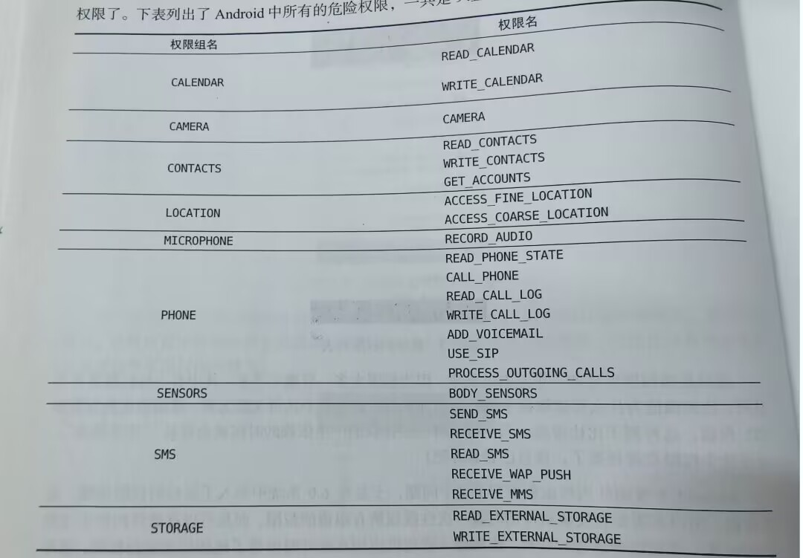

# 运行时权限

### 危险权限表格



### 运行时申请权限(以打电话为例)

1.先借助ContextCompat.checkSelfPermission()方法判断用户是否进行了授权。

checkSelfPermission()接收两个参数，第一个是Context，第二个是具体的权限名

2.使用方法的返回值和PackageManager.PERMISSION_GRANTED作比较，不等表示未授权，相等表示已授权

3.把打电话的逻辑封装在**call()**方法当中如果授权直接执行该方法，如果未授权，利用**ActivityCompat.requestPermissions()**方法向用户申请授权，**requestPermissions()**接收三个参数，第一个是Activity实例，第二个是String数组，把权限名放入其中，第三个是请求码，只要是唯一值就行。

4.调用**requestPermissions()**方法后最终会回调到**onRequestPermissionResult()**方法，而授权结果会封装在**grantResults**参数中，判断最后的授权结果

**完整的实例：**

```java
public class MainActivity extends AppCompatActivity {

    @Override
    protected void onCreate(Bundle savedInstanceState) {
        super.onCreate(savedInstanceState);
        setContentView(R.layout.activity_main);
        Button makeCall=(Button) findViewById(R.id.make_call);
        makeCall.setOnClickListener(new View.OnClickListener() {
            @Override
            public void onClick(View view) {
                if(ContextCompat.checkSelfPermission(MainActivity.this,Manifest.permission.CALL_PHONE)!= PackageManager.PERMISSION_GRANTED){
                    ActivityCompat.requestPermissions(MainActivity.this,new String[]{Manifest.permission.CALL_PHONE},1);
                }
                else{
                    call();
                }
            }
        });
    }
    private void call(){
        try{
            Intent intent=new Intent(Intent.ACTION_CALL);
            intent.setData(Uri.parse("tel:10086"));
            startActivity(intent);
        }catch (SecurityException e){
            e.printStackTrace();
        }
    }
    @SuppressLint("MissingSuperCall")
    @Override
    public void onRequestPermissionsResult(int requestCode,String[] permissions,int[] grantResults){
        switch(requestCode){
            case 1:
                if(grantResults.length>0 && grantResults[0]== PERMISSION_GRANTED){
                    call();
                }else{
                    Toast.makeText(this, "You denied the permission", Toast.LENGTH_SHORT).show();
                }
                break;
            default:
        }
    }
}
```


------

# 访问其他程序的数据

### ContentResolver的基本用法

通过getContentResolver()方法获取ContentResolver实例ContentResolver提供了一系列方法，用于对数据进行CRUD和SQLite相似但参数上略有一些区别。

不同于数据库的是表名参数被Uri参数代替，主要由两部分组成authority和path，authority一般以程序包名进行命名，path则对同一程序不同表进行区分，标准格式为：content://com.example.app.provider/table1,还需要将其解析才可以作为参数传入，

`Uri uri=Uri.parse("content://com.example.app.provider/table1")`

### Query( )

```java
          Cursor cursor=getContentResolver().query(uri,projection,selection,selectionArgs,sortOrder);
          if(cursor!=null){
              while(cursor.moveToNext()){
                  String column1=cursor.getString(cursor.getColumnIndex("column1"));
                   int column2=cursor.getInt(cursor.getColumnIndex("column2"));
              }
              cursor.close();
          }
```

### Insert( )

```java
ContentValues values=new ContentValues();
values.put("column1","text");
values.put("column2",1);
getContentResolver().insert(uri,values);
```

### update( )

```java
ContentValues values=new ContentValues();
values.put("column1","");
getContentResolver().update(uri,values,"column1=? and column2=?",new String[]{"text","1"});
```

### delete( )

```java
getContentResolver().delete(uri,"column2=?",new String[]{"1"});
```


### 读取系统联系人

**完整实例：**

```java
public class MainActivity extends AppCompatActivity {
    ArrayAdapter<String>adapter;
    List<String>contactsList=new ArrayList<>();

    @Override
    protected void onCreate(Bundle savedInstanceState) {
        super.onCreate(savedInstanceState);
        setContentView(R.layout.activity_main);
        ListView contactsView=(ListView) findViewById(R.id.contacts_view);
        adapter=new ArrayAdapter<String>(this,android.R.layout.simple_list_item_1,contactsList);
        contactsView.setAdapter(adapter);
        if(ContextCompat.checkSelfPermission(this, Manifest.permission.READ_CONTACTS)!= PackageManager.PERMISSION_GRANTED){
            ActivityCompat.requestPermissions(this,new String[]{Manifest.permission.READ_CONTACTS},1);
        }
        else{
            readContacts();
        }
    }

    private void readContacts() {
        Cursor cursor=null;
        try{
            cursor=getContentResolver().query(ContactsContract.CommonDataKinds.Phone.CONTENT_URI,null,null,null,null);
            if(cursor!=null){
                while(cursor.moveToNext()){
                    @SuppressLint("Range") String displayName=cursor.getString(cursor.getColumnIndex(ContactsContract.CommonDataKinds.Phone.DISPLAY_NAME));
                    @SuppressLint("Range") String number=cursor.getString(cursor.getColumnIndex(ContactsContract.CommonDataKinds.Phone.NUMBER));
                    contactsList.add(displayName+"\n"+number);
                }
                adapter.notifyDataSetChanged();
            }
        }catch(Exception e){
            e.printStackTrace();
        }finally{
            if(cursor!=null){
                cursor.close();
            }
        }
    }

    @SuppressLint("MissingSuperCall")
    @Override
    public void onRequestPermissionsResult(int requestCode, @NonNull String[] permissions, @NonNull int[] grantResults) {
        if(requestCode==1){
            if(grantResults.length>0&&grantResults[0]==PackageManager.PERMISSION_GRANTED){
                readContacts();
            }
            else{
                Toast.makeText(this, "You denied the permission", Toast.LENGTH_SHORT).show();
            }
        }
    }
}
```

重点看readContacts()方法 里面的uri与前面讲的不太一样，这是为什么呢？这是因为ContactsContract.CommonDataKinds.Phone类已经帮我们做好了封装，提供另一个CONTENT_URI常量，而这个常量就是Uri.parse解析出来的结果。

------

# 创建内容提供器

1.利用Android Studio创建一个Content Provider，已经在在AndroidManifest.xml中自动注册。

onCraete():返回true表示创建成功，返回false表示创建失败。

query():返回值为Cursor类型

insert():返回一个表示这条新记录的URI

update():更新已有数据

delete():被删除的行数将作为返回值返回

getType():根据传入的URI来返回相应的MIME类型。

使用通配符表示两种格式的URI：

***：**表示匹配任意长度的任意字符。例子content://com.example.app.provider/*

**#：**表示匹配任意长度的数字。例子content://com.example.app.provider/table1/#

2.可以借助UriMatcher这个类实现匹配内容URI的功能，利用UriMatcher中的addURI（）方法，接受三个参数，第一个是authority第二个是path第三个是自定义代码，这样当调用match()方法时就能匹配相应的表数据。

```java
 public static final int TABLE1_DIR=0;
    public static final int TABLE1_ITEM=1;
    public static final int TABLE2_DIR=2;
    public static final int TABLE2_ITEM=3;
    private static UriMatcher uriMatcher;
    static {
        uriMatcher=new UriMatcher(UriMatcher.NO_MATCH);
        uriMatcher.addURI("com.example.app.provider","table1",TABLE1_DIR);
        uriMatcher.addURI("com.example.app.provider","table1",TABLE1_DIR);
        uriMatcher.addURI("com.example.app.provider","table1",TABLE1_DIR);
        uriMatcher.addURI("com.example.app.provider","table1",TABLE1_DIR);
    }
@Override
    public Cursor query(@NonNull Uri uri, @Nullable String[] strings, @Nullable String s, @Nullable String[] strings1, @Nullable String s1) {
        if(uriMatcher.match(uri)==TABLE1_DIR){

        } else if (uriMatcher.match(uri)==TABLE1_ITEM) {

        } else if (uriMatcher.match(uri)==TABLE2_DIR) {

        } else if (uriMatcher.match(uri) == TABLE2_ITEM) {

        }
        return null;
    }
```

3.getType()方法一个URI内容对应的MIME字符由三部分组成：

<必须以vnd开头>

<如果内容以路径结尾，则后接android.cursor.dir/，如果以id结尾则后接android.cursor.item/.>

<最后接上vnd.<authority>.<path>>

URI为“content://com.example.app.provider/table1”对应的MIME类型为“vnd.android.cursor.dir/vnd.com.example.app.provider.table1”

URI为“content://com.example.app.provider/table1/1”对应的MIME类型为“vnd.android.cursor.item/vnd.com.example.app.provider.table1”

实例：

```java
 @Override
    public String getType(@NonNull Uri uri) {
        if(uriMatcher.match(uri)==TABLE1_DIR){
            return "vnd.android.cursor.dir/vnd.com.example.app.provider.table1";
        } else if (uriMatcher.match(uri)==TABLE1_ITEM) {
            return "vnd.android.cursor.item/vnd.com.example.app.provider.table1";
        } else if (uriMatcher.match(uri)==TABLE2_DIR) {
            return "vnd.android.cursor.dir/vnd.com.example.app.provider.table2";
        } else if (uriMatcher.match(uri) == TABLE2_ITEM) {
            return "vnd.android.cursor.item/vnd.com.example.app.provider.table2";
        } 
        return null;
    }
```


------

