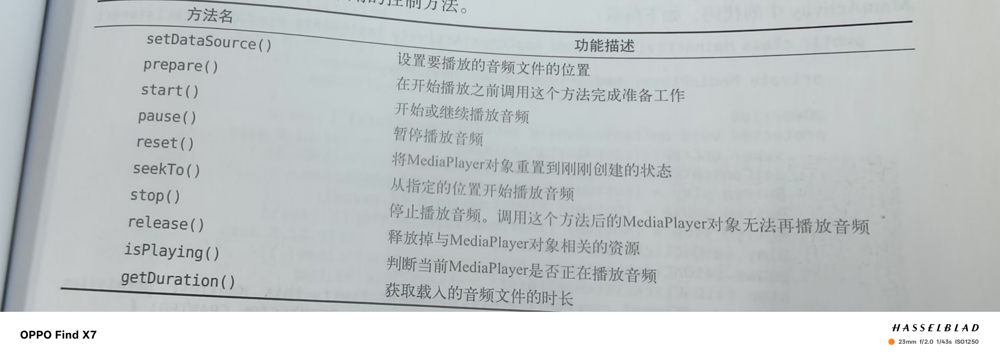
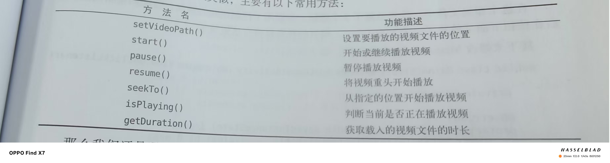

# 通知(进阶)

1.创建通知通道并请求通知权限

2.用getSystemService()获取一个NotificationManager对通知进行管理

3.创建Notification对象并进行一些基础设置

4.用notify()显示通知

```java

/**
 * 演示通知功能的主活动类
 */
public class MainActivity extends AppCompatActivity implements View.OnClickListener {

    @Override
    protected void onCreate(Bundle savedInstanceState) {
        super.onCreate(savedInstanceState);
        // 加载布局文件
        setContentView(R.layout.activity_main);

        // 创建通知通道（仅在 Android 8.0 及以上版本需要）
        createNotificationChannel();

        // 获取按钮控件并绑定点击事件
        Button sendNotice = findViewById(R.id.send_notice);
        sendNotice.setOnClickListener(this);
    }

    @Override
    public void onClick(View v) {
        // 判断是否是发送通知按钮被点击
        if (v.getId() == R.id.send_notice) {
            try {
                // 创建一个Intent，用于在通知被点击时启动NotificationActivity
                Intent intent = new Intent(this, NotificationActivity.class);
                // 创建一个PendingIntent，作为通知的点击动作
                PendingIntent pi = PendingIntent.getActivity(this, 0, intent, PendingIntent.FLAG_UPDATE_CURRENT);

                // 获取通知管理器实例
                NotificationManager manager = (NotificationManager) getSystemService(NOTIFICATION_SERVICE);

                // 构建通知对象
                Notification notification = new NotificationCompat.Builder(this, "default_channel_id")
                        // 设置通知标题
                        .setContentTitle("This is content title")
                        // 设置通知内容
                        .setContentText("Learn how to build notifications, send and sync data, and use voice actions. Get the official Android IDE and developer tools to build apps for Android.")
                        // 设置通知时间
                        .setWhen(System.currentTimeMillis())
                        // 设置小图标
                        .setSmallIcon(R.mipmap.ic_launcher)
                        // 设置大图标
                        .setLargeIcon(BitmapFactory.decodeResource(getResources(), R.mipmap.ic_launcher))
                        // 设置通知点击的Intent
                        .setContentIntent(pi)
                        // 设置自动取消通知
                        .setAutoCancel(true)
                        // 设置默认通知声音、震动、灯光
                        .setDefaults(NotificationCompat.DEFAULT_ALL)
                        // 使用大文本样式
                        .setStyle(new NotificationCompat.BigTextStyle().bigText("Learn how to build notifications, send and" +
                                "sync data, and use voice actions,Get the official Android IDE and developer tools to build apps for Android."))
                        // 设置通知优先级
                        .setPriority(NotificationCompat.PRIORITY_MAX)
                        // 构建通知对象
                        .build();

                // 处理 Android 13 及以上版本的 POST_NOTIFICATIONS 权限
                if (Build.VERSION.SDK_INT >= Build.VERSION_CODES.TIRAMISU) {
                    if (ContextCompat.checkSelfPermission(MainActivity.this, Manifest.permission.POST_NOTIFICATIONS) != PackageManager.PERMISSION_GRANTED) {
                        // 如果没有权限，请求权限
                        ActivityCompat.requestPermissions(MainActivity.this, new String[]{Manifest.permission.POST_NOTIFICATIONS}, 1);
                    } else {
                        // 如果有权限，发送通知
                        manager.notify(1, notification);
                    }
                } else {
                    // Android 13 以下版本直接发送通知
                    manager.notify(1, notification);
                }
            } catch (Exception e) {
                // 捕获并处理异常
                e.printStackTrace();
                Toast.makeText(this, "发送通知失败： " + e.getMessage(), Toast.LENGTH_LONG).show();
            }
        }
    }

    @Override
    public void onRequestPermissionsResult(int requestCode, @NonNull String[] permissions, @NonNull int[] grantResults) {
        super.onRequestPermissionsResult(requestCode, permissions, grantResults);
        // 获取通知管理器实例
        NotificationManager manager = (NotificationManager) getSystemService(NOTIFICATION_SERVICE);

        try {
            // 重新构建通知对象（与 onClick 中相同）
            Notification notification = new NotificationCompat.Builder(this, "default_channel_id")
                    .setContentTitle("This is content title")
                    .setContentText("Learn how to build notifications, send and sync data, and use voice actions. Get the official Android IDE and developer tools to build apps for Android.")
                    .setWhen(System.currentTimeMillis())
                    .setSmallIcon(R.mipmap.ic_launcher)
                    .setLargeIcon(BitmapFactory.decodeResource(getResources(), R.mipmap.ic_launcher))
                    .setAutoCancel(true)
                    .setDefaults(NotificationCompat.DEFAULT_ALL)
                    .setStyle(new NotificationCompat.BigTextStyle().bigText("Learn how to build notifications, send and" +
                            "sync data, and use voice actions,Get the official Android IDE and developer tools to build apps for Android."))
                    .setPriority(NotificationCompat.PRIORITY_MAX)
                    .build();

            // 根据请求码处理权限请求结果
            switch (requestCode) {
                case 1:
                    // 处理 POST_NOTIFICATIONS 权限请求结果
                    if (grantResults.length > 0 && grantResults[0] == PackageManager.PERMISSION_GRANTED) {
                        // 权限授予，发送通知
                        manager.notify(1, notification);
                    } else {
                        // 权限被拒绝，显示提示信息
                        Toast.makeText(this, "You denied the permission", Toast.LENGTH_SHORT).show();
                    }
                    break;
                default:
                    // 处理其他请求码
                    break;
            }
        } catch (Exception e) {
            // 捕获并处理异常
            e.printStackTrace();
            Toast.makeText(this, "发送通知失败： " + e.getMessage(), Toast.LENGTH_LONG).show();
        }
    }

    /**
     * 创建通知通道（仅在 Android 8.0 及以上版本需要）
     * 通知通道用于分组和管理不同的通知
     */
    private void createNotificationChannel() {
        if (Build.VERSION.SDK_INT >= Build.VERSION_CODES.O) {
            // 创建一个 NotificationChannel 对象
            NotificationChannel channel = new NotificationChannel(
                    "default_channel_id", // 通道 ID
                    "Default Channel",    // 通道名称
                    NotificationManager.IMPORTANCE_DEFAULT // 重要性级别
            );
            // 获取通知管理器实例
            NotificationManager manager = (NotificationManager) getSystemService(NOTIFICATION_SERVICE);
            // 创建通知通道
            manager.createNotificationChannel(channel);
        }
    }
}
```

```java
public class NotificationActivity extends AppCompatActivity {

    @Override
    protected void onCreate(Bundle savedInstanceState) {
        super.onCreate(savedInstanceState);
        setContentView(R.layout.notification_layout);
        NotificationManager manager=(NotificationManager) getSystemService(NOTIFICATION_SERVICE);
        manager.cancel(1);
    }
}
```

```java
<uses-permission android:name="android.permission.POST_NOTIFICATIONS" />
    <uses-permission android:name="android.permission.VIBRATE"/>
```


------

# 摄像头和相册

### 调用摄像头拍照

1.设置Button和ImageView控件

2.申请相机权限,创建File对象存放在SD卡的应用关联缓存目录下

3.把File转换为Uri,被内容提供器FileProvider通过getUriForFile()接收

4.构建intent启动相机

5.重写onActivityResult处理结果

6.在AndroidManifest.xml注册内容提供器,声明权限

7.在xml目录下创建file_paths.xml共享路径

```java
public class MainActivity extends AppCompatActivity {
    public static final int TAKE_PHOTO=1;//声明一个请求码，用于识别返回的结果
    public static final int CHOOSE_PHOTO=2;
    private ImageView picture;
    private Uri imageUri;

    @Override
    protected void onCreate(Bundle savedInstanceState) {
        super.onCreate(savedInstanceState);
        setContentView(R.layout.activity_main);
        Button takePhoto=(Button) findViewById(R.id.take_photo);
        picture =(ImageView) findViewById(R.id.picture);
        takePhoto.setOnClickListener(new View.OnClickListener() {
            @Override
            public void onClick(View view) {
                //创建File对象，用于存储拍照后的图片
                File outputImage=new File(getExternalCacheDir(),"output_image.jpg");
                try //判断图片是否存在，存在则删除重建，不存在则直接创建
                {
                    if(outputImage.exists()){
                        outputImage.delete();
                    }
                    outputImage.createNewFile();
                } catch (IOException e) {
                    e.printStackTrace();
                }
                if(Build.VERSION.SDK_INT>=24)
                    //判断安卓的版本是否高于7.0，高于则调用高于的方法，低于则调用低于的方法
                    //把文件转化成Uri对象
                    /*之所以这样是因为android7.0之后直接使用本地真实路径是不安全的，会抛出异常。
                    FileProvider是一种特殊的内容提供器，可以对数据进行保护*/
                {
                    imageUri= FileProvider.getUriForFile(MainActivity.this,"com.example.cameraalbumtest.fileprovider",outputImage);
                    /*
                    第一个参数：content对象
                    第二个参数：任意唯一的字符串
                    第三个参数：文件对象
                    */
                }else{
                    imageUri=Uri.fromFile(outputImage);
                }
                //启动相机程序
                Intent intent=new Intent("android.media.action.IMAGE_CAPTURE");
                intent.putExtra(MediaStore.EXTRA_OUTPUT,imageUri);
                startActivityForResult(intent,TAKE_PHOTO);
            }
        });
    }
    @Override
    protected void onActivityResult(int requestCode, int resultCode, @Nullable Intent data) {
        super.onActivityResult(requestCode, resultCode, data);
       switch(requestCode){
           case TAKE_PHOTO:
            if (resultCode == RESULT_OK) {
                try {
                    Bitmap bitmap = BitmapFactory.decodeStream(getContentResolver().openInputStream(imageUri));
                    picture.setImageBitmap(bitmap);
                } catch (FileNotFoundException e) {
                    e.printStackTrace();
                }
            }
            break;
        
           default:
               break;
        }
    }

        }
}
```

```java
       <provider
            android:name="androidx.core.content.FileProvider"
            android:authorities="com.example.cameraalbumtest.fileprovider"
            android:exported="false"
            android:grantUriPermissions="true">
            <meta-data
                android:name="android.support.FILE_PROVIDER_PATHS"
                android:resource="@xml/file_paths"/>
        </provider>
```

```java
   <uses-permission android:name="android.permission.WRITE_EXTERNAL_STORAGE" />
```

```java
<paths xmlns:android="http://schemas.android.com/apk/res/android">
    <external-path
        name="my_images"
        path="" />
</paths>
```


### 从相册中选择图片

1.申请权限

2.创建并调用openAlum()方法

3.重写onActivityResult处理结果

4.针对不同图片格式进行不同操作

```java
public class MainActivity extends AppCompatActivity {
    public static final int TAKE_PHOTO=1;//声明一个请求码，用于识别返回的结果
    public static final int CHOOSE_PHOTO=2;
    private ImageView picture;
    private Uri imageUri;

    @Override
    protected void onCreate(Bundle savedInstanceState) {
        super.onCreate(savedInstanceState);
        setContentView(R.layout.activity_main);
        Button takePhoto=(Button) findViewById(R.id.take_photo);
        Button choosePhoto=(Button) findViewById(R.id.choose_from_album);
        picture =(ImageView) findViewById(R.id.picture);
        takePhoto.setOnClickListener(new View.OnClickListener() {
            @Override
            public void onClick(View view) {
                //创建File对象，用于存储拍照后的图片
                File outputImage=new File(getExternalCacheDir(),"output_image.jpg");
                try //判断图片是否存在，存在则删除重建，不存在则直接创建
                {
                    if(outputImage.exists()){
                        outputImage.delete();
                    }
                    outputImage.createNewFile();
                } catch (IOException e) {
                    e.printStackTrace();
                }
                if(Build.VERSION.SDK_INT>=24)
                    //判断安卓的版本是否高于7.0，高于则调用高于的方法，低于则调用低于的方法
                    //把文件转化成Uri对象
                    /*之所以这样是因为android7.0之后直接使用本地真实路径是不安全的，会抛出异常。
                    FileProvider是一种特殊的内容提供器，可以对数据进行保护*/
                {
                    imageUri= FileProvider.getUriForFile(MainActivity.this,"com.example.cameraalbumtest.fileprovider",outputImage);
                    /*
                    第一个参数：content对象
                    第二个参数：任意唯一的字符串
                    第三个参数：文件对象
                    */
                }else{
                    imageUri=Uri.fromFile(outputImage);
                }
                //启动相机程序
                Intent intent=new Intent("android.media.action.IMAGE_CAPTURE");
                intent.putExtra(MediaStore.EXTRA_OUTPUT,imageUri);
                startActivityForResult(intent,TAKE_PHOTO);
            }
        });
        choosePhoto.setOnClickListener(new View.OnClickListener() {
            @Override
            public void onClick(View view) {
                if(ContextCompat.checkSelfPermission(MainActivity.this, Manifest.permission.WRITE_EXTERNAL_STORAGE)!= PackageManager.PERMISSION_GRANTED){
                    ActivityCompat.requestPermissions(MainActivity.this,new String[]{ Manifest.permission.WRITE_EXTERNAL_STORAGE},1);
                }
                else{
                    openAlbum();
                }
            }
        });
    }
private void openAlbum(){
        Intent intent=new Intent("android.intent.action.GET_CONTENT");
        intent.setType("image/*");
        startActivityForResult(intent,CHOOSE_PHOTO);
}

    @Override
    public void onRequestPermissionsResult(int requestCode, @NonNull String[] permissions, @NonNull int[] grantResults) {
        super.onRequestPermissionsResult(requestCode, permissions, grantResults);
       if(requestCode==1){
           if(grantResults.length>0&&grantResults[0]==PackageManager.PERMISSION_GRANTED){
               openAlbum();
           }else{
               Toast.makeText(this, "You denide the permission", Toast.LENGTH_SHORT).show();
           }
       }
    }
    @Override
    protected void onActivityResult(int requestCode, int resultCode, @Nullable Intent data) {
        super.onActivityResult(requestCode, resultCode, data);
       switch(requestCode){
           case TAKE_PHOTO:
            if (resultCode == RESULT_OK) {
                try {
                    Bitmap bitmap = BitmapFactory.decodeStream(getContentResolver().openInputStream(imageUri));
                    picture.setImageBitmap(bitmap);
                } catch (FileNotFoundException e) {
                    e.printStackTrace();
                }
            }
            break;
           case CHOOSE_PHOTO:
               if(resultCode==RESULT_OK){
                   if( Build.VERSION.SDK_INT>=19){
                       //4.4以上系统使用这个方法处理照片
                       handleImageOnKitKat(data);

                   }
                   else{
                       //4.4以下使用
                       handleImageBeforeKitKat(data);
                   }
               }
               break;
           default:
               break;
        }
    }

    private void handleImageBeforeKitKat(Intent data) {
        Uri uri=data.getData();
        String imagePath=getImagePath(uri,null);
        displayImage(imagePath);//根据路径显示图片
    }

    private void handleImageOnKitKat(Intent data) {
        String imagePath=null;
        Uri uri=data.getData();
        if (DocumentsContract.isDocumentUri(this,uri)) {
            //如果是document类型的Uri，则通过document id处理
            String docId = DocumentsContract.getDocumentId(uri);
            if ("com.android.providers.media.documents".equals(uri.getAuthority())) {
                String id = docId.split(":")[1];//解析出数字格式的id
                String selection = MediaStore.Images.Media._ID + "=" + id;
                imagePath = getImagePath(MediaStore.Images.Media.EXTERNAL_CONTENT_URI, selection);
            } else if ("com.android.providers.downloads.documents".equals(uri.getAuthority())) {
                Uri contentUri = ContentUris.withAppendedId(Uri.parse("content://downloads/public_downloads"), Long.valueOf(docId));
                imagePath = getImagePath(contentUri, null);
            }
        }else if ("content".equalsIgnoreCase(uri.getScheme())) {
                //如果是Content类型的uri则使用普通方法处理
                imagePath=getImagePath(uri,null);

            } else if ("file".equalsIgnoreCase(uri.getScheme())) {
                imagePath=uri.getPath();

            }
            displayImage(imagePath);//根据路径显示图片
        }
        @SuppressLint("Range")
        private String getImagePath(Uri uri, String selection){
        String path=null;
        //通过Uri和selection来获取真实的图片路径
            Cursor cursor=getContentResolver().query(uri,null,selection,null,null);
            if(cursor!=null){
                if(cursor.moveToFirst()){
                    path=cursor.getString(cursor.getColumnIndex(MediaStore.Images.Media.DATA));
                }
                cursor.close();
            }
            return path;
        }
        private void displayImage(String imagePath){
        if(imagePath!=null){
            Bitmap bitmap=BitmapFactory.decodeFile(imagePath);
            picture.setImageBitmap(bitmap);
        }else{
            Toast.makeText(this, "failed to get image", Toast.LENGTH_SHORT).show();
        }
        }

}
```


------

# 播放多媒体文件

### 播放音频

MediaPlayer类的方法：



1.创建一个MediaPlayer类

2.动态申请权限

3.调用initMediaPlayer方法对其进行初始化

```java
<LinearLayout xmlns:android="http://schemas.android.com/apk/res/android"
    android:orientation="vertical"
    android:layout_width="match_parent"
    android:layout_height="match_parent"
    >
    <Button
        android:id="@+id/play"
        android:layout_width="match_parent"
        android:layout_height="wrap_content"
        android:text="Play"
         />
    <Button
        android:id="@+id/pause"
        android:layout_width="match_parent"
        android:layout_height="wrap_content"
        android:text="Pause"
         />

    <Button
        android:id="@+id/stop"
        android:layout_width="match_parent"
        android:layout_height="wrap_content"
        android:text="Stop" />

</LinearLayout>
```


```java
public class MainActivity extends AppCompatActivity {
private MediaPlayer mediaPlayer=new MediaPlayer();
    @Override
    protected void onCreate(Bundle savedInstanceState) {
        super.onCreate(savedInstanceState);
        setContentView(R.layout.activity_main);
        Button play=(Button) findViewById(R.id.play);
        Button pause=(Button) findViewById(R.id.pause);
        Button stop=(Button) findViewById(R.id.stop);
        play.setOnClickListener(new View.OnClickListener() {
            @Override
            public void onClick(View view) {
                if(!mediaPlayer.isPlaying()){
                    mediaPlayer.start();
                }
            }
        });
        pause.setOnClickListener(new View.OnClickListener() {
            @Override
            public void onClick(View view) {
                if(mediaPlayer.isPlaying()){
                    mediaPlayer.pause();
                }
            }
        });
        stop.setOnClickListener(new View.OnClickListener() {
            @Override
            public void onClick(View view) {
                if(mediaPlayer.isPlaying()){
                    mediaPlayer.reset();//停止播放
                    initMediaPlayer();
                }
            }
        });
        if(ContextCompat.checkSelfPermission(MainActivity.this, Manifest.permission.WRITE_EXTERNAL_STORAGE)!= PackageManager.PERMISSION_GRANTED){
            ActivityCompat.requestPermissions(MainActivity.this,new String[]{Manifest.permission.WRITE_EXTERNAL_STORAGE},1);
        }else{
            initMediaPlayer();
        }
    }

    @Override
    public void onRequestPermissionsResult(int requestCode, @NonNull String[] permissions, @NonNull int[] grantResults) {
        super.onRequestPermissionsResult(requestCode, permissions, grantResults);
        if(requestCode==1){
            if(grantResults.length>0&&grantResults[0]==PackageManager.PERMISSION_GRANTED){
                initMediaPlayer();
            }else{
                Toast.makeText(this, "拒绝权限将无法使用程序", Toast.LENGTH_SHORT).show();
                finish();
            }
        }
    }

    @Override
    protected void onDestroy() {
        super.onDestroy();
        if(mediaPlayer!=null){
            mediaPlayer.stop();
            mediaPlayer.release();
        }
    }
    private void initMediaPlayer(){
        try{
            File file=new File(Environment.getExternalStorageDirectory(),"music.mp3");
            mediaPlayer.setDataSource(file.getPath());//指定音频文件的路径
            mediaPlayer.prepare();//让mediaPlayer进入到准备状态
        }
        catch (Exception e){
            e.printStackTrace();
        }

    }
}
```

```java
<uses-permission android:name="android.permission.WRITE_EXTERNAL_STORAGE"/>
```


### 播放视频

VideoView类的方法：



1.创建VideoView实例

2.动态申请权限

3.利用initVideoView方法初始化

```java
<LinearLayout xmlns:android="http://schemas.android.com/apk/res/android"
    android:orientation="vertical"
    android:layout_width="match_parent"
    android:layout_height="match_parent"
    >
    <LinearLayout
        android:layout_width="match_parent"
        android:layout_height="wrap_content">
        <Button
            android:id="@+id/play"
            android:layout_width="0dp"
            android:layout_height="wrap_content"
            android:layout_weight="1"
            android:text="Play"/>
       <Button
           android:id="@+id/pause"
           android:layout_width="0dp"
           android:layout_height="wrap_content"
           android:layout_weight="1"
           android:text="Pause"/>
        <Button
            android:id="@+id/replay"
            android:layout_width="0dp"
            android:layout_height="wrap_content"
            android:layout_weight="1"
            android:text="Replay"/>
    </LinearLayout>
    <VideoView
        android:id="@+id/video_view"
        android:layout_width="match_parent"
        android:layout_height="wrap_content"/>
</LinearLayout>
```

```java
public class MainActivity extends AppCompatActivity implements View.OnClickListener {
private VideoView videoView;
    @Override
    protected void onCreate(Bundle savedInstanceState) {
        super.onCreate(savedInstanceState);
        setContentView(R.layout.activity_main);
        videoView=(VideoView) findViewById(R.id.video_view);
        Button play=(Button) findViewById(R.id.play);
        Button pause=(Button) findViewById(R.id.pause);
        Button replay=(Button) findViewById(R.id.replay);
        play.setOnClickListener(this);
        pause.setOnClickListener(this);
        replay.setOnClickListener(this);
        if(ContextCompat.checkSelfPermission(MainActivity.this, Manifest.permission.WRITE_EXTERNAL_STORAGE)!= PackageManager.PERMISSION_GRANTED){
            ActivityCompat.requestPermissions(MainActivity.this,new String[]{Manifest.permission.WRITE_EXTERNAL_STORAGE},1);
        }else{
            initVideoPath();//初始化MediaPlayer
        }
    }

    private void initVideoPath() {
        File file=new File(Environment.getExternalStorageDirectory(),"movie.mp4");
        videoView.setVideoPath(file.getPath());
    }

    @Override
    public void onRequestPermissionsResult(int requestCode, @NonNull String[] permissions, @NonNull int[] grantResults) {
        super.onRequestPermissionsResult(requestCode, permissions, grantResults);
        if(requestCode==1){
            if(grantResults.length>0&&grantResults[0]==PackageManager.PERMISSION_GRANTED){
                initVideoPath();
            }
            else{
                Toast.makeText(this, "拒绝权限将无法使用该程序", Toast.LENGTH_SHORT).show();
                finish();
            }
        }
    }

    @Override
    protected void onDestroy() {
        super.onDestroy();
        if(videoView!=null){
            videoView.suspend();
        }
    }

    @Override
    public void onClick(View view) {
       if(view.getId()==R.id.play){
           if(!videoView.isPlaying()){
               videoView.start();
           }
       } else if (view.getId()==R.id.pause) {
           if(videoView.isPlaying()){
               videoView.pause();
           }

       } else if (videoView.isPlaying()) {
           //停止播放视频，并释放资源
           videoView.resume();
       }

    }
}
```

```java
<uses-permission android:name="android.permission.WRITE_EXTERNAL_STORAGE"/>
```

------

