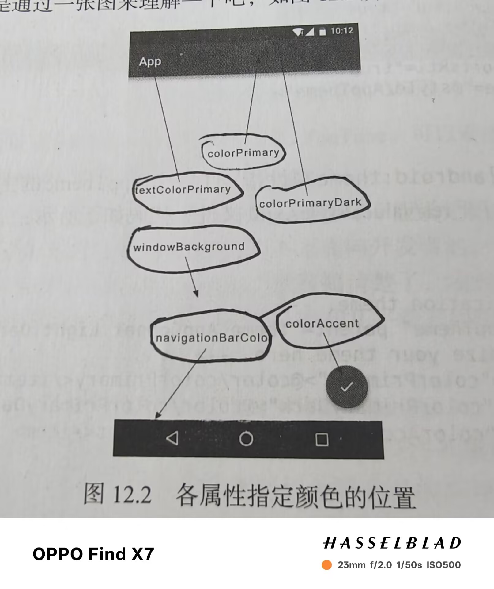

# Toolbar

1.设置主题为Theme.AppCompat.Light.NoActionBar(淡色主题)

2.在layout中使用Toolbar

3..在Mainactivity获取toolbar实例

4.设置menu并在Mainactivity中使用



```java
<resources xmlns:tools="http://schemas.android.com/tools">
    <!-- Base application theme. -->
    <style name="AppTheme" parent="Theme.AppCompat.Light.NoActionBar">
        <!-- Customize your light theme here. -->
        <item name="colorPrimary">@color/black</item>
        <item name="colorPrimaryDark">@color/black</item>
        <item name="colorAccent">@color/white</item>
        <item name="android:textColorPrimary">@color/black</item>
        <item name="android:windowBackground">@color/white</item>
        <item name="android:navigationBarColor">@color/black</item>
    </style>

</resources>
```

```java
<FrameLayout xmlns:android="http://schemas.android.com/apk/res/android"
    xmlns:app="http://schemas.android.com/apk/res-auto"
    android:layout_width="match_parent"
    android:layout_height="match_parent">

    <androidx.appcompat.widget.Toolbar
        android:id="@+id/toolbar"
        android:layout_width="match_parent"
        android:layout_height="?attr/actionBarSize"
        android:background="?attr/colorPrimary"
        android:theme="@style/ThemeOverlay.AppCompat.Dark.ActionBar"
       app:popupTheme="@style/ThemeOverlay.AppCompat.Light"/>

</FrameLayout>
```

```java
<menu xmlns:android="http://schemas.android.com/apk/res/android"
    xmlns:app="http://schemas.android.com/apk/res-auto">
    <item
        android:id="@+id/backup"
        android:icon="@drawable/ic_launcher_background"
        android:title="Backup"
        app:showAsAction="always"/>
    <item
        android:id="@+id/delete"
        android:icon="@drawable/ic_launcher_background"
        android:title="Delete"
        app:showAsAction="ifRoom"/>
    <item
        android:id="@+id/settings"
        android:icon="@drawable/ic_launcher_background"
        android:title="Settings"
        app:showAsAction="never"/>
</menu>
```

```java
public class MainActivity extends AppCompatActivity {
    @Override
    protected void onCreate(Bundle savedInstanceState) {
        super.onCreate(savedInstanceState);
        setContentView(R.layout.activity_main);
        Toolbar toolbar = (Toolbar) findViewById(R.id.toolbar);
        setSupportActionBar(toolbar);

    }
    public boolean onCreateOptionsMenu(Menu menu){
        getMenuInflater().inflate(R.menu.toolbar,menu);
        return true;
    }

    @Override
    public boolean onOptionsItemSelected(@NonNull MenuItem item) {
        if(item.getItemId()==R.id.backup){
            Toast.makeText(this, "You clicked Backup", Toast.LENGTH_SHORT).show();
        } else if (item.getItemId()==R.id.delete) {
            Toast.makeText(this, "You clicked Delete", Toast.LENGTH_SHORT).show();
        }else{
            Toast.makeText(this, "You clicked Settings", Toast.LENGTH_SHORT).show();
        }
        return  true;
    }
}
```


------

# 滑动菜单

### DrawerLayout

1.修改布局中代码，使用DrawerLayout布局

2.获取DrawerLayout和ActionBar的实例

3.利用ActionBar的方法让导航按钮显示

4.对按钮的点击事件进行处理

```java
<androidx.drawerlayout.widget.DrawerLayout
    xmlns:android="http://schemas.android.com/apk/res/android"
    xmlns:app="http://schemas.android.com/apk/res-auto"
    android:id="@+id/drawer_layout"
    android:layout_width="match_parent"
    android:layout_height="match_parent">
    <FrameLayout
        android:layout_width="match_parent"
        android:layout_height="match_parent">
        <androidx.appcompat.widget.Toolbar
            android:id="@+id/toolbar"
            android:layout_width="match_parent"
            android:layout_height="?attr/actionBarSize"
            android:background="?attr/colorPrimary"
            android:theme="@style/ThemeOverlay.AppCompat.Dark.ActionBar"
            app:popupTheme="@style/ThemeOverlay.AppCompat.Light"/>
    </FrameLayout>
    <TextView
        android:layout_width="match_parent"
        android:layout_height="match_parent"
        android:layout_gravity="start"
        android:text="This is menu"
        android:textSize="30sp"
        android:background="#FFF"/>

</androidx.drawerlayout.widget.DrawerLayout>
```

```java
private DrawerLayout mDrawerLayout;
 mDrawerLayout=(DrawerLayout) findViewById(R.id.drawer_layout);
        ActionBar actionBar=getSupportActionBar();
        if(actionBar!=null){
            actionBar.setDisplayHomeAsUpEnabled(true);
            actionBar.setHomeAsUpIndicator(R.drawable.ic_launcher_foreground);
        }
```

```java
if(item.getItemId()==android.R.id.home){
            mDrawerLayout.openDrawer(GravityCompat.START);
        }
```

### NavigationView

1.添加依赖库

2.准备menu和headerLayout

3.在activity_main.xml布局中使用NavigationView控件

4.创建点击事件

```java
implementation ("com.google.android.material:material:1.9.0")//design support库
    implementation ("de.hdodenhof:circleimageview:3.1.0")
```

```java
<menu xmlns:android="http://schemas.android.com/apk/res/android">
    //group表示一个组，single表示只能单选
    <group android:checkableBehavior="single">
        <item
            android:id="@+id/nav_call"
            android:icon="@drawable/ic_launcher_background"
            android:title="Call"/>
        <item
            android:id="@+id/nav_friends"
            android:icon="@drawable/ic_launcher_background"
            android:title="Friends"/>
        <item
            android:id="@+id/nav_location"
            android:icon="@drawable/ic_launcher_background"
            android:title="Location"/>
        <item
            android:id="@+id/nav_mail"
            android:icon="@drawable/ic_launcher_background"
            android:title="Mail"/>
        <item
            android:id="@+id/nav_task"
            android:icon="@drawable/ic_launcher_background"
            android:title="Tasks"/>
    </group>
</menu>
```

```java
<?xml version="1.0" encoding="utf-8"?>
<RelativeLayout xmlns:android="http://schemas.android.com/apk/res/android"
    android:layout_width="match_parent"
    android:layout_height="180dp"
    android:padding="10dp"
    android:background="?attr/colorPrimary">
        //将图形圆形化
    <de.hdodenhof.circleimageview.CircleImageView
        android:id="@+id/icon_image"
        android:layout_width="70dp"
        android:layout_height="70dp"
        android:src="@drawable/ic_launcher_background"
        android:layout_centerInParent="true"/>
    <TextView
        android:id="@+id/username"
        android:layout_width="wrap_content"
        android:layout_height="wrap_content"
        android:layout_alignParentBottom="true"
        android:text="1234567890@qq.com"
        android:textColor="#FFF"
        android:textSize="14sp"/>
    <TextView
        android:id="@+id/mail"
        android:layout_width="wrap_content"
        android:layout_height="wrap_content"
        android:layout_above="@+id/username"
        android:text="Klet"
        android:textColor="#FFF"
        android:textSize="14sp"/>

</RelativeLayout>
```

```java
<com.google.android.material.navigation.NavigationView
        android:id="@+id/nav_view"
         android:layout_height="match_parent"
        android:layout_width="match_parent"
        android:layout_gravity="start"
        app:menu="@menu/nav_menu"
        app:headerLayout="@layout/nav_header"/>
```

```java
//获取实例
        NavigationView navView=(NavigationView)findViewById(R.id.nav_view);
 //设置默认选中
        navView.setCheckedItem(R.id.nav_call);
        //设置点击事件
        navView.setNavigationItemSelectedListener(new NavigationView.OnNavigationItemSelectedListener() {
            @Override
            public boolean onNavigationItemSelected(@NonNull MenuItem item) {
                mDrawerLayout.closeDrawers();
                return true;
            }
        });
```


------

# 悬浮按钮和可交互显示

### FloatingActionButton

1.在布局中添加控件

2.设置点击事件

```java
<com.google.android.material.floatingactionbutton.FloatingActionButton
            android:id="@+id/fab"
             android:layout_height="wrap_content"
            android:layout_width="wrap_content"
            android:layout_gravity="bottom|end"
            android:layout_margin="16dp"
            android:src="@drawable/ic_done"
            app:elevation="8dp"//设置悬浮高度
            />
```

```java
FloatingActionButton fab=(FloatingActionButton) findViewById(R.id.fab);
        fab.setOnClickListener(new View.OnClickListener() {
            @Override
            public void onClick(View view) {
                Toast.makeText(MainActivity.this, "FAB clicked", Toast.LENGTH_SHORT).show();
            }
        });
```


### Snackbar(可交互的Toast)

1.用make获取对象

2.setAction设置动作

3.用show将其显示

```java
Snackbar.make(view,"Data Delete",Snackbar.LENGTH_SHORT)
                        .setAction("UOdo", new View.OnClickListener() {
                            @Override
                            public void onClick(View view) {
                                Toast.makeText(MainActivity.this, "Data Restored", Toast.LENGTH_SHORT).show();
                            }
                        }).show();
```


### CoordinatorLayout(加强版FrameLayout)

可以监听到所有子控件的各种事件，然后自动帮助我们做出最为合理的响应，就是加强版的FrameLayout

```java
<androidx.coordinatorlayout.widget.CoordinatorLayout
        android:layout_width="match_parent"
        android:layout_height="match_parent">
        <androidx.appcompat.widget.Toolbar
            android:id="@+id/toolbar"
            android:layout_width="match_parent"
            android:layout_height="?attr/actionBarSize"
            android:background="?attr/colorPrimary"
            android:theme="@style/ThemeOverlay.AppCompat.Dark.ActionBar"
            app:popupTheme="@style/ThemeOverlay.AppCompat.Light"/>
        <com.google.android.material.floatingactionbutton.FloatingActionButton
            android:id="@+id/fab"
             android:layout_height="wrap_content"
            android:layout_width="wrap_content"
            android:layout_gravity="bottom|end"
            android:layout_margin="16dp"
            android:src="@drawable/ic_done"
            app:elevation="8dp"
            />
    </androidx.coordinatorlayout.widget.CoordinatorLayout>
```


------

# 卡片式布局

### CardView（是一个FrameLayout)

RecyclerView和CardView混合使用

1.添加依赖

2.在布局中添加RecyclerView并建立Fruit类，子项布局和适配器

3.应用recyclerView

```java
implementation ("androidx.cardview:cardview:1.0.0")//cardView依赖
    implementation ("androidx.recyclerview:recyclerview:1.3.2")//recyclerView依赖
    implementation ("com.github.bumptech.glide:glide:4.16.0")//Glide依赖，强大的图片加载库
```

```java
<androidx.cardview.widget.CardView
    xmlns:android="http://schemas.android.com/apk/res/android"
    xmlns:app="http://schemas.android.com/apk/res-auto"
    android:layout_width="match_parent"
    android:layout_height="wrap_content"
    android:layout_margin="5dp"
    app:cardCornerRadius="4dp">
    <LinearLayout
        android:orientation="vertical"
        android:layout_width="match_parent"
        android:layout_height="wrap_content">
        <ImageView
            android:id="@+id/fruit_image"
            android:layout_width="match_parent"
            android:layout_height="100dp"
                //指定图片的缩放模式
            android:scaleType="centerCrop"/>
        <TextView
            android:id="@+id/fruit_text"
            android:layout_width="wrap_content"
            android:layout_height="wrap_content"
            android:layout_gravity="center_horizontal"
            android:layout_margin="5dp"
            android:textSize="16sp"/>
    </LinearLayout>

</androidx.cardview.widget.CardView>
```

```java
public class Fruit {
    private String name;
    private  int imageId;

    public Fruit(String name, int imageId) {
        this.name = name;
        this.imageId = imageId;
    }

    public String getName() {
        return name;
    }


    public int getImageId() {
        return imageId;
    }


}

```

```java
public class FruitAdapter extends RecyclerView.Adapter<FruitAdapter.ViewHolder> {
    private Context mContext;
    private List<Fruit>mFruitList;
    static class ViewHolder extends RecyclerView.ViewHolder{
        CardView cardView;
        ImageView fruitImage;
        TextView fruitName;
        public ViewHolder(View view){
            super(view);
            cardView=(CardView) view;
            fruitImage=(ImageView) view.findViewById(R.id.fruit_image);
            fruitName=(TextView) view.findViewById(R.id.fruit_text);
        }
    }
public FruitAdapter(List<Fruit>fruitList){
        mFruitList=fruitList;
}
    @NonNull
    @Override
    public ViewHolder onCreateViewHolder(@NonNull ViewGroup parent, int viewType) {
        if(mContext==null){
            mContext=parent.getContext();
        }
        View view= LayoutInflater.from(mContext).inflate(R.layout.fruit_item,parent,false);
        return new ViewHolder(view);
    }

    @Override
    public void onBindViewHolder(@NonNull ViewHolder holder, int position) {
            Fruit fruit=mFruitList.get(position);
            holder.fruitName.setText(fruit.getName());
        Glide.with(mContext).load(fruit.getImageId()).into(holder.fruitImage);
    }

    @Override
    public int getItemCount() {
        return mFruitList.size();
    }

}

```

```java
 private Fruit[] fruits={new Fruit("Apple",R.drawable.apple),new Fruit("Banana",R.drawable.banana)
    ,new Fruit("Orange",R.drawable.orange),new Fruit("Watermelon",R.drawable.watermelon)};
    private List<Fruit>fruitList=new ArrayList<>();
    private FruitAdapter adapter;
 @Override
    protected void onCreate(Bundle savedInstanceState) {
        super.onCreate(savedInstanceState);
        setContentView(R.layout.activity_main);
         inits();
        RecyclerView recyclerView=(RecyclerView) findViewById(R.id.recycler_view);
        //接收两个参数，第一个是Context第二个是列数
        GridLayoutManager layoutManager=new GridLayoutManager(this,2);
        recyclerView.setLayoutManager(layoutManager);
        adapter=new FruitAdapter(fruitList);
        recyclerView.setAdapter(adapter);
    }
  private void inits(){
        fruitList.clear();
        for(int i=0;i<50;i++){
            Random random=new Random();
            int index=random.nextInt(fruits.length);
            fruitList.add(fruits[index]);

        }
    }
```

### AppBarLayout

用来解决RecyclerView遮挡ToolBar问题

1.将ToolBar嵌入到AppBarLayout中

2.给RecyclerView添加一个布局行为

3.在ToolBar中添加app：layout_scrollFlags属性

```java
<androidx.drawerlayout.widget.DrawerLayout
    xmlns:android="http://schemas.android.com/apk/res/android"
    xmlns:app="http://schemas.android.com/apk/res-auto"
    android:id="@+id/drawer_layout"
    android:layout_width="match_parent"
    android:layout_height="match_parent">
    <androidx.coordinatorlayout.widget.CoordinatorLayout
        android:layout_width="match_parent"
        android:layout_height="match_parent">
           //使用AppBarLayout
        <com.google.android.material.appbar.AppBarLayout
            android:layout_width="match_parent"
            android:layout_height="wrap_content">
            <androidx.appcompat.widget.Toolbar
                android:id="@+id/toolbar"
                android:layout_width="match_parent"
                android:layout_height="?attr/actionBarSize"
                android:background="?attr/colorPrimary"
                android:theme="@style/ThemeOverlay.AppCompat.Dark.ActionBar"
                app:popupTheme="@style/ThemeOverlay.AppCompat.Light"
                    //scroll表示向上滚动ToolBar隐藏，enterAlways表示向下滚动ToolBar重新显示snap表示还没完全显示或隐藏时                         根据滚动的距离自动选择隐藏还是显示
                app:layout_scrollFlags="scroll|enterAlways|snap"/>

        </com.google.android.material.appbar.AppBarLayout>
        <androidx.recyclerview.widget.RecyclerView
            android:id="@+id/recycler_view"
            android:layout_width="match_parent"
            android:layout_height="match_parent"
                //RecyclerView添加一个布局行为
            app:layout_behavior="@string/appbar_scrolling_view_behavior"/>
        <com.google.android.material.floatingactionbutton.FloatingActionButton
            android:id="@+id/fab"
             android:layout_height="wrap_content"
            android:layout_width="wrap_content"
            android:layout_gravity="bottom|end"
            android:layout_margin="16dp"
            android:src="@drawable/ic_done"
            app:elevation="8dp"
            />
    </androidx.coordinatorlayout.widget.CoordinatorLayout>
    <com.google.android.material.navigation.NavigationView
        android:id="@+id/nav_view"
         android:layout_height="match_parent"
        android:layout_width="match_parent"
        android:layout_gravity="start"
        app:menu="@menu/nav_menu"
        app:headerLayout="@layout/nav_header"/>

</androidx.drawerlayout.widget.DrawerLayout>
```


------

# 下拉刷新

利用SwipeRefreshLayout

1.将RecyclerView嵌入到SwipeRefreshLayout中，并将RecyclerView中的布局行为移到SwipeRefreshLayout中

2.在主活动中处理具体的刷新逻辑

```java
<androidx.swiperefreshlayout.widget.SwipeRefreshLayout
            android:id="@+id/swipe_refresh"
            android:layout_width="match_parent"
            android:layout_height="match_parent"
            app:layout_behavior="@string/appbar_scrolling_view_behavior"
            >
            <androidx.recyclerview.widget.RecyclerView
                android:id="@+id/recycler_view"
                android:layout_width="match_parent"
                android:layout_height="match_parent" />
        </androidx.swiperefreshlayout.widget.SwipeRefreshLayout>
```

```java
 private SwipeRefreshLayout swipeRefreshLayout;
@Override
    protected void onCreate(Bundle savedInstanceState) {
        super.onCreate(savedInstanceState);
        setContentView(R.layout.activity_main);
    	  //获取实例
        swipeRefreshLayout=(SwipeRefreshLayout) findViewById(R.id.swipe_refresh);
        //设置刷新进度条的颜色
        swipeRefreshLayout.setColorSchemeResources(R.color.black);
        //设置下拉刷新的监听器
        swipeRefreshLayout.setOnRefreshListener(new SwipeRefreshLayout.OnRefreshListener() {
            @Override
            public void onRefresh() {
                refreshFruits();
            }
        });
    }
 private void refreshFruits() {
        //开启一个线程
        new Thread(new Runnable() {
            @Override
            public void run() {
                try{
                    //将线程沉睡两秒钟(因为本地刷新速度很快，如果不沉睡刷新立刻就结束了)
                    Thread.sleep(2000);
                }catch(InterruptedException e){
                    e.printStackTrace();
                }
                //将线程切换回主线程
                runOnUiThread(new Runnable() {
                    @Override
                    public void run() {
                        //初始化
                        inits();
                        //更新
                        adapter.notifyDataSetChanged();
                        //用于表示刷新事件结束，并隐藏进度条
                        swipeRefreshLayout.setRefreshing(false);
                    }
                });
            }
        }).start();
    }
```


------

# 可折叠式标题栏

### CollapsingToolbarLayout

**CollapsingToolbarLayout不能独立存在，他只能作为AppBarLayout的直接子布局使用，AppBarLayout又必须是CoordinatorLayout的子布局**

1.使用CoordinatorLayout作为最外层布局，里面嵌套一个AppBarLayout，再嵌套一个CollapsingToolbarLayout

2.在CollapsingToolbarLayout中添加一个ImageView和Toolbar(这个高级标题栏由图片和普通标题栏构成)

3.在最外层布局中使用NestedScrollView(和AppBarLayout同级)

4.NestedScrollView内部只允许一个直接子布局，故先嵌套一个LinearLayout

5.在其中嵌入卡片式布局

6.可以再添加一个FloatingActionButton

7.接着在FruitActivity中编写功能逻辑

8.为RecyclerView设置点击事件

```java
<androidx.coordinatorlayout.widget.CoordinatorLayout xmlns:android="http://schemas.android.com/apk/res/android"
    xmlns:app="http://schemas.android.com/apk/res-auto"
    xmlns:tools="http://schemas.android.com/tools"
    android:layout_width="match_parent"
    android:layout_height="match_parent"
    tools:context=".FruitActivity">
    <com.google.android.material.appbar.AppBarLayout
        android:id="@+id/appBar"
        android:layout_width="match_parent"
        android:layout_height="250dp">
       <com.google.android.material.appbar.CollapsingToolbarLayout
           android:id="@+id/collapsing_toolbar"
           android:layout_width="match_parent"
           android:layout_height="match_parent"
           android:theme="@style/ThemeOverlay.AppCompat.Dark.ActionBar"
           app:contentScrim="?attr/colorPrimary"
           app:layout_scrollFlags="scroll|exitUntilCollapsed">
           <ImageView
               android:id="@+id/fruit_image_view"
               android:layout_width="match_parent"
               android:layout_height="match_parent"
               android:scaleType="centerCrop"
               app:layout_collapseMode="parallax"/>
           <androidx.appcompat.widget.Toolbar
               android:id="@+id/toolbar"
               android:layout_width="match_parent"
               android:layout_height="?attr/actionBarSize"
               app:layout_collapseMode="pin"/>
       </com.google.android.material.appbar.CollapsingToolbarLayout>
    </com.google.android.material.appbar.AppBarLayout>
    <androidx.core.widget.NestedScrollView
        android:layout_width="match_parent"
        android:layout_height="match_parent"
        app:layout_behavior="@string/appbar_scrolling_view_behavior">
        <LinearLayout
            android:orientation="vertical"
            android:layout_width="match_parent"
            android:layout_height="wrap_content">
            <androidx.cardview.widget.CardView
                android:layout_width="match_parent"
                android:layout_height="wrap_content"
                android:layout_marginBottom="15dp"
                android:layout_marginLeft="15dp"
                android:layout_marginRight="15dp"
                android:layout_marginTop="35dp"
                app:cardCornerRadius="4dp">
                <TextView
                    android:id="@+id/fruit_content_text"
                    android:layout_width="wrap_content"
                    android:layout_height="wrap_content"
                    android:layout_margin="10dp"/>
            </androidx.cardview.widget.CardView>
        </LinearLayout>
    </androidx.core.widget.NestedScrollView>
    <com.google.android.material.floatingactionbutton.FloatingActionButton
        android:layout_width="wrap_content"
        android:layout_height="wrap_content"
        android:layout_margin="16sp"
        android:src="@drawable/ic_done"
        app:layout_anchor="@id/appBar"
        app:layout_anchorGravity="bottom|end"/>
</androidx.coordinatorlayout.widget.CoordinatorLayout>
```

```java
public class FruitActivity extends AppCompatActivity {
public  static final String FRUIT_NAME="fruit_name";
    public  static final String FRUIT_IMAGE_ID="fruit_image_id";
    @Override
    protected void onCreate(Bundle savedInstanceState) {
        super.onCreate(savedInstanceState);
        setContentView(R.layout.activity_fruit);
        //通过Intent获取水果名字和图片
        Intent intent=getIntent();
        String fruitName=intent.getStringExtra(FRUIT_NAME);
        int fruitImageId=intent.getIntExtra(FRUIT_IMAGE_ID,0);
        //获取Toolbar实例
        Toolbar toolbar=(Toolbar) findViewById(R.id.toolbar);
        //获取CollapsingToolbarLayout实例
        CollapsingToolbarLayout collapsingToolbarLayout=(CollapsingToolbarLayout) findViewById(R.id.collapsing_toolbar);
        //获取ImageView和TextView实例
        ImageView fruitImageView=(ImageView) findViewById(R.id.fruit_image_view);
        TextView fruitContentText=(TextView) findViewById(R.id.fruit_content_text);
        //将toolbar实例传入
        setSupportActionBar(toolbar);
        //启用HomeAsUp按钮
        ActionBar actionBar=getSupportActionBar();
        if(actionBar!=null){
            actionBar.setDisplayHomeAsUpEnabled(true);
        }
        //设置标题
        collapsingToolbarLayout.setTitle(fruitName);
        //设置图形
        Glide.with(this).load(fruitImageId).into(fruitImageView);
        String fruitContent=generateFruitContent(fruitName);
        fruitContentText.setText(fruitContent);
    }

    private String generateFruitContent(String fruitName) {
        StringBuilder fruitContent=new StringBuilder();
        for(int i=0;i<500;i++){
            fruitContent.append(fruitName);
        }
        return fruitContent.toString();
    }

    @Override
    public boolean onOptionsItemSelected(@NonNull MenuItem item) {
        if(item.getItemId()==android.R.id.home){
            finish();
            return true;
        }
        return super.onOptionsItemSelected(item);
    }
}
```

```java
 @NonNull
    @Override
    public ViewHolder onCreateViewHolder(@NonNull ViewGroup parent, int viewType) {
        if(mContext==null){
            mContext=parent.getContext();
        }
        View view= LayoutInflater.from(mContext).inflate(R.layout.fruit_item,parent,false);
        final ViewHolder holder=new ViewHolder(view);
        holder.cardView.setOnClickListener(new View.OnClickListener() {
            @Override
            public void onClick(View view) {
                int position=holder.getAdapterPosition();
                Fruit fruit=mFruitList.get(position);
                Intent intent=new Intent(mContext, FruitActivity.class);
                intent.putExtra(FruitActivity.FRUIT_NAME,fruit.getName());
                intent.putExtra(FruitActivity.FRUIT_IMAGE_ID,fruit.getImageId());
                mContext.startActivity(intent);
            }
        });
        return holder;
    }
```

### 充分利用系统状态栏空间

让背景图和系统状态栏融合

1.将ImageView及其所有父布局使用android:fitsSystemWindows="true"

2.使用android:statusBarColor属性将主题状态栏颜色设为透明(该属性是API21之后才有的，故需要新建一个values-v21目录并对其进行编写)

3.对values中的theme文件进行修改

4.在Manifest.xml中对活动主题进行修改

```java
<androidx.coordinatorlayout.widget.CoordinatorLayout xmlns:android="http://schemas.android.com/apk/res/android"
    xmlns:app="http://schemas.android.com/apk/res-auto"
    xmlns:tools="http://schemas.android.com/tools"
    android:layout_width="match_parent"
    android:layout_height="match_parent"
    tools:context=".FruitActivity"
    android:fitsSystemWindows="true">
    <com.google.android.material.appbar.AppBarLayout
        android:id="@+id/appBar"
        android:layout_width="match_parent"
        android:layout_height="250dp"
        android:fitsSystemWindows="true">
       <com.google.android.material.appbar.CollapsingToolbarLayout
           android:id="@+id/collapsing_toolbar"
           android:layout_width="match_parent"
           android:layout_height="match_parent"
           android:theme="@style/ThemeOverlay.AppCompat.Dark.ActionBar"
           app:contentScrim="?attr/colorPrimary"
           app:layout_scrollFlags="scroll|exitUntilCollapsed"
           android:fitsSystemWindows="true">
           <ImageView
               android:id="@+id/fruit_image_view"
               android:layout_width="match_parent"
               android:layout_height="match_parent"
               android:scaleType="centerCrop"
               app:layout_collapseMode="parallax"
               android:fitsSystemWindows="true"/>
```

```java
<resources>
    <style name="FruitActivityTheme" parent="AppTheme">
        <item name="android:statusBarColor">@android:color/transparent</item>
    </style>
</resources>
```

```java
 <style name="FruitActivityTheme" parent="AppTheme">
    </style>
```

```java
<activity
            android:name=".FruitActivity"
            android:theme="@style/FruitActivityTheme"
            android:exported="false" />
```

------

