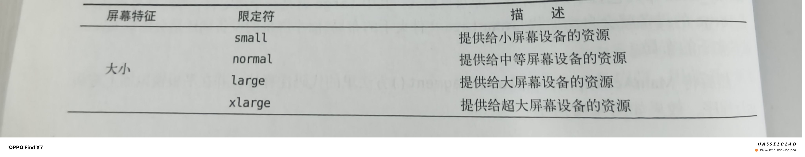

# 碎片是什么

碎片是一种可以嵌入在活动当中的UI片段，它能让程序更加合理充分地利用大屏幕的空间，因而在平板上应用广泛。

------

# 碎片的使用方式

### 碎片的简单用法

新建一个左侧碎片布局left_fragment.xml:

```java
<LinearLayout xmlns:android="http://schemas.android.com/apk/res/android"
    android:orientation="vertical"
    android:layout_width="match_parent"
    android:layout_height="match_parent">
    <Button
        android:id="@+id/button"
        android:layout_width="wrap_content"
        android:layout_height="wrap_content"
        android:layout_gravity="center_horizontal"
        android:text="Button"/>
</LinearLayout>
```

新建一个右侧碎片布局right_fragment.xml:

```java
<LinearLayout xmlns:android="http://schemas.android.com/apk/res/android"
    android:orientation="vertical"
    android:background="#00ff00"
    android:layout_width="match_parent"
    android:layout_height="match_parent">
    <TextView
        android:layout_width="wrap_content"
        android:layout_height="wrap_content"
        android:layout_gravity="center_horizontal"
        android:textSize="20sp"
        android:text="This is right fragment"/>
</LinearLayout>
```

新建一个LeftFragment类继承自Fragment(**通过LayoutInflater的inflate()方法将定义的碎片布局动态加载进去**):

```java
public class LeftFragment extends Fragment {
    @Nullable
    @Override
    public View onCreateView(@NonNull LayoutInflater inflater, @Nullable ViewGroup container, @Nullable Bundle savedInstanceState) {
        View view=inflater.inflate(R.layout.left_fragment,container,false);
        return view;
    }
}

```

同样的方法新建一个RightFragment类：

```java
public class RightFragment extends Fragment {
    @Override
    public View onCreateView(@NonNull LayoutInflater inflater, @Nullable ViewGroup container, @Nullable Bundle savedInstanceState) {
        View view=inflater.inflate(R.layout.right_fragment,container,false);
        return view;
    }
}

```

接下来修改activity_main布局中的代码：

```java
<LinearLayout xmlns:android="http://schemas.android.com/apk/res/android"
    android:orientation="horizontal"
    android:layout_width="match_parent"
    android:layout_height="match_parent"
    >
   <fragment
       android:id="@+id/left_fragment"
       android:name="com.example.fragmenttest.LeftFragment"
       android:layout_width="0dp"
       android:layout_height="match_parent"
       android:layout_weight="1"/>
   <fragment
       android:id="@+id/right_fragment"
       android:name="com.example.fragmenttest.RightFragment"
       android:layout_width="0dp"
       android:layout_height="match_parent" 
       android:layout_weight="1"/>
</LinearLayout>
```

### 动态添加碎片

(1)创建待添加的碎片实例(another_right_fragment.xml)

创建布局以及加载实例

```java
<LinearLayout xmlns:android="http://schemas.android.com/apk/res/android"
    android:orientation="vertical"
    android:background="#ffff00"
    android:layout_width="match_parent"
    android:layout_height="match_parent">
    <TextView
        android:layout_width="wrap_content"
        android:layout_height="wrap_content"
        android:layout_gravity="center_horizontal"
        android:textSize="20sp"
        android:text="This is another right fragment"/>
</LinearLayout>
```

```java
public class AnotherRightFragment extends Fragment {
    @Nullable
    @Override
    public View onCreateView(@NonNull LayoutInflater inflater, @Nullable ViewGroup container, @Nullable Bundle savedInstanceState) {
        View view=inflater.inflate(R.layout.another_right_fragment,container,false);
        return view;
    }
}

```

修改主活动布局文件：

```java
<LinearLayout xmlns:android="http://schemas.android.com/apk/res/android"
    android:orientation="horizontal"
    android:layout_width="match_parent"
    android:layout_height="match_parent"
    >
   <fragment
       android:id="@+id/left_fragment"
       android:name="com.example.fragmenttest.LeftFragment"
       android:layout_width="0dp"
       android:layout_height="match_parent"
       android:layout_weight="1"/>
   <FrameLayout
       android:id="@+id/right_layout"
       android:layout_width="0dp"
       android:layout_height="match_parent"
       android:layout_weight="1">
     </FrameLayout>
</LinearLayout>
```

(2)获取FragmentManager，在活动中可以直接通过调用getSupportFragmentManager()方法得到

(3)开启一个事务，通过调用beginTransaction()方法开启

(4)向容器内添加或替换碎片，一般使用replace()方法实现，需要传入容器的id和待添加的碎片实例

(5)提交事务，调用commit()方法来完成

```java
public class MainActivity extends AppCompatActivity {

    @Override
    protected void onCreate(Bundle savedInstanceState) {
        super.onCreate(savedInstanceState);
        setContentView(R.layout.activity_main);
       Button button=(Button) findViewById(R.id.button);
        button.setOnClickListener(new View.OnClickListener() {
          @Override
            public void onClick(View view) {
                if(view.getId()==R.id.button){
                    replaceFragment(new AnotherRightFragment());
                }
            }
        });
      replaceFragment(new RightFragment());

    }
   private void replaceFragment(Fragment fragement){
        FragmentManager fragmentManager=getSupportFragmentManager();
        FragmentTransaction transaction=fragmentManager.beginTransaction();
        transaction.replace(R.id.right_layout,fragement);
        transaction.commit();
    }
}
```

### 在碎片中模拟返回栈

利用addToBackStack()方法可以将一个事务添加到返回栈中

```java
private void replaceFragment(Fragment fragement){
        FragmentManager fragmentManager=getSupportFragmentManager();
        FragmentTransaction transaction=fragmentManager.beginTransaction();
        transaction.replace(R.id.right_layout,fragement);
        transaction.addToBackStack(null);
        transaction.commit();
}
```

### 碎片与活动之间进行通信

调用FragmentManager的findFragmentById()方法在活动中得到相应碎片的实例，然后就能轻松调用碎片里的方法

```java
RightFragment rightFragment=(RightFragment) getFragmentManager().findFragmentById(R.id.right_fragment);
```

通过getActivity可以在碎片中调用活动中的方法

```java
ManinActivity activity=(ManinActivity) getActivity(); 
```

------


# 碎片的生命周期

### 碎片的状态

（1）运行状态：

当一个碎片是可见的，并且它所关联的活动正处于运行状态时，该碎片也处于运行状态

（2）暂停状态：

当一个活动进入暂停状态时(由于另一个未占满屏幕的活动被添加到了栈顶)，与它相关联的可见碎片就会进入到暂停状态。

（3）停止状态：

当一个活动进入到停止状态时，与它相关联的碎片就会进入到停止状态，或者通过调用FragmentTransaction的remove(),replace()方法将碎片从活动中移除，但如果在事务提交之前使用addToBackStack()方法，这时的碎片也会进入到停止状态。总的来说，进入到停止状态的碎片对用户来说完全不可见，有可能被系统回收。

（4）销毁状态：

碎片总是依附于活动而存在，因此当活动被销毁时，与它相关联的碎片就会进入到销毁状态。或者通过调用FragmentTransaction的remove(),replace()方法将碎片从活动中移除，但如果在事务提交之前没有使用addToBackStack()方法，这时碎片也会进入到销毁状态。

### 碎片的回调方法

onAttach().当碎片和活动建立起关联的时候调用

onCreateView().为碎片加载布局时调用

onActivityCreated().确保与碎片相关联的活动一定已经创建完毕时使用

onDestroyView().当与碎片相关联的视图被移除的时候调用

onDetach().当碎片和活动解除关联时调用

碎片的完整生命周期示意图：


### 体验碎片的生命周期

```java
public class RightFragment extends Fragment {
    public static final String TAG="RightFragment";

    @Override
    public void onAttach(@NonNull Context context) {
        super.onAttach(context);
        Log.d(TAG, "onAttach");
    }

    @Override
    public void onCreate(@Nullable Bundle savedInstanceState) {
        super.onCreate(savedInstanceState);
        Log.d(TAG, "onCreate");
    }
    @Nullable
    @Override
    public View onCreateView(@NonNull LayoutInflater inflater, @Nullable ViewGroup container, @Nullable Bundle savedInstanceState) {
        Log.d(TAG, "onCreateView");
        View view=inflater.inflate(R.layout.right_fragment,container,false);
        return view;
    }

    @Override
    public void onActivityCreated(@Nullable Bundle savedInstanceState) {
        super.onActivityCreated(savedInstanceState);
        Log.d(TAG, "onActivityCreated");
    }

    @Override
    public void onStart() {
        super.onStart();
        Log.d(TAG, "onStart");
    }

    @Override
    public void onResume() {
        super.onResume();
        Log.d(TAG, "onResume");
    }

    @Override
    public void onPause() {
        super.onPause();
        Log.d(TAG, "onPause");
    }

    @Override
    public void onStop() {
        super.onStop();
        Log.d(TAG, "onStop");
    }

    @Override
    public void onDestroyView() {
        super.onDestroyView();
        Log.d(TAG, "onDestroyView");
    }

    @Override
    public void onDestroy() {
        super.onDestroy();
        Log.d(TAG, "onDestroy");
    }

    @Override
    public void onDetach() {
        super.onDetach();
        Log.d(TAG, "onDetach");
    }
}
```

------


# 加载动态布局的技巧

### 使用限定符

新建一个layout-large文件夹并在里面添加activity_main布局，layout中布局是单页模式，layout-large中布局是双页模式。其中large便是限定符，那些屏幕大的会自动识别并使用layout-large布局,屏幕小的则使用layout布局

### 常见限定符如下图所示




### 使用最小宽度限定符

想更加灵活地为不同设备加载布局，这时就可以用到最小宽度限定符，这允许我们对屏幕宽度指定一个最小值，以这个值为临界，比这个大的加载一个布局，比这个小的加载另一个布局。

例子：

在res下新建layout-sw600dp文件夹，宽度大于600dp的加载layout-sw600dp上的布局，宽度小于600dp的加载layout上的布局

------


