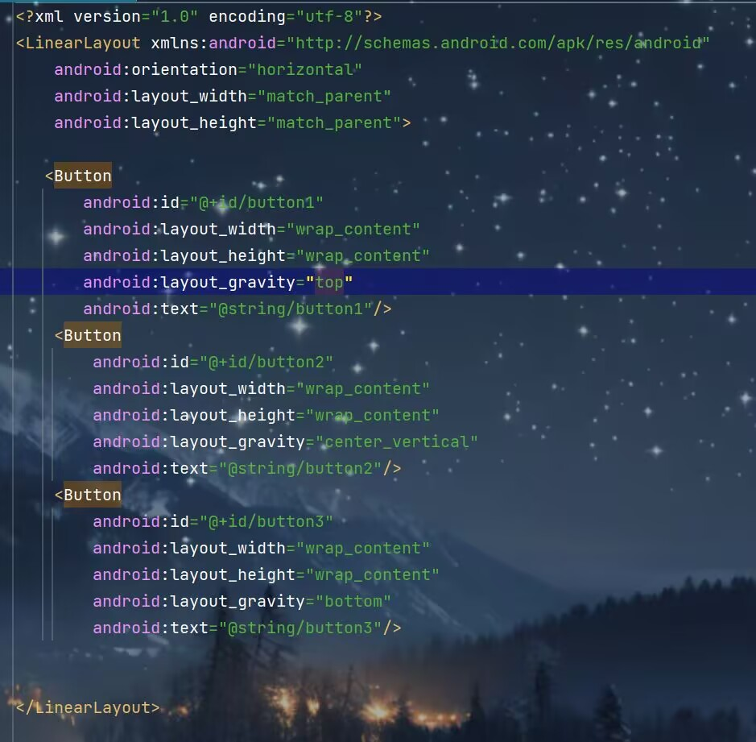
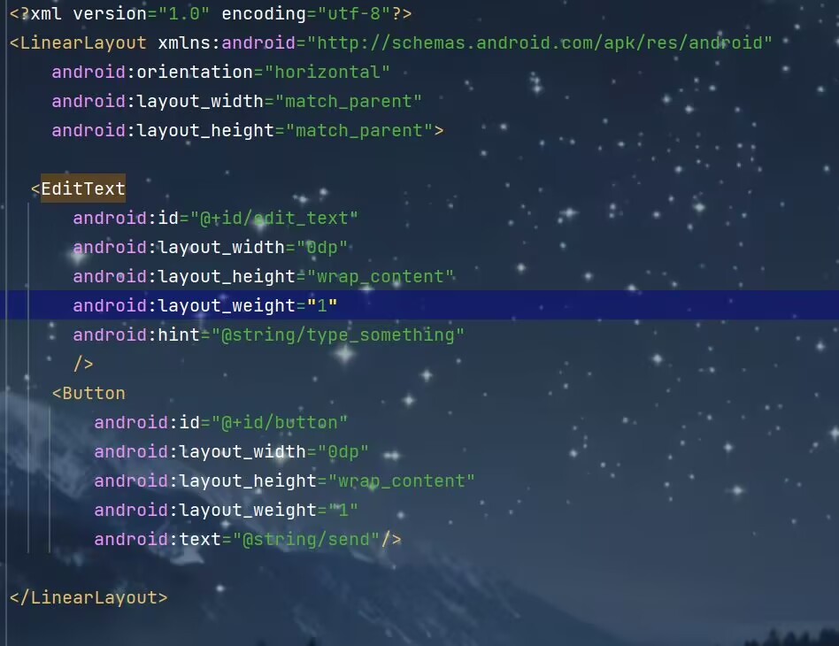
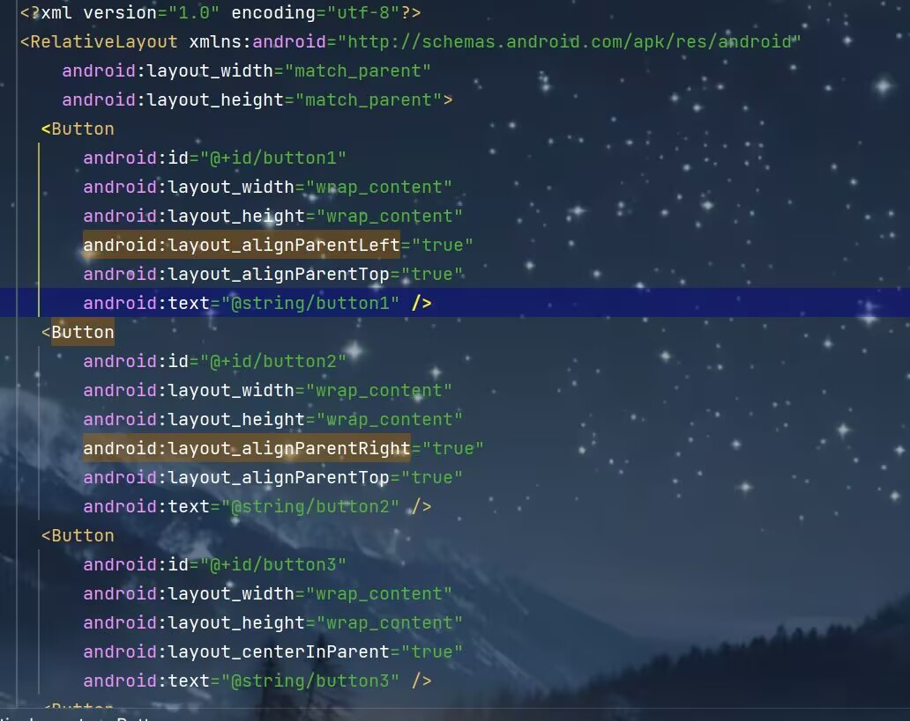
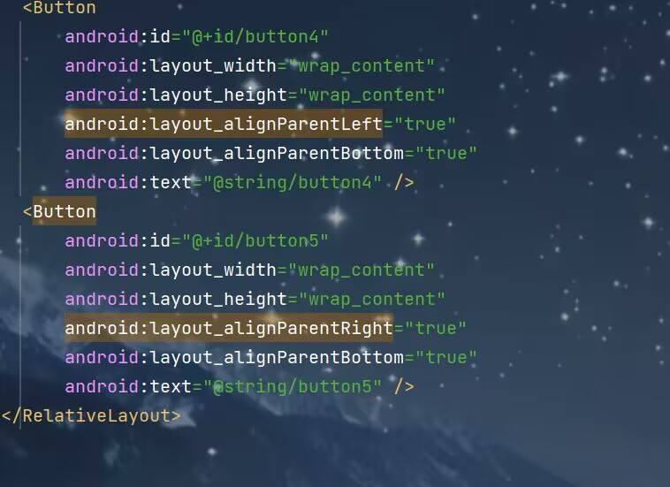
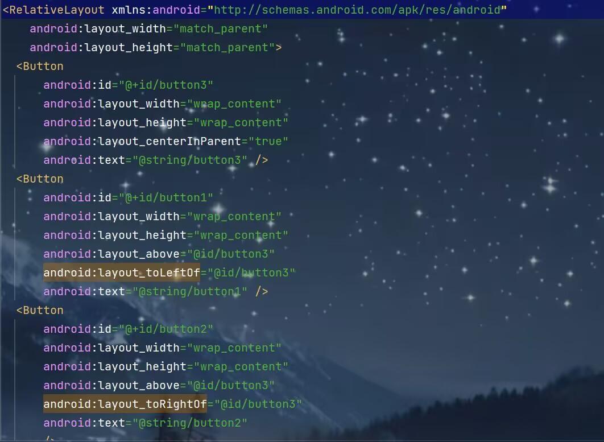
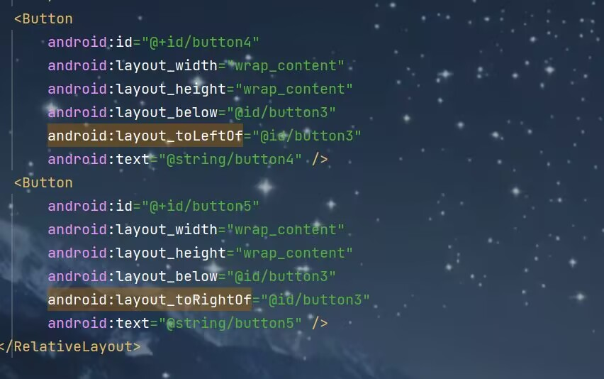

# 常用控件

### TextView

```kotlin
<TextView
        android:id="@+id/textView"//定义唯一标识符
        android:layout_width="match_parent"//控件宽度
        android:layout_height="wrap_content"//控件高度
        android:gravity="center"//文字位置
        android:textColor="@color/red"//文字颜色
        android:textSize="24sp"//文字大小
        android:text="This is TextView"//文字内容
       />
```


### Button

```kotlin
<Button
        android:id="@+id/button"
        android:layout_width="match_parent"
        android:layout_height="wrap_content"
        android:text="Button"/>
```

**点击事件：**

(1)

```kotlin
 myBinding.button.setOnClickListener {
     //代码逻辑
 }
```

(2)接口法

```kotlin
class MainActivity : AppCompatActivity(),View.OnClickListener {
    override fun onCreate(savedInstanceState: Bundle?) {
                   ......
    }
    override fun onClick(v: View?) {
        when(v?.id){
            R.id.button->{
                //在此处添加逻辑
            }
        }
    }
}
```


### EditText

```kotlin
<EditText
        android:id="@+id/editText"
        android:layout_width="match_parent"
        android:layout_height="wrap_content"
        android:textSize="26dp"
        android:hint="Type something here"//提示性文字
        android:maxLines="2"//最大行数
        />
```


### ImageView

```kotlin
<ImageView
        android:id="@+id/imageView"
        android:layout_width="wrap_content"
        android:layout_height="wrap_content"
        android:src="@drawable/ic_launcher_background"/>
```

**动态变化ImageView中图片**

```kotlin
 myBinding.button.setOnClickListener {
            myBinding.imageView.setImageResource(R.drawable.b)
        }
```


### ProgressBar

```kotlin
<ProgressBar
        android:id="@+id/progressBar"
        android:layout_width="match_parent"
        android:layout_height="wrap_content"
        style="?android:attr/progressBarStyleHorizontal"//进度条样式
        android:max="100"/>//进度条最大值
```


### AlertDialog

```kotlin
AlertDialog.Builder(this).apply {
                setTitle("This is Dialog")
                setMessage("Something important")
                setCancelable(false)//点击别的地方是否可以取消弹出框
                setPositiveButton("OK"){
                    dialog,which->
                }
                setNegativeButton("Cancel"){
                    dialog,which->
                }
                show()
            }
```


------

# 布局

### LinearLayout



android:layout_weight这个属性允许我们使用比例的方式来指定控件的大小。使用这个时要把layout_width的值设为“0dp”



### RelativeLayout

**相对父布局**





**相对其他控件**

**注：**引用控件放在前面





**其他定位属性:**
android:layout_alignLeft表示让一个控件的左边缘同另一个控件左边缘对齐
android:layout_alignRight表示让一个控件的右边缘同另一个控件右边缘对齐
android:layout_alignTop
android:layout_alignBottom

### FrameLayout

FrameLayout又叫帧布局，应用场景较少，所有控件都会默认摆在布局左上角，也可以使用android:layout_gravity进行对齐操作，此方法应用场景过少，不做过多赘述

------

# 自定义控件

### 引入布局

1.创建一个子项布局

2.在相应活动布局中引用该布局

```kotlin
<?xml version="1.0" encoding="utf-8"?>
<LinearLayout xmlns:android="http://schemas.android.com/apk/res/android"
    android:orientation="horizontal"
    android:layout_width="match_parent"
    android:layout_height="wrap_content"
    android:background="@drawable/title_bg">
    <Button
        android:id="@+id/titleBack"
        android:layout_width="wrap_content"
        android:layout_height="wrap_content"
        android:text="Back"
        android:layout_gravity="center"
        android:layout_margin="5dp"
        android:textColor="#fff"
        android:background="@drawable/back_bg"/>

    <TextView
        android:id="@+id/titleText"
        android:layout_width="0dp"
        android:layout_height="wrap_content"
        android:layout_weight="1"
        android:text="Title Text"
        android:gravity="center"
        android:layout_gravity="center"
        android:textColor="@color/black"
        android:textSize="24sp"
        />
    <Button
        android:id="@+id/titleEdit"
        android:layout_width="wrap_content"
        android:layout_height="wrap_content"
        android:text="Edit"
        android:layout_gravity="center"
        android:layout_margin="5dp"
        android:textColor="#fff"
        android:background="@drawable/edit_bg"/>
</LinearLayout>
```

```kotlin
<include layout="@layout/title"/>
```

因为建立的是标题栏需要将系统自带的隐藏

```kotlin
supportActionBar?.hind()
```

### 创建自定义控件

1.新建一个自定义类继承LinearLayout作为控件

2.在布局文件中添加这个控件

3.在自定义类中添加点击事件

```kotlin
class TitleLayout(context: Context,attrs:AttributeSet):LinearLayout(context,attrs) {
    init {
        //动态加载标题栏布局
        LayoutInflater.from(context).inflate(R.layout.title,this)
        val titleBack=findViewById<Button>(R.id.titleBack)
        val titleEdit=findViewById<Button>(R.id.titleEdit)
        titleBack.setOnClickListener {
            val activity =context as Activity
            activity.finish()
        }
        titleEdit.setOnClickListener {
            Toast.makeText(context,"You clicked edit button",Toast.LENGTH_SHORT).show()
        }
    }
}
```

```kotlin
 <com.example.uicustomviews.TitleLayout
        android:layout_width="match_parent"
        android:layout_height="wrap_content"
/>
```

------

# ListView

1.在布局中添加该控件

2.制作一个适配器并定义一个类作为适配器类型

3.定义一个子项布局

4.将适配器和**listview**建立联系

5.定义其点击事件

```kotlin
<?xml version="1.0" encoding="utf-8"?>
<LinearLayout xmlns:android="http://schemas.android.com/apk/res/android"
    android:layout_width="match_parent"
    android:layout_height="match_parent"
   >
    <ListView
        android:id="@+id/listView"
        android:layout_width="match_parent"
        android:layout_height="match_parent"/>
</LinearLayout>
```

```kotlin
//适配器类型
class Fruit(val name:String,val imageId:Int)
```

```kotlin
class FruitAdapter(activity: Activity,val resourceId:Int,data:List<Fruit>):ArrayAdapter<Fruit>(activity,resourceId,data) {
    //用于对控件实例进行缓存
    inner class ViewHolder(val fruitImage:ImageView,val fruitName:TextView)
    //该方法在每个子项被滚动到屏幕内的时候会被调用
    override fun getView(position: Int, convertView: View?, parent: ViewGroup): View {
        val view:View
        val viewHolder:ViewHolder
        //利用convertView对加载好的布局进行缓存以便于复用
        //不为空则调用之前缓存的布局控件
        if(convertView!=null){
            view=convertView
            viewHolder=view.tag as ViewHolder
        }
        else{
            //动态加载布局
            view =LayoutInflater.from(context).inflate(resourceId,parent,false)
            //获取控件实例
            val fruitImage:ImageView=view.findViewById(R.id.fruit_image)
            val fruitName:TextView=view.findViewById(R.id.fruitName)
           //缓存控件实例以便于复用
            viewHolder=ViewHolder(fruitImage,fruitName)
            //利用View的setTag()方法将viewHolder对象存储在View中
            view.tag=viewHolder
        }
        //获取当前项的Fruit实例
        val fruit=getItem(position)
        //设置图片和文本
        if(fruit!=null){
            viewHolder.fruitImage.setImageResource(fruit.imageId)
            viewHolder.fruitName.text=fruit.name
        }
        return view
    }
}
```

```kotlin
<?xml version="1.0" encoding="utf-8"?>
<LinearLayout xmlns:android="http://schemas.android.com/apk/res/android"
    android:layout_width="match_parent"
    android:layout_height="60dp">
    <ImageView
        android:id="@+id/fruit_image"
        android:layout_width="40dp"
        android:layout_height="40dp"
        android:layout_gravity="center_vertical"
        android:layout_marginLeft="10dp"/>
    <TextView
        android:id="@+id/fruitName"
        android:layout_width="wrap_content"
        android:layout_height="wrap_content"
        android:layout_gravity="center_vertical"
        android:layout_marginLeft="10dp"/>
</LinearLayout>
```

```kotlin
  private val fruitList=ArrayList<Fruit>()
//获取适配器实例
val adapter=FruitAdapter(this,R.layout.fruit_item,fruitList)
//建立联系
        binding.listView.adapter=adapter
```

```kotlin
 //设置点击事件
binding.listView.setOnItemClickListener { _, _, position, _ ->
            val fruit=fruitList[position]
            Toast.makeText(this,fruit.name,Toast.LENGTH_SHORT).show()
        }
```

------

# RecyclerView

1.添加依赖库

2.添加控件

3.准备一个适配器并定义一个适配器类型

4.定义一个子项布局

5.将适配器和**RecyclerView**建立联系并设置其布局形式

6.设置点击事件(在适配器的**onCreateViewHolder()**方法中设置)

```kotlin
implementation ("androidx.recyclerview:recyclerview:1.3.2")
```

```kotlin
<?xml version="1.0" encoding="utf-8"?>
<LinearLayout xmlns:android="http://schemas.android.com/apk/res/android"
    android:layout_width="match_parent"
    android:layout_height="match_parent">
    <androidx.recyclerview.widget.RecyclerView
        android:id="@+id/recyclerView"
        android:layout_width="match_parent"
        android:layout_height="match_parent"/>
</LinearLayout>
```

```kotlin
//适配器类型
class Fruit(val name:String,val imageId:Int)
```

```kotlin
class FruitAdapter(val fruitList: List<Fruit>):RecyclerView.Adapter<FruitAdapter.ViewHolder>() {
    //内部类ViewHolder存储控件
    inner class ViewHolder(view: View):RecyclerView.ViewHolder(view){
        val fruitImage:ImageView=view.findViewById(R.id.fruit_image)
        val fruitName:TextView=view.findViewById(R.id.fruitName)

    }

    override fun onCreateViewHolder(parent: ViewGroup, viewType: Int): ViewHolder {
        //动态加载布局
        val view=LayoutInflater.from(parent.context).inflate(R.layout.fruit_item,parent,false)
        //获取viewHolder实例
        val viewHolder=ViewHolder(view)
        //设置点击事件
        viewHolder.itemView.setOnClickListener {
            //获取位置
            val position=viewHolder.adapterPosition
            //获取实体类实例
            val fruit=fruitList[position]
            //具体事件
            Toast.makeText(parent.context,"you clivked view ${fruit.name}",Toast.LENGTH_SHORT).show()
        }
        viewHolder.fruitImage.setOnClickListener {
             //获取位置
            val position=viewHolder.adapterPosition
            //获取实体类实例
            val fruit=fruitList[position]
             //具体事件
            Toast.makeText(parent.context,"you clivked image ${fruit.name}",Toast.LENGTH_SHORT).show()
        }
        return viewHolder
    }
//对RecyclerView的子项数据进行赋值
    @SuppressLint("SuspiciousIndentation")
    override fun onBindViewHolder(holder: ViewHolder, position: Int) {
      val fruit =fruitList[position]
        holder.fruitImage.setImageResource(fruit.imageId)
        holder.fruitName.text=fruit.name
    }
    override fun getItemCount()=fruitList.size
}
```

```kotlin
<?xml version="1.0" encoding="utf-8"?>
<LinearLayout xmlns:android="http://schemas.android.com/apk/res/android"
    android:layout_width="match_parent"
    android:layout_height="60dp">
    <ImageView
        android:id="@+id/fruit_image"
        android:layout_width="40dp"
        android:layout_height="40dp"
        android:layout_gravity="center_vertical"
        android:layout_marginLeft="10dp"/>
    <TextView
        android:id="@+id/fruitName"
        android:layout_width="wrap_content"
        android:layout_height="wrap_content"
        android:layout_gravity="center_vertical"
        android:layout_marginLeft="10dp"/>
</LinearLayout>
```

```kotlin
class MainActivity : AppCompatActivity() {
    private val fruitList=ArrayList<Fruit>()
    private lateinit var binding:ActivityMainBinding
    override fun onCreate(savedInstanceState: Bundle?) {
        super.onCreate(savedInstanceState)
        binding=ActivityMainBinding.inflate(layoutInflater)
        setContentView(binding.root)
        //初始化数据
        initFruits()
        //创建LinearLayoutManager对象
        //LayoutManager用于指定布局方式，LinearLayoutManager(this)指线性布局，GridLayoutManager()是网格布局
       //设置布局排列方向(线性布局)
       /* layoutManager.orientation=LinearLayoutManager.HORIZONTAL*/
        //瀑布流布局传入两个参数第一个指定布局的列数，第二个指定布局排列的方向
        val layoutManager=StaggeredGridLayoutManager(3,StaggeredGridLayoutManager.VERTICAL)
        //将该对象设置到recyclerView中
        binding.recyclerView.layoutManager=layoutManager
        //获取FruitAdapter实例
        val adapter=FruitAdapter(fruitList)
        //完成适配器设置
        binding.recyclerView.adapter=adapter
    }

    private fun initFruits() {
        repeat(2) {
            fruitList.add(Fruit(getRandomLengthName("Apple"), R.drawable.apple_pic))
            fruitList.add(Fruit(getRandomLengthName("Banana"), R.drawable.banana_pic))
            fruitList.add(Fruit(getRandomLengthName("Orange"), R.drawable.orange_pic))
            fruitList.add(Fruit(getRandomLengthName("Watermelon"), R.drawable.watermelon_pic))
            fruitList.add(Fruit(getRandomLengthName("Pear"), R.drawable.pear_pic))
            fruitList.add(Fruit(getRandomLengthName("Grape"), R.drawable.grape_pic))
            fruitList.add(Fruit(getRandomLengthName("Pineapple"), R.drawable.pineapple_pic))
            fruitList.add(Fruit(getRandomLengthName("Strawberry"), R.drawable.strawberry_pic))
            fruitList.add(Fruit(getRandomLengthName("Cherry"), R.drawable.cherry_pic))
            fruitList.add(Fruit(getRandomLengthName("Mango"), R.drawable.mango_pic))
        }
    }

    private fun getRandomLengthName(name: String): String {
        val n=(1..20).random()
        val builder = StringBuilder()
       repeat(n){
           builder.append(name)
       }
        return builder.toString()
    }
}
```

------

