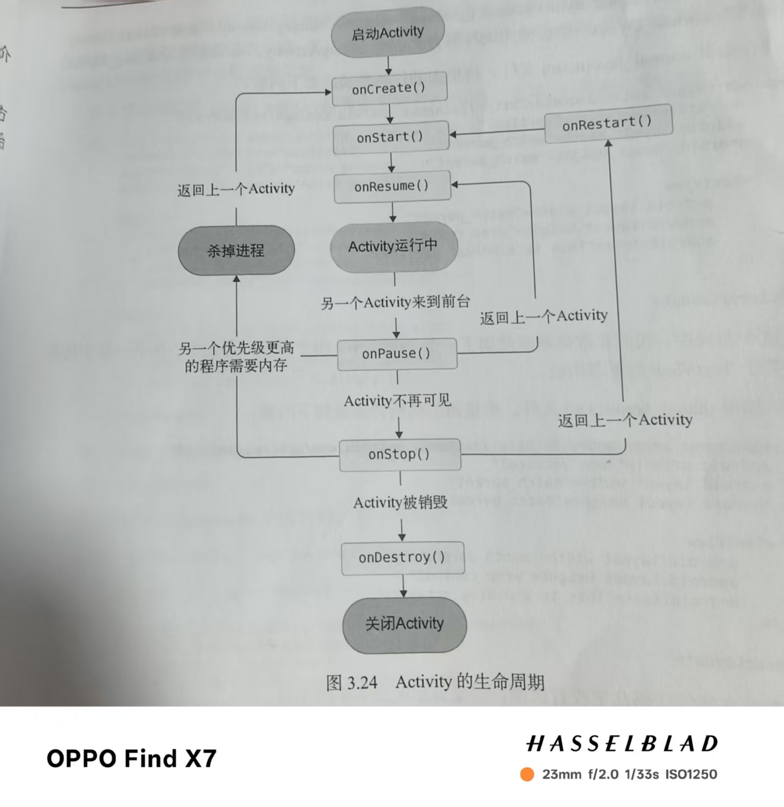
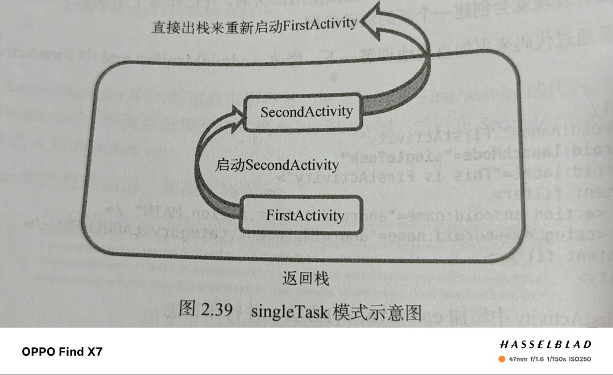

# Toast

1.一种提醒方式

2.用法

```kotlin
 val button1: Button = findViewById(R.id.button1)
            button1.setOnClickListener {
                Toast.makeText(this,"You clicked out",Toast.LENGTH_SHORT).show()
            }
```

------

# ViewBinding

1.先在build.gradle.kts(app)中导入ViewBinding

2.声明该类型

3.绑定布局

```kotlin
android {
    // 启用 ViewBinding
    viewBinding {
        enable = true
    }
}
```

```kotlin
class FirstActivity : BaseActivity() {
          //声明变量
        private lateinit var myBinding:FirstActivityBinding
        override fun onCreate(savedInstanceState: Bundle?) {
            super.onCreate(savedInstanceState)
            //绑定布局
            myBinding=FirstActivityBinding.inflate(layoutInflater)
            setContentView(myBinding.root)
            //使用
            myBinding.button1.setOnClickListener {

            }
        }
    }
```

------

# Menu

1.创建**menu**文件夹并创建**Menu resource file**

2.重写**onCreateOptionsMenu()**方法对菜单完成创建

3.重写**onOptionsItemSelected()**方法设计点击事件

```kotlin
override fun onCreateOptionsMenu(menu: Menu?): Boolean {
            menuInflater.inflate(R.menu.main, menu)
            return true
        }

        override fun onOptionsItemSelected(item: MenuItem): Boolean {
            when (item.itemId) {
                R.id.add_item -> Toast.makeText(this, "you clicked add", Toast.LENGTH_SHORT).show()
                R.id.remove_item -> Toast.makeText(this, "you clicked remove", Toast.LENGTH_SHORT)
                    .show()
            }
            return true
        }
```

------

# Intent

### 显式Intent

```kotlin
   val intent=Intent(this,SecondActivity::class.java)//SecondActivity::class.java相当于Java中的SecondActivity.class 
   startActivity(intent)
```

### 隐式Intent

1.在<intent-filter>标签下配置<action>和<category>

2.直接将action传入Intent构造函数中

3只有<action>和<category>同时匹配才能响应

```kotlin
        <activity
            android:name=".SecondActivity"
            android:exported="false">
            <intent-filter>
                <action android:name="com.example.activitytest.ACTION_START" />
                <category android:name="android.intent.category.DEFAULT" />
                <category android:name="com.example.activitytest.MY_CATEGORY" />
            </intent-filter>
        </activity>
```


```kotlin
val intent=Intent("com.example.activitytest.ACTION_START")
//添加category(action只有一个category可以有多个)
intent.addCategory("com.example.activitytest.MY_CATEGORY")
startActivity(intent)
```

### 隐式Intent用法

1.调用系统浏览器

```kotlin
            val intent=Intent(Intent.ACTION_VIEW)
            intent.data= Uri.parse("https://www.baidu.com")
            startActivity(intent)
```

2.调用电话

```kotlin
            val intent=Intent(Intent.ACTION_DIAL)
            intent.data= Uri.parse("tel:10086")
            startActivity(intent)
```

### 向下一个活动传递数据

利用putExtra传入一个键值对

```kotlin
            val data="Hello SecondActivity"
            val intent=Intent(this,SecondActivity::class.java)
            intent.putExtra("extra_data",data)
            startActivity(intent)
```

利用getStringExtra接收数据传入“键”

```kotlin
val extraData=intent.getStringExtra("extra_data")
```

### 向上一活动返回数据

1.第一个活动中通过startActivityForResult启动活动

2.第二个活动构建要传输的数据

3.在第一个活动中重onActivityResult方法得到返回数据

```kotlin
myBinding.button1.setOnClickListener {
    val intent=Intent(this,SecondActivity::class.java)
            startActivityForResult(intent,1)
}
```

```kotlin
           button2.setOnClickListener {
           val intent= Intent()
            intent.putExtra("data_return","Hello FirstActivity!!!")
            setResult(RESULT_OK,intent)
            finish()
           }
```

```kotlin
override fun onActivityResult(requestCode: Int, resultCode: Int, data: Intent?) {
            super.onActivityResult(requestCode, resultCode, data)
            when (requestCode) {
                1 -> if (resultCode == RESULT_OK) {
                    val returnData = data?.getStringExtra("data_return")
                    Log.d("FirstActivity", "returned data is $returnData ")
                }
            }
        }
```

如果通过back键返回：

```kotlin
override fun onBackPressed() {
        val intent= Intent()
        intent.putExtra("data_return","Hello FirstActivity")
        setResult(RESULT_OK,intent)
        finish()
    }
```

------

# Activity生命周期

### 生存期

**1. onCreate()**

作用：

当 Activity 第一次被创建时调用。在这个方法中，你通常会完成以下工作：

- 设置布局文件（例如调用 `setContentView()`）
- 初始化控件、变量和数据
- 配置基本组件（如 Toolbar、Fragment 等）

**2.onStart()**

作用：

在 `onCreate()` 之后调用，此时 Activity 已经对用户可见，但还未获得焦点，也就是还不能进行用户交互。通常在这里启动一些即将进入前台的操作。

**3.onResume()**

作用：

在 `onStart()` 之后调用，此时 Activity 已经位于前台，并且可以接收用户的输入和交互。这也是应用处于“运行”状态的主要阶段。

**4.onPause()**

作用：

当系统准备启动或恢复另一个 Activity 时调用，此时当前 Activity 仍然部分可见，但失去了用户焦点。通常在这里进行轻量级的保存工作，比如暂停动画、保存数据或释放一些占用较多资源的操作。

**5.onStop()**

作用：

当 Activity 完全对用户不可见时调用，可能是因为新的 Activity 覆盖在上面或 Activity 被销毁。通常在这里释放不再需要的资源，并执行较重的保存工作。

**6.onDestroy()**

作用：

在 Activity 被完全销毁之前调用。这可能是因为用户主动关闭 Activity 或系统由于资源不足而销毁 Activity。在此方法中需要清理所有占用的资源，确保内存没有泄漏。

**7.onRestart()**

作用：

当一个已停止的 Activity 将要重新启动时调用，此方法紧接在 `onStop()` 之后调用，然后进入 `onStart()`。常用于重新初始化在 `onStop()` 中释放的资源或状态恢复。

### 生存期类别

**1.完整生存期： **

 onCreate()，onStart()，onResume()，onPause()，onStop()，onDestroy()

**2.可见生存期：**

onStart()，onResume()，onPause()，onStop()

**3.前台生存期：**

onResume()，onPause()



### Activity被回收了咋办

1.重写onSaveInstanceState()方法保存数据

2.利用onCreate()方法中的Bundle类型读取数据

```kotlin
 override fun onSaveInstanceState(outState: Bundle) {
        super.onSaveInstanceState(outState)
        val tempData="Something you just typed"
        outState.putString("data_key",tempData)
    }

```

```kotlin
override fun onCreate(savedInstanceState: Bundle?) {
        super.onCreate(savedInstanceState)
        setContentView(R.layout.activity_main)
        if(savedInstanceState!=null){
            val tempData=savedInstanceState.getString("data_key")
            Log.d(TAG, "tempData is $tempData")
        }
    }
```

------

# Activity启动模式

### standard

默认设置，每点击一次按钮均会生成一个新的活动，不管这个活动是否存在

### singleTop

1.在<activity>标签中添加android:launchMode属性更改

2.作用：

创建活动时会先检查栈顶的是否是该活动，如果栈顶的活动是该活动则直接调用如果不是创建新活动

3.原理图


### singleTask

1.在<activity>标签中添加android:launchMode属性更改

2.作用：

每次启动该活动时会先检查栈中是否有该活动如果有会直接调用并将该活动上方其他活动直接出栈，如果没有则创建新活动

3.原理图：



### singleInstance

1.在<activity>标签中添加android:launchMode属性更改

2.作用：

会启用一个新的返回栈来管理该活动，可以实现不同程序之间共享Activity实例

3.原理图：


------

# Activity最佳实践

### 知晓当前是哪个活动

1.建立BaseActivity类

2.在该类onCreate方法中打印一行日志打印当前类名

3.其余所以活动继承该类

```kotlin
open class BaseActivity:AppCompatActivity() {

    override fun onCreate(savedInstanceState: Bundle?) {
        super.onCreate(savedInstanceState)
        Log.d("BaseActivity", javaClass.simpleName)
    }
}
```

### 随时随地退出程序

1.新建一个单例类管理所有活动

2.修改BaseActivity类中方法实现添加删除

3.调用方法退出程序

```kotlin
object ActivityCollector {
    private val activities=ArrayList<Activity>()
    fun addActivity(activity:Activity){
        activities.add(activity)
    }
    fun removeActivity(activity: Activity){
        activities.remove(activity)
    }
    fun finishAll(){
        for(activity in activities){
            if(!activity.isFinishing) {
                activity.finish()
            }
        }
        activities.clear()
    }
}
```

```kotlin
open class BaseActivity:AppCompatActivity() {

    override fun onCreate(savedInstanceState: Bundle?) {
        super.onCreate(savedInstanceState)
        Log.d("BaseActivity", javaClass.simpleName)
        ActivityCollector.addActivity(this)
    }

    override fun onDestroy() {
        super.onDestroy()
        ActivityCollector.removeActivity(this)
    }

}
```

```kotlin
ActivityCollector.finishAll()
```

也可以在最后加一个杀掉当前进程的代码，来保证完全退出程序

```kotlin
android.os.Process.killProcess(android.os.Process.myPid())
```


### 启动Activity最佳写法

```kotlin
// 在要启动的活动内添加该静态方法
companion object {
    // 封装启动 SecondActivity 的静态方法
    fun actionStart(context: Context, data: String) {
        // 创建一个 Intent 对象，指定从当前上下文启动 SecondActivity
        val intent = Intent(context, SecondActivity::class.java)
        // 将传入的字符串数据作为额外参数存入 Intent，
        // "extra_data" 为键，用于在 SecondActivity 中提取该数据
        intent.putExtra("extra_data", data)
        // 通过上下文启动 SecondActivity
        context.startActivity(intent)
    }
}
```

```kotlin
   button1.setOnClickListener {
         SecondActivity.actionStart(this, "data")
 }
```

------


