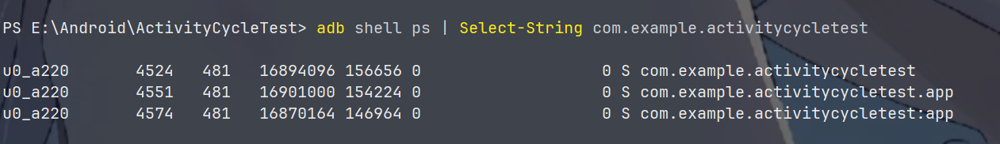

### 开启多线程模式、

**开启的方法**

- 在Android中使用多进程只有一种方法，那就是给四大组件指定android:process属性
- 还有一种非常规的方法是通过JNI在native层去fork一个新的进程，但一般不做考虑

**实例**

```xml
<activity
            android:name=".ThirdActivity"
            android:exported="false"
            android:process=":app"/>
        <activity
            android:name=".SecondActivity"
            android:configChanges="screenLayout"
            android:exported="false"
            android:launchMode="singleTask"
            android:process="com.example.activitycycletest.app"/>
        <activity
            android:name=".MainActivity"
            android:configChanges="orientation|screenSize"
            android:exported="true">
            <intent-filter>
                <action android:name="android.intent.action.MAIN" />
                <category android:name="android.intent.category.LAUNCHER" />
            </intent-filter>
        </activity>
```



**查询进程的方法**

在终端输入命令

`adb shell ps | Select-String +包名`

**进程分类**

- 进程名以“：”开头的属于当前应用的私有进程，其他应用的组件不可以和他跑在同一个进程中，而进程名不以“：”开头的属于全局进程，其他应用通过ShareUID方式可以和他跑在同一个进程中
- 两个应用通过ShareUID跑在同一个进程中是有要求的，需要两个应用有相同的ShareUID并且签名相同才可以
