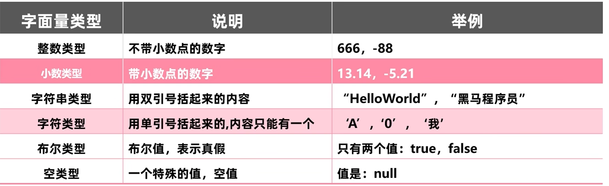
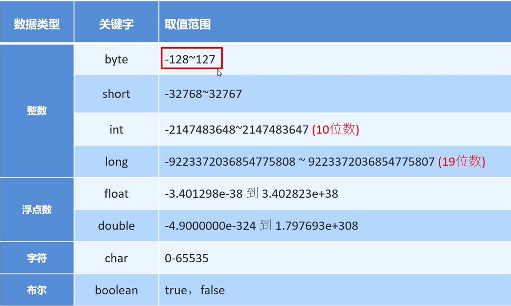

# 注释

### 注释的定义

- 注释是在程序指定位置添加的说明性信息
- 对代码的解释，不参与编译

### 分类

- 单行注释  格式`//注释信息`
- 多行注释  格式`/* 注释信息 */`
- 文档注释 格式`/**注释信息*/`

------

# 关键字

### 特点及定义

- 被java赋予特定含义的英文单词
- 关键字字母全部小写

### class

- 用于创建或定义一个类
- 类是java最基本的组成单元

------

# 字面量

### 分类

### '\t'制表符

在打印的时候，把前面字符串的长度补齐到8，或者8的整数倍。最少补1个空格，最多补8个。

------

# 数据类型

### 分类

基本数据类型和引用数据类型

### 基本数据类型

- **long**和**float**数据类型后面需要分别加上**L**和**F**标识

### 取值范围大小关系

double>float>long>int>short>byte

------

# 标识符

### 命名规则-----硬性规则

- 由数字，字母，下划线，美元符组成
- 不能以数字开头
- 不能是关键字
- 区分大小写

### 命名规则-----软性建议

1. **小驼峰命名法(适用于方法，变量)**
   - 标识符是一个单词时，全部小写
   - 标识符是多个单词时，第一个单词首字母小写其他单词首字母大写
2. **大驼峰命名法(适用于类名)**
   - 标识符是一个单词时，首字母大写
   - 标识符是多个单词时，每个单词的首字母大写

------

