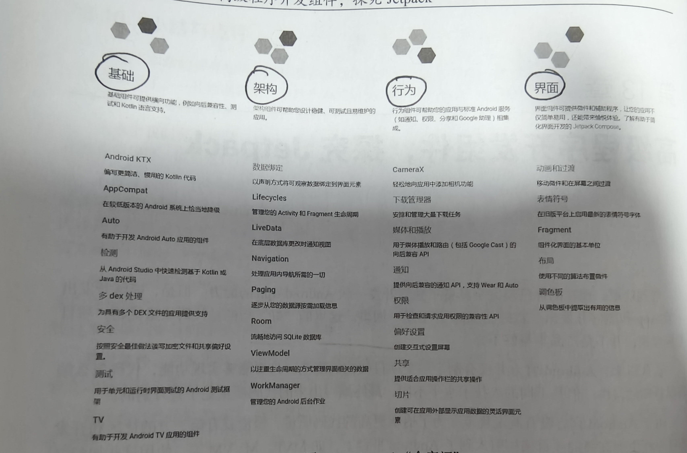
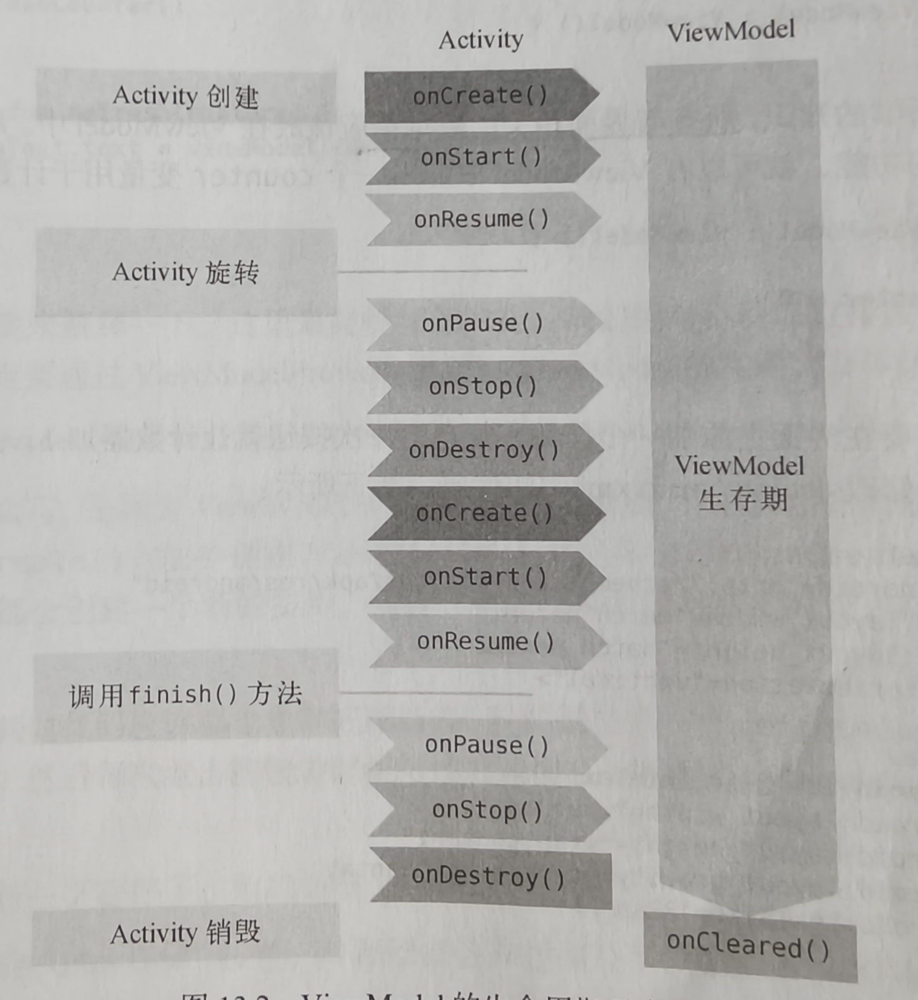

# Jetpack

### Jetpack全家福



------

# ViewModel

### 作用

帮助Activity分担一部分工作，专门用于存放与界面相关的数据的，他可以保证在手机屏幕发生旋转时不会被重新创建，数据不会丢失

### 生命周期



### 用法

- 添加依赖

- 创建一个ViewModel类继承自ViewModel()

- 把界面相关的数据都放入其中

- 在Activity或fragment中创建其实例

- 构建相关逻辑

  ```kotlin
  implementation ("androidx.lifecycle:lifecycle-viewmodel-ktx:2.6.2") // Kotlin 版本
  implementation ("androidx.lifecycle:lifecycle-viewmodel:2.6.2")     // Java 版本
  ```

  ```kotlin
  class MainViewModel(countReserved: Int) : ViewModel() {
  	var counter=0
  }
  ```

  ```kotlin
  class MainActivity : AppCompatActivity() {
      private lateinit var binding: ActivityMainBinding
      lateinit var viewModel: MainViewModel
      override fun onCreate(savedInstanceState: Bundle?) {
          super.onCreate(savedInstanceState)
          binding=ActivityMainBinding.inflate(layoutInflater)
          setContentView(binding.root)
          //获取实例
          viewModel=ViewModelProvider(this).get(MainViewModel::class.java)
          binding.plus.setOnClickListener {
              viewModel.counter++
              refreshCounter()
          }
          refreshCounter()
  }
      private fun refreshCounter(){
          binding.infoText.text=viewModel.counter.toString()
      }o
  }
  ```

### 像ViewModel传递参数

- 添加参数

- 新建ViewModelFactory类，实现ViewModelProvider.Factory接口

- 利用SharedPreferences保存数据

- 读取数据，将数据传入到ViewModelFactory的构造函数中

  ```kotlin
  class MainViewModel(countReserved: Int) : ViewModel() {
     var counter=countReserved
  }
  ```

  ```kotlin
  class MainViewModelFactory(private val countReserved:Int):ViewModelProvider.Factory {
      override fun <T : ViewModel> create(modelClass: Class<T>): T {
          return MainViewModel(countReserved) as T
      }
  }
  ```

  ```kotlin
  class MainActivity : AppCompatActivity() {
      private lateinit var binding: ActivityMainBinding
      lateinit var viewModel: MainViewModel
      lateinit var sp:SharedPreferences
      override fun onCreate(savedInstanceState: Bundle?) {
          super.onCreate(savedInstanceState)
          binding=ActivityMainBinding.inflate(layoutInflater)
          setContentView(binding.root)
          sp=getPreferences(Context.MODE_PRIVATE)
          val contReserved=sp.getInt("count_reserved",0)
          viewModel=ViewModelProvider(this,MainViewModelFactory(contReserved)).get(MainViewModel::class.java)
          binding.plus.setOnClickListener {
              viewModel.counter++
              refreshCounter()
          }
          binding.clear.setOnClickListener {
              viewModel.counter=0
              refreshCounter()
          }
          refreshCounter() 
      }
      private fun refreshCounter(){
          binding.infoText.text=viewModel.counter.toString()
      }
  
      override fun onPause() {
          super.onPause()
          sp.edit {
              putInt("count_reserved",viewModel.counter.value?:0)
          }
      }
  }
  ```

------

# Lifecycles

### 作用

他可以让任何一个类轻松地感知到Activity生命周期

### 用法

- 新建一个类

- 借助注解能力编写逻辑代码

- 获取LifecycleOwer实例，Activity或者Fragment本身就是一个LifecycleOwer实例

- 在活动中进行调用(也可以在任何地方调用lifecycle.currentState来主动获取当前生命周期状态)

  ```kotlin
  class MyObserver(val lifecycle: Lifecycle):LifecycleObserver {
      @OnLifecycleEvent(Lifecycle.Event.ON_START)
      fun activityStart(){
          Log.d("MyObserver", "activityStart: ")
      }
      @OnLifecycleEvent(Lifecycle.Event.ON_STOP)
      fun activityStop(){
          Log.d("MyObserve", "activityStop: ")
      }
  }
  ```

  ```kotlin
  lifecycle.addObserver(MyObserver())
  ```

------

# LiveData

### 基本用法

- **添加依赖**

  ```kotlin
   implementation "androidx.lifecycle:lifecycle-livedata-ktx:2.5.1"
  ```

- **创建LiveData**

  ```kotlin
  class MyViewModel (countReserved:Int): ViewModel() {
      // 创建 LiveData
      private val _counter = MutableLiveData<Int>()
      val counter: LiveData<Int> get() = _counter
  
      init {
          _counter.value = countReserved
      }
  
      // 更新 LiveData 数据
      fun incrementCounter() {
          _counter.value = (_counter.value ?: 0) + 1
      }
  }
  ```

  - **MutableLiveData**: 可变的 LiveData 类型，允许数据更新。
  - **LiveData**: 不可变的 LiveData 类型，只能观察数据，不能直接修改数据。

- #### **在 Activity 或 Fragment 中观察 LiveData**

  在 Activity 或 Fragment 中，你可以通过 `observe()` 方法观察 LiveData。当数据发生变化时，LiveData 才会发送更新。

  ```kotlin
  class MainActivity : AppCompatActivity() {
  
      // 获取 ViewModel 实例
      private val myViewModel: MyViewModel by viewModels()
  
      override fun onCreate(savedInstanceState: Bundle?) {
          super.onCreate(savedInstanceState)
          setContentView(R.layout.activity_main)
  
          // 观察 LiveData 数据
          myViewModel.counter.observe(this){ count ->
              // 更新 UI
              counterText.text = count.toString()
          }
  
          // 设置按钮点击事件
          incrementButton.setOnClickListener {
              myViewModel.incrementCounter()
          }
      }
  }
  ```

  

### map和switchMap

- **map**

  - 作用：将实际包含数据的LiveData和仅用于观察数据的LiveData进行转换

  - 用法：

    ```kotlin
    class MyViewModel : ViewModel() {
        private val _userName = MutableLiveData<String>()
        val userName: LiveData<String> get() = _userName
    
        // 使用 map 将原始数据转换为需要的格式
        val userGreeting: LiveData<String> = userName.map { name ->
            "Hello, $name"
        }
    
        fun updateUserName(name: String) {
            _userName.value = name
        }
    }
    ```

- **switchMap**

  - 使用场景：当ViewModel中某个liveData对象是调用另外的方法获取的时候用switchMap

  - 用法：

    ```kotlin
    class MyViewModel : ViewModel() {
        private val _searchQuery = MutableLiveData<String>()
        val searchQuery: LiveData<String> get() = _searchQuery
    
        // 使用 switchMap 来根据 searchQuery 触发新的搜索请求
        val searchResults: LiveData<List<String>> = searchQuery.switchMap { query ->
            // 假设搜索是一个异步操作，这里模拟为一个简单的列表
            MutableLiveData<List<String>>().apply {
                value = listOf("Result for $query")
            }
        }
    
        fun updateSearchQuery(query: String) {
            _searchQuery.value = query
        }
    }
    ```

    - `searchQuery` 是一个包含搜索关键字的 LiveData。
    - `switchMap` 将每次更新的 `searchQuery` 映射到一个新的 LiveData（这里模拟为搜索结果）。
    - 当 `searchQuery` 更新时，`switchMap` 会取消之前的查询并触发新的查询。

------

# Room

### 基本特征

**Room** 是 Jetpack 提供的一个数据库库，简化了 SQLite 的操作。它提供了一个抽象层，允许开发者更方便、更安全地访问本地数据库。Room 提供了注解（annotation）支持，结合 Kotlin 的数据类和架构组件，能够更高效地管理数据持久化操作。

Room 提供了一个 **DAO（数据访问对象）** 层来进行数据库操作，DAO 使用 SQL 查询语句来与数据库交互。Room 会在编译时生成实际的实现代码，减少了手动编写 SQL 语句的繁琐。

- **简单易用**：相比直接使用 SQLite，Room 提供了更简单、类型安全的 API。
- **SQLite 完全支持**：它是基于 SQLite 的，可以执行 SQL 查询、插入、更新和删除操作。
- **注解支持**：使用注解定义数据库实体、DAO 和数据库版本。
- **与 LiveData 兼容**：Room 支持与 LiveData 结合使用，当数据改变时，Room 可以自动通知观察者。

### 添加依赖和插件

```kotlin
kotlin("kapt")
```

```kotlin
    implementation("androidx.room:room-runtime:2.6.1")  // Room 的运行时库
    kapt("androidx.room:room-compiler:2.6.1")  // Room 的编译器，使用 KAPT 注解处理
    implementation("androidx.room:room-ktx:2.6.1")  // Room 的扩展库，提供了一些扩展函数和属性.
```

### 定义实体类(Entity)

```kotlin
@Entity
data class User (var firstName:String,var lastName:String,var age:Int){
    @PrimaryKey(autoGenerate = true)
    var id:Long=0
}
```

- **@Entity** 注解标识这个类是一个数据库表。
- **@PrimaryKey** 注解指定主键，并可以设置 `autoGenerate = true` 让 Room 自动生成主键。

### 定义Dao

- Room关键部分，所有数据库操作均封装在这里

```kotlin
@Dao
interface UserDao {
    @Insert
    fun insertUser(user:User):Long
    @Update
    fun updateUser(newUser: User)
    @Query("select * from User")
    fun loadAllUsers():List<User>
    @Query("select * from User where age> :age")
    fun loadUsersOlderThan(age:Int):List<User>
    @Delete
    fun deleteUser(user: User)
    @Query("delete from User where lastName=:lastName")
    fun deleteUserByLastName(lastName:String):Int
}
```

- **@Dao** 注解标识这个接口是 DAO。
- **@Insert** 注解用于插入数据。
- **@Query** 注解定义 SQL 查询语句。
- **@Update**注解用于更新数据
- **@Delete**注解用于删除数据
- 利用非实体类参数来增删改数据时都要用**@Query**注解

### 定义数据库(Database)

```kotlin
@Database(version = 1, entities = [User::class])
abstract class AppDatabase:RoomDatabase(){
    abstract fun userDao():UserDao
    companion object{
        private var instance:AppDatabase?=null
        @Synchronized
        fun getDatabase(context: Context):AppDatabase{
            instance?.let {
                return  it
            }
            return Room.databaseBuilder(context.applicationContext,AppDatabase::class.java,"app_database"          
                .build().apply {
                    instance=this
                }
        }
    }

} 
```

- **@Database** 注解用于定义数据库，并指定包含的实体类和数据库版本，实体类之间用逗号隔开。
- `abstract fun userDao()` 方法提供对 DAO 的访问。
- 通过 `Room.databaseBuilder()` 方法获取数据库实例
- 由于数据库操作均为耗时操作故需要在子线程中进行

### 数据库升级

1. 更新版本和包含的实体类
2. 实现 Migration的匿名类
3. 构建实例时加入addMigrations方法

```kotlin
@Database(version = 3, entities = [User::class, Book::class])
abstract class AppDatabase : RoomDatabase() {

    /**
     * UserDao 是用于操作 User 实体的 DAO（Data Access Object）。
     */
    abstract fun userDao(): UserDao

    /**
     * BookDao 是用于操作 Book 实体的 DAO（Data Access Object）。
     */
    abstract fun bookDao(): BookDao

    /**
     * Companion 对象用于存储数据库的迁移信息和实例。
     */
    companion object {

        /**
         * MIGRATION_1_2 是从数据库版本 1 到 2 的迁移。
         */
        val MIGRATION_1_2 = object : Migration(1, 2) {
            /**
             * migrate 方法用于执行从版本 1 到 2 的迁移。
             * 在这个例子中，我们创建了一个名为 Book 的新表。
             */
            override fun migrate(database: SupportSQLiteDatabase) {
                database.execSQL("""
                    CREATE TABLE Book (
                        id INTEGER PRIMARY KEY AUTOINCREMENT NOT NULL,
                        name TEXT NOT NULL,
                        pages INTEGER NOT NULL,
                        author TEXT NOT NULL
                    )
                """.trimIndent())
            }
        }

        /**
         * MIGRATION_2_3 是从数据库版本 2 到 3 的迁移。
         */
        val MIGRATION_2_3 = object : Migration(2, 3) {
            /**
             * migrate 方法用于执行从版本 2 到 3 的迁移。
             * 在这个例子中，我们添加了一个名为 author 的新列到 User 表中。
             */
            override fun migrate(database: SupportSQLiteDatabase) {
                database.execSQL("""
                    ALTER TABLE User ADD COLUMN 
                    author TEXT NOT NULL DEFAULT 'unknown'
                    """)
            }
        }

        /**
         * instance 是 AppDatabase 的实例。
         */
        private var instance: AppDatabase? = null

        /**
         * getDatabase 方法用于获取 AppDatabase 的实例。
         * 如果实例已经存在，则直接返回实例。
         * 否则，则创建一个新的实例并返回。
         */
        @Synchronized
        fun getDatabase(context: Context): AppDatabase {
            instance?.let { return it }
            return Room.databaseBuilder(
                context.applicationContext,
                AppDatabase::class.java,
                "app_database"
            )
                .addMigrations(MIGRATION_1_2, MIGRATION_2_3)
                .build().apply { instance = this }
        }
    }
}

```

------

# WorkManager

### 作用

处理一些要求定时执行的任务，可以根据操作系统的版本自动选择是使用AlarmManager还是JobScheduler实现。另外还能支持周期性任务，链式任务处理等功能。它很适合执行一些定期和服务器交互的任务，比如周期性的同步数据

### 基本用法

1.  添加依赖

   ```kotlin
   implementation ("androidx.work:work-runtime:2.8.1") // Java
       implementation ("androidx.work:work-runtime-ktx:2.8.1") // Kotlin + Coroutines
   ```

   

2. 定义后台任务并实现具体的任务逻辑

   ```kotlin
   class SimpleWorker(context: Context,params:WorkerParameters):Worker(context,params) {
       override fun doWork(): Result {
           //编写具体的后台任务逻辑
           Log.d("SimpleWorker", "do work in simpleworker")
           return  Result.success()
       }
   
   }
   ```

   -  返回Result.success()表示成功
   - 返回Result.failure()表示失败
   - 返回Result.retry()也表示失败，只是可以结合WorkRequest.Builder的setBackoffCriteria()方法来重新执行任务

3. 配置该后台任务的运行条件和约束信息，并构建后台任务请求

   ```kotlin
   val workRequest = OneTimeWorkRequest.Builder(SimpleWorker::class.java)
       .build()
   
   ```

   ```kotlin
   val periodicWorkRequest = PeriodicWorkRequest.Builder(MyWorker::class.java, 1, TimeUnit.HOURS)
       .build()
   ```

   - **OneTimeWorkRequest** 来执行一次性任务
   - **PeriodicWorkRequest** 来执行定期任务。

4. 将该后台任务请求传入WorkManager的enqueue()的方法中，系统会在合适的时间运行

   ```kotlin
   WorkManager.getInstance(applicationContext).enqueue(workRequest)
   ```

### 处理复杂任务

- **设置约束信息**

  ```kotlin
  val workRequest = OneTimeWorkRequest.Builder(MyWorker::class.java)
  	.setInitialDelay(5,TimeUnit.MINUTES)
      .addTag("simple")
      .build()
  ```

- **取消后台任务请求**

  ```kotlin
  WorkManager.getInstance(applicationContext).cancelWorkByTag("simple")
  ```

  ```kotlin
  WorkManager.getInstance(applicationContext).cancelWorkById(workRequest.id)
  ```

  ```kotlin
  WorkManager.getInstance(applicationContext).cancelAllwork()//一次性取消所有后台任务
  ```

  使用id只能取消单个任务，使用标签可以取消同一标签名的所有任务

- **任务重试**

  当doWork方法中返回Result.retry()时可以结合setBackoffCriteria方法重新执行任务

  ```kotlin
  //第一个参数指的是如果任务再次执行失败，下次重试的时间应以什么形式延迟
  val workRequest = OneTimeWorkRequest.Builder(MyWorker::class.java)
      .setBackoffCriteria(BackoffPolicy.EXPONENTIAL, 10, TimeUnit.SECONDS)
      .build()
  
  WorkManager.getInstance(applicationContext).enqueue(workRequest)
  ```

- ###### **观察任务状态**

  ```kotlin
  WorkManager.getInstance(applicationContext)
      .getWorkInfoByIdLiveData(workRequest.id)
      .observe(this, Observer { workInfo ->
          if (workInfo != null) {
              when (workInfo.state) {
                  WorkInfo.State.SUCCEEDED -> {
                      // 任务成功
                  }
                  WorkInfo.State.FAILED -> {
                      // 任务失败
                  }
                  WorkInfo.State.RUNNING -> {
                      // 任务正在运行
                  }
                  else -> {
                      // 任务还未开始或已经完成
                  }
              }
          }
      })
  ```

-  **链式任务**

  ```kotlin
  val firstRequest = OneTimeWorkRequest.Builder(MyWorker::class.java).build()
  val secondRequest = OneTimeWorkRequest.Builder(SecondWorker::class.java).build()
  
  WorkManager.getInstance(applicationContext)
      .beginWith(firstRequest)
      .then(secondRequest)
      .enqueue()
  ```

  **注：**千万别依赖其去实现一些核心功能，它在国产手机上是不稳定的

------

