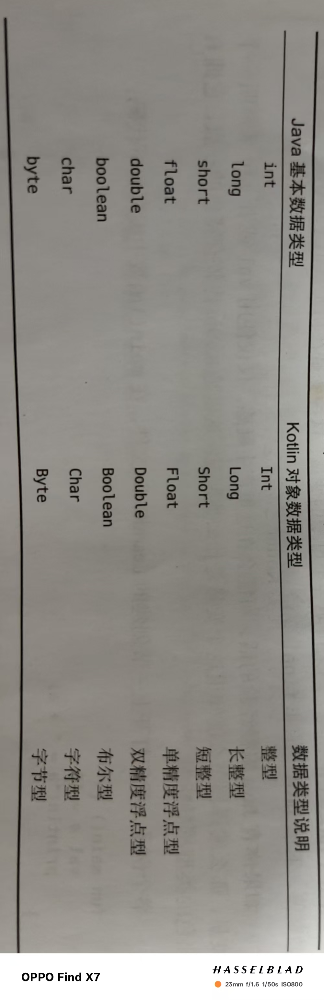
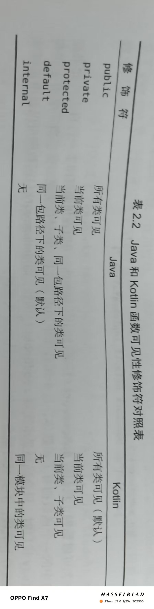

# 变量和函数

### 变量

1.由val和var声明变量，其中val声明不可变变量，var声明可变变量(**建议所有变量开始由val修饰，后根据需要选择用var修饰**)

2.也可以显示的声明变量类型，如`val a : Int = 10`

3.数据类型：



### 函数

1.标准形式：

```kotlin
fun methodName(param1: Int, param2: Int):Int{
return 0
}
```

2.语法糖：

当一个函数只有一行代码时，可以直接将那行代码直接写在函数定义的尾部用等号连接

`fun largeNumber(num1: Int, num2: Int) = max(num1,num2)`

------

# 程序的逻辑控制

### if条件句

1.写法和Java的一样

2.和java不一样的点在于它可以有返回值，如：

```kotlin
fun largeNumber(num1: Int, num2: Int) : Int{
    return if(num1 > num2){
        num1
    }else{
        num2
    }
}
```

可以用语法糖简化为：

```kotlin
fun largeNumber(num1: Int, num2: Int) = if(num1 > num2) num1 else num2
```


### when条件句

1.由这个例子说明：

```kotlin
fun getScore(name:String)=if(name=="Tom"){
    86
}else if (name=="Jim"){
    77
}else if (name=="Jack"){
    95
}else if (name=="Lily"){
    100
}else{
    0
}
```

这段显得冗杂可以用when简化

```kotlin
fun getScore(name:String)=when(name){
    "Tom"->86
    "Jim"->77
    "Jack"->95
    "Lily"->100
    else->0
}
```

2.标准格式：

匹配值 -> { 执行逻辑 }（执行逻辑只有一行时括号可省）

3.类型匹配：

```kotlin
fun checkNumber(num:Number)=when(num){
    is Int->println("number is Int")
    is Double->println("number is Double")
    else->println("number not support")
}
```

4.不在when中传入参数：（用得少）

```kotlin
fun getScore(name:String)=when{
   name == "Tom"->86
   name == "Jim"->77
   name ==  "Jack"->95
   name ==  "Lily"->100
    else->0
}
```

5.有些情况必须用4中方法：

假设所有名字以“Tom”开头的人分数只有86：

```kotlin
fun getScore(name:String)=when{
   name.startsWith("Tom")->86
   name == "Jim"->77
   name ==  "Jack"->95
   name ==  "Lily"->100
    else->0
}
```


### 循环语句

1.while循环和之前学的一样不再赘述

2.Kotlin中区间表示：

`val range = 0..10`两端都是闭区间

`val range = 0 until 10`左闭右开区间

`val range = 10 downTo 1`降序区间两端都是闭区间

3.**step**关键字相当于**i++**

2.for-in循环：

```kotlin
for(i in 0..10){
    println(i)
}
for(i in 0 until 10 step 2){
    println(i)
}
for(i in 10 downTo 1){
    println(i)
}
```


------

# 面向对象编程

### 类和对象

创建方法和之前的一样，实例化有区别,去掉了new关键字：

`val p=Person()`

### 继承与构造函数

1.开放继承权限(kotlin中非抽象类默认不可继承)，在类前加上**open**关键字即可

```kotlin
open class person{
...
}
```

2.继承，关键字由之前的extends变为了冒号，例如：

```kotlin
class Student : Person(){
    var sno= ""
    var grade=0
}
```

Person后有一个括号是因为子类构造函数必须调用父类的构造函数

3.构造函数分为**主构造函数**和**次构造函数**：

**主构造函数**(没有函数体，逻辑写在init中)：

```kotlin
class Student(val sno String,val grade :Int):Person(){
    init{
        println(sno)
        println(grade)
    }
}
```

继承来的数据不需要用val或var修饰

```kotlin
class Student(val sno :String,val grade :Int, name:String,age:Int):Person(name,age){
}
```

**次构造函数**(几乎不会用到)

当一个类既有主构造又有次构造函数，所有次构造函数都必须直接或间接调用主构造函数：

```kotlin
class Student(val sno :String,val grade :Int, name:String,age:Int):Person(name,age){
    constructor(name:String,age:Int):this("",0,name,age){}//直接调用主构造函数
    constructor():this("",0){}//间接调用主构造函数
}
```

只有次构造而没有主构造时：

```kotlin
class Student:Person{
    constructor(name:String,age:Int):super(name,age){}
}
```

此时没有显式的定义主构造函数，又有次构造可以认为其没有主构造，既然没有主构造，那么Person类后也不需要加括号了

### 接口

1.接口和java也基本一样，接口中函数不要求有函数体

```kotlin
interface Study {
    fun readBooks()
    fun doHomework()
}
```

2.接口关键字也使用冒号

```kotlin
class Student(name:String,age:Int):Person(name,age),Study {
    override fun readBooks() {
        println(name+" is reading!")
    }

    override fun doHomework() {
        println(name+" is doing homework")
    }
}
```

调用如下：

```kotlin
fun main(){
   val s=Student("Jack" ,18)
    doStudy(s)
}
fun doStudy(study:Study){
    study.readBooks()
    study.doHomework()
}
```

3.kotlin中特有的功能：允许对接口中定义的函数进行默认实现

```kotlin
interface Study {
    fun readBooks()
    fun doHomework(){
        println("do homework default implementation.")
    }
}
```

### 修饰符

**1.public:**

默认项，和java的一致

**2.private：**

只对当前类内部可见

**3.protected:**

只对当前类和子类可见

**4.internal:**

只对同一模块中的类可见



### 数据类与单例类

**1.数据类:**

在class前加上data关键字

**2.单例类:**

作用：避免创建重复的对象

用法：将class换成object即可

调用：

```kotlin
object Singleton{
    fun singletonTest(){
        println("singletonTest is called")
    }
}
fun main(){
       Singleton.singletonTest()
}
```

------

# 集合的创建和遍历

### listOf(不可变集合)

创建和遍历：

```kotlin
 val list= listOf("Apple","Banana","Pear")
    for (fruit in list){
        println(fruit)
    }
```

### mutableListOf(可变集合)

创建和遍历：

```kotlin
val list= *mutableListOf*("Apple","Banana","Pear")
list.add("Watermeleon")
for (fruit in list){
    *println*(fruit)
}
```

### setOf和mutableSetOf

用法和**listOf**和**mutableListOf**一模一样，只是**setOf**和**mutableSetOf**中不能放重复元素

### Map集合(键值对形式)

1.添加和读取数据用下标法

```kotlin
val map=HashMap<String,Int>()
map["Apple"]=1//添加
val number=map["Apple"]//读取
```

2.简化(使用mapOf和mutableMapOf):

```kotlin
val map= mapOf("Apple" to 1,"Banana" to 2,"Oramge" to 3)
    for((fruit,number) in map){
        println("fruit is "+fruit+",number is ," +number)
    }
```

------

# Lambda

**1.语法结构：**

{参数名1：参数类型，参数名2：参数类型  -> 函数体}（函数体可以编写任一行代码，最后一行代码会自动作为返回值）

**2.一些简化点：（函数API实例说明）**

```kotlin
val maxLengthFruit = list.maxBy({fruit:String->fruit.length})
```

(1)当Lambda参数是函数最后一个参数时可以将**lambda**表达式移到函数括号的外面

```kotlin
val maxLengthFruit = list.maxBy(){fruit:String->fruit.length}
```

(2)当Lambda参数是函数唯一一个参数时可以将函数的括号删掉

```kotlin
val maxLengthFruit = list.maxBy{fruit:String->fruit.length}
```

(3)因为Kotlin具有类型推到机制大多情况不需声明类型

```kotlin
val maxLengthFruit = list.maxBy{fruit->fruit.length}
```

(4)当表达式参数列表只有一个参数时，也可以不声明参数名，用it来代替

```kotlin
val maxLengthFruit = list.maxBy{it.length}
```

**3.map函数(对集合元素映射转化)**

```kotlin
val list= listOf("Apple","Banana","Pear")
val newList =list.map{it.toUpperCase()}
for(fruit in newlist){
    println(fruit)
}
```

**4.filter函数(过滤集合中的数据)**

```kotlin
val list= listOf("Apple","Banana","Pear")
val newList =list.filter{it.length<=5}//保留五个字母以内的水果
                 .map{it.toUpperCase()}
for(fruit in newlist){
    println(fruit)
}
```

这里先调用filter再调用map效率更高

**5.any和all函数**

any函数用来判断集合中是否至少存在一个元素满足指定条件

all函数用来判断集合中是否所有元素都满足指定条件

```kotlin
val list= listOf("Apple","Banana","Pear")
val anyResult =list.any{it.length<=5}
val allResult =list.all{it.length<=5}    
println("anyResult is "+anyResult+",allResult is "+allResult)
```

------

# Java函数式API的使用

**1.使用前提：**

kotlin中调用一个java方法，并且该方法接收一个java单抽象方法接口参数，就可以使用函数式API(Java单抽象方法接口指的是接口中只有一个待实现的方法)

**2.实例说明：**

（1）Runnable实例kotlin形式

```kotlin
Thread(object:Runnable{
    override fun run(){
        println("Thread is running")
    }
}).start()
```

(2)只有一个方法可以将方法名省去

```kotlin
Thread(Runnable{
        println("Thread is running")
}).start()
```

(3)如果一个java方法参数列表中有且仅有一个java单抽象方法接口参数，可以将接口名省去

```kotlin
Thread({
        println("Thread is running")
}).start()
```

(4)根据lambda表达式可以更精简为

```kotlin
Thread{      println("Thread is running")
}.start()
```

------

# 空指针检查

kotlin将空指针判定提前到了编译环节

### 可空类型系统

在类名的后面加一个问号表示可为空的类型

如Int表示不可为空的整型，Int？表示可为空的整型

### 判空辅助工具

**1."?."操作符:**

当对象不为空时正常调用，为空时啥也不干

**2.“？:”操作符：**

操作符左右两边均接收一个表达式，如果左边表达式不为空就返回左边否则返回右边

以上两种方法结合使用：

```kotlin
fun getTextLength(text:String?)=text?.length?:0
```

**3.空指针检查机制可能出问题：**

可以使用非空断言工具，在对象后面加**“！！”**，使其强行通过编译(写法有风险，谨慎使用)

```kotlin
val upperCase=content!!.toUpperCase()
```

**4.辅助工具----let：(函数)(let可以处理全局判空问题而if无法做到)**

（1）形式：

```kotlin
obj.let{ obj2->
//编写具体的逻辑
}
```

其中obj2和obj是一个对象，防止变量重名故改为obj2

(2)优化：

？.和let结合使用

```kotlin
fun doStudy(study:Study?){
      study?.let{
          stu->
          stu.readBooks()
          stu.doHomeWork()
      }
}
```

可以简化为

```kotlin
fun doStudy(study:Study?){
      study?.let{
          it.readBooks()
          it.doHomeWork()
      }
}
```


------

# Kotlin一些小技巧

### 字符串内嵌表达式

可以用**${}**语法结构来代替加号连接符

```kotlin
println("hello,${obj.name}.nice to meet you!")
```

如果表达式仅有一个变量时还可以将大括号省去

### 函数的参数默认值

不需要一一对应，可以使用键值对传参

```kotlin
fun printParams(num:Int=100,str:String){//num:Int=100即设定了默认值
    println("num is $num，str is $str")
}
fun main(){
    printParams(str="world")
}
```

### 下划线写法

在一些方法中如果只有部分参数使用到，未使用的参数可以用下划线代替

------

# as

kotlin中类型强制转换时使用的关键字

------

# 内部类

用**inner class**关键字来定义内部类

------

