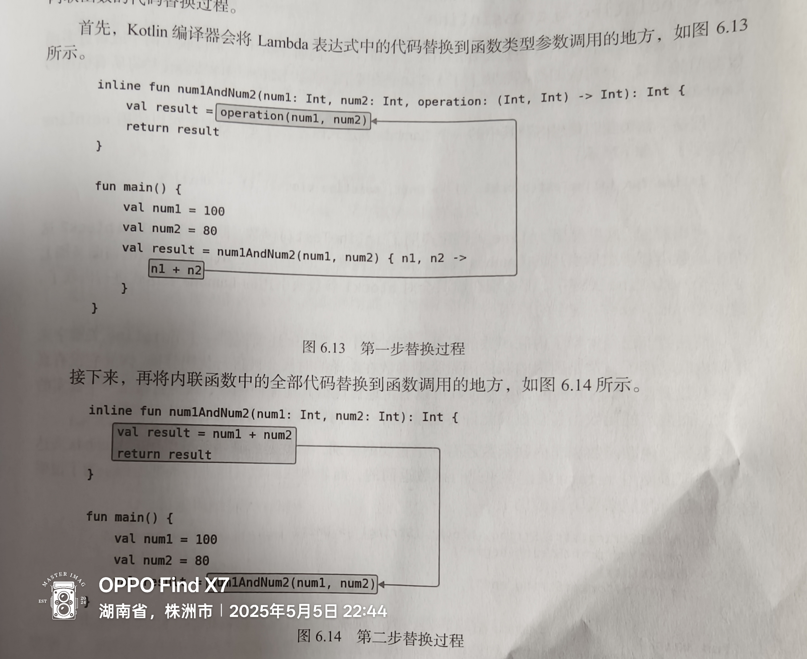
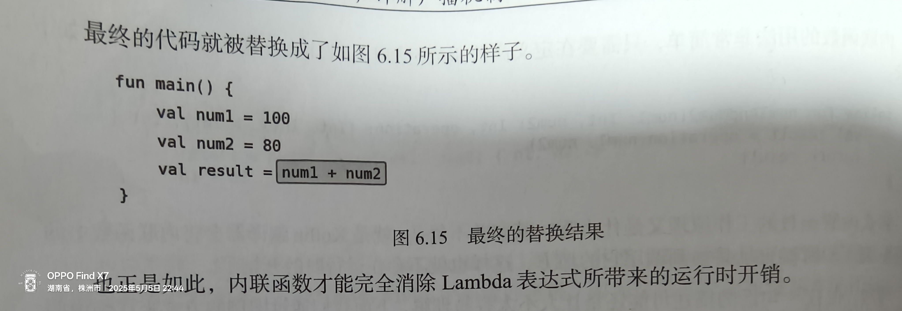

# 高阶函数

### 函数类型

(String,Int)->Unit

左边是函数接收参数类型，右边是返回值类型

### 定义

含有函数类型的就叫高阶函数

### 实例1

```kotlin
fun num1Andnum2(num1:Int,num2:Int,operation: (Int,Int)->Int):Int{
    val result=operation(num1,num2)
    return result
}
fun plus(num1:Int,num2:Int):Int{
    return num1 + num2
}
fun minus(num1:Int,num2:Int):Int{
    return num1-num2
}
fun main(){
    val num1=100
    val num2=50
    val result1=num1Andnum2(num1,num2,::plus)
    val result2= num1Andnum2(num1,num2,::minus)
    println(result1)
    println(result2)
}
```

Lambda表达式改进

```kotlin
fun num1Andnum2(num1:Int,num2:Int,operation: (Int,Int)->Int):Int{
    val result=operation(num1,num2)
    return result
}
fun main(){
    val num1=100
    val num2=50
    val result1=num1Andnum2(num1,num2){
        num1,num2->num1+num2
    }
    val result2= num1Andnum2(num1,num2){
            num1,num2->num1-num2
    }
    println(result1)
    println(result2)
}
```

### 实例2

```kotlin
fun StringBuilder.build( block:StringBuilder.()->Unit):StringBuilder{
    block()
    return this
}
fun main(){
    val list= listOf("Apple","Banana","Orange","Pear","Grape")
    val result=StringBuilder().build {
        append("Start eating fruits\n")
        for(fruit in list){
            append(fruit).append("\n")
        }
        append("Ate all fruits")
    }
    println(result.toString())
}
```

------

# 内联函数

### 用法

使用**inline**关键字，在高阶函数前加上inline即可

### 作用

可以将使用Lambda表达式带来的运行时开销完全消除

### 实例

```kotlin
inline fun num1Andnum2(num1:Int,num2:Int,operation: (Int,Int)->Int):Int{
    val result=operation(num1,num2)
    return result
}
```

### 原理





------

# noinline和crossinline

### noinline

如果含有多个函数类型参数，但只想内联其中一个，这时可以在函数类型前加noinline表示不内联

### 内联和非内联区别

内联函数中的lambda表达式可以使用return关键字返回，非内联只能局部返回

### 局部返回实例

```kotlin
 fun printString(str: String, block: (String) -> Unit) {
    println("printString begin")
    block(str)
    println("printString end")
}
fun main(){
     println("main start")
    val str = ""
    printString(str) { s ->
        println("lambda start")
        if (s.isEmpty()) return@printString
        println(s)
        println("lambda end")
    }
    println("main end")
}
```

输出结果

```kotlin
main start
printString begin
lambda start
printString end
main end
```

### 内联函数返回实例

```kotlin
inline fun printString(str: String, block: (String) -> Unit) {
    println("printString begin")
    block(str)
    println("printString end")
}
fun main(){
     println("main start")
    val str = ""
    printString(str) { s ->
        println("lambda start")
        if (s.isEmpty()) return
        println(s)
        println("lambda end")
    }
    println("main end")
}
```

输出结果

```
main start
printString begin
lambda start
```

### 注意

在高阶函数中创建另外的Lambda或匿名类实现，并且在这些实现中调用函数类型参数，此时再将其声明为内联函数会报错

**原因**：内联函数允许使用return和高阶函数的匿名类不允许使用return矛盾导致报错

### crossinline

借用crossinline可以解决上述问题，crossinline相当于一份契约，用于保证在内联函数的lambda中一定不会使用return关键字

虽然不能使用return返回但仍可以使用局部返回

### crossinline实例

```kotlin
inline fun runRunnable(crossinline block: () -> Unit) {
    val runnable = Runnable {
        block()
    }
    runnable.run()
}
```


------
