# SQL通用语法及其分类

### 通用语法

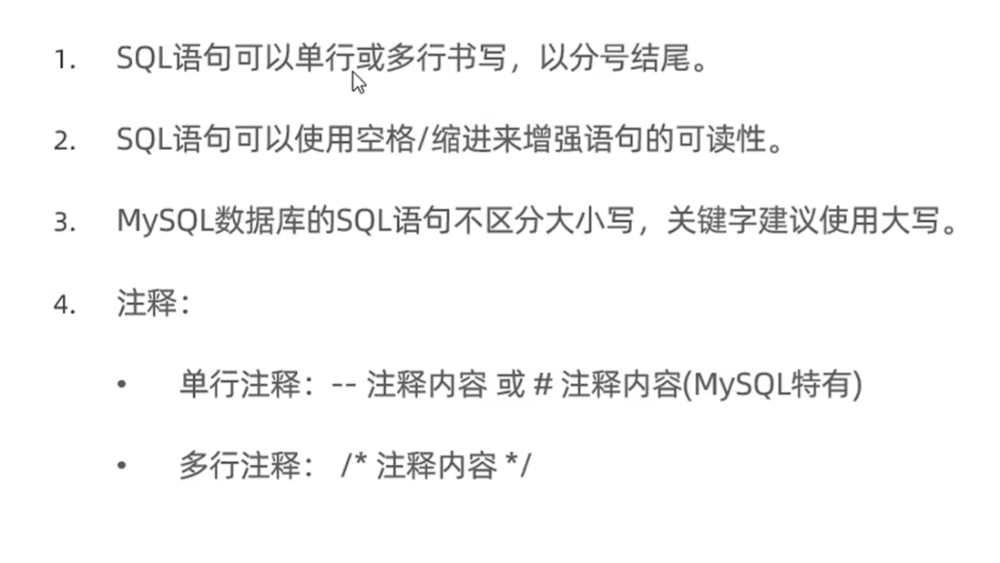

### 分类

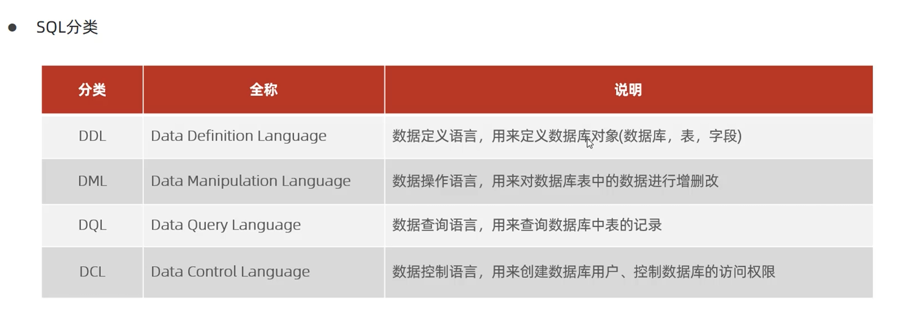

------

# DDL

### 数据库操作

- **查询**

  ```sql
  show databases;#查询所有数据库
  select database();#查询当前数据库
  ```

- **创建**

  ```sql
  create database [IF NOT EXISTS] 数据库名 [DEFAULT CHARSET 字符集] [COLLATE 排列规则];
  ```

- **删除**

  ```sql
  DROP DATABASE [IF EXISTS] 数据库名;
  ```

- **使用**

  ```sql
  USE 数据库名;
  ```

### 表操作

- **查询**

  ```sql
  SHOW TABLES;#查询当前数据库所有表格
  DESC 表名;#查询表结构
  SHOW CREATE TABLE 表名;#查询指定表的建表语句
  ```

- **创建**

  ```sql
  CREATE TABLE 表名(
  	字段1 字段1类型[COMMENT 字段1注释]
      字段2 字段2类型[COMMENT 字段2注释]
      字段3 字段3类型[COMMENT 字段3注释]
      . . . . . . .
      字段n 字段n类型[COMMENT 字段n注释]
  )[COMMENT 表注释]
  ```

- **修改**

  ```sql
  ALTER TABLE 表名 ADD 字段名 类型(长度) [COMMENT 注释] [约束];#添加字段
  ALTER TABLE 表名 MODIFY 字段名 新数据类型(长度);#修改数据类型
  ALTER TABLE 表名 CHANGE 旧字段名 新字段名 类型(长度) [COMMENT 注释] [约束];#修改字段名和字段类型
  ALTER TABLE 表名 RENAME TO 新表名;#修改表名
  ```

- **删除**

  ```sql
  alter table 表名 drop 字段名;#删除字段
  drop table [if exists] 表名;#删除表
  truncate table 表名;#删除指定表，并重新创建该表
  ```

  

### 数据类型

- **字符串类型**

  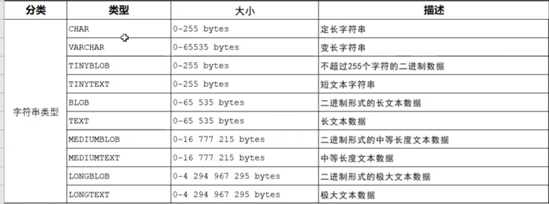

- **数值类型**

  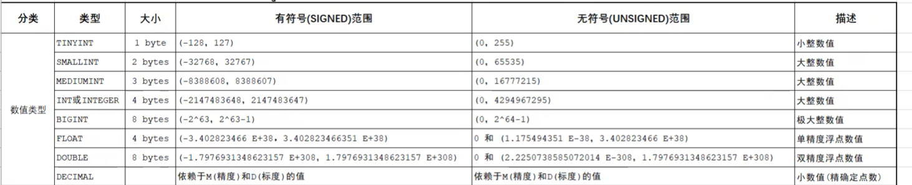

- **日期类型**

  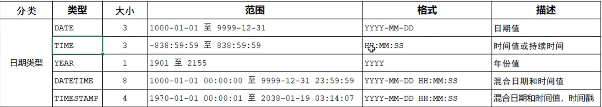

------

# DML

### 添加数据

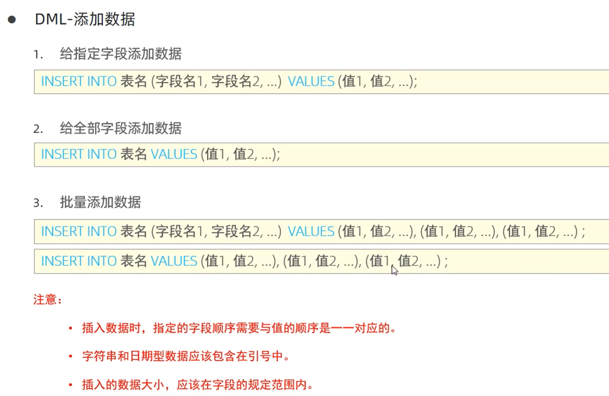

### 修改数据

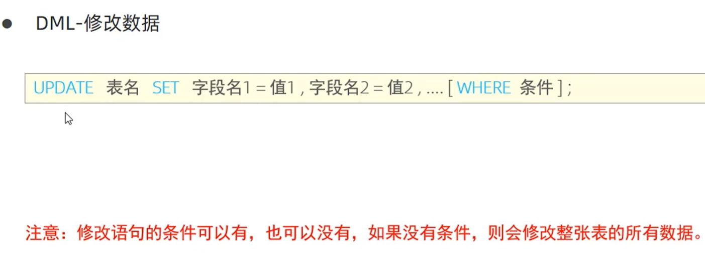

### 删除数据

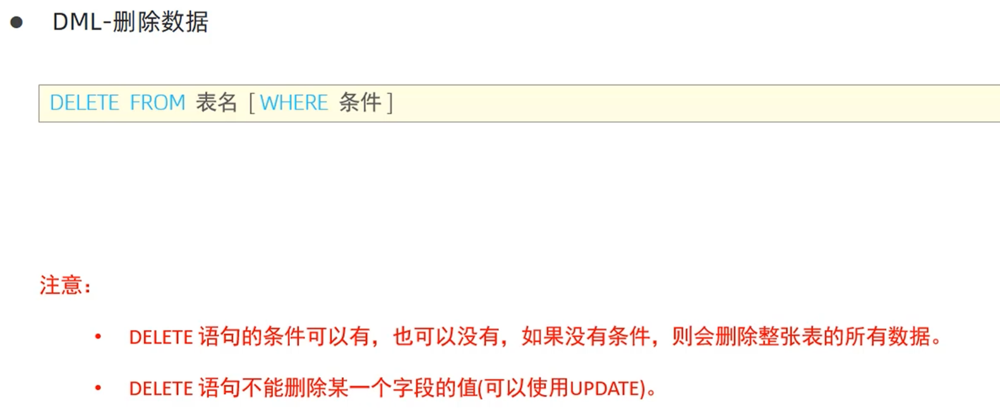

------

# DQL

### 通用语法

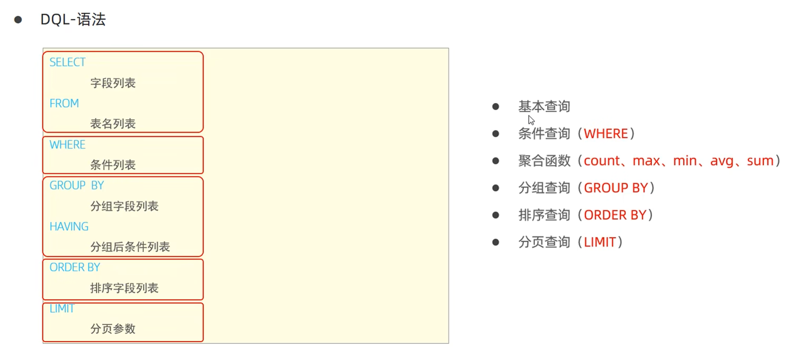

### 基本查询

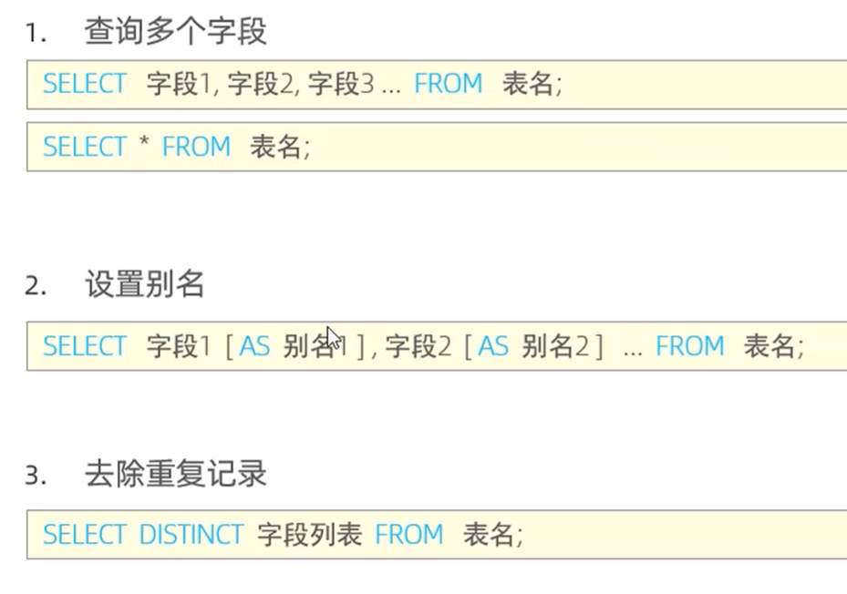

### 条件查询

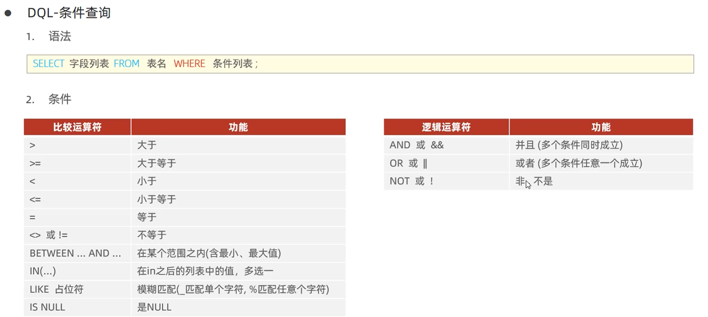

### 聚合函数

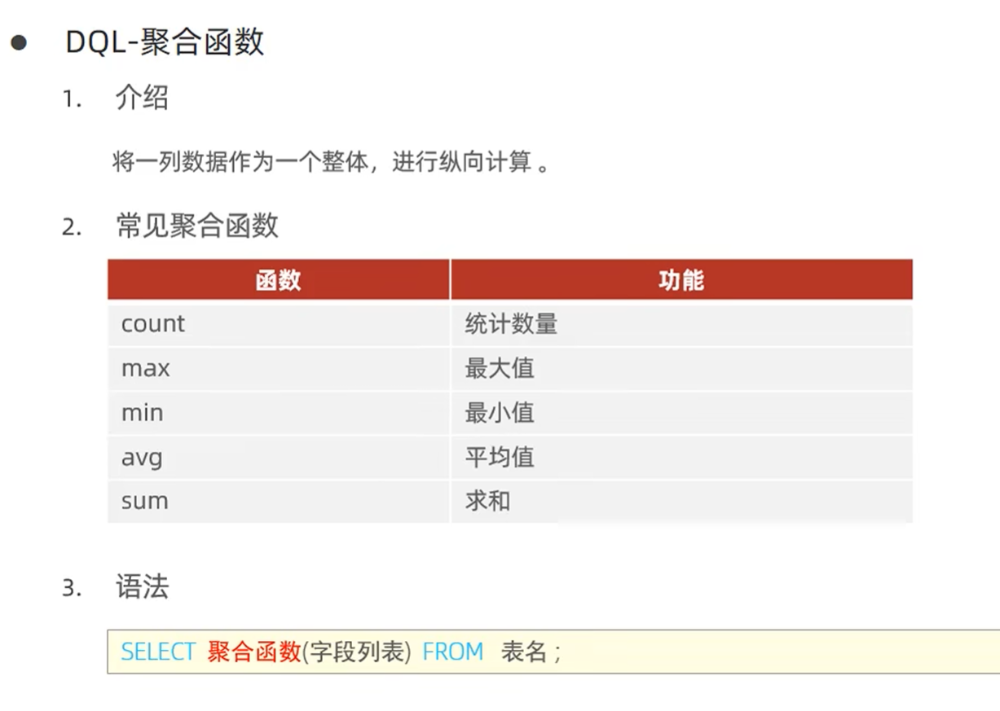

### 分组查询

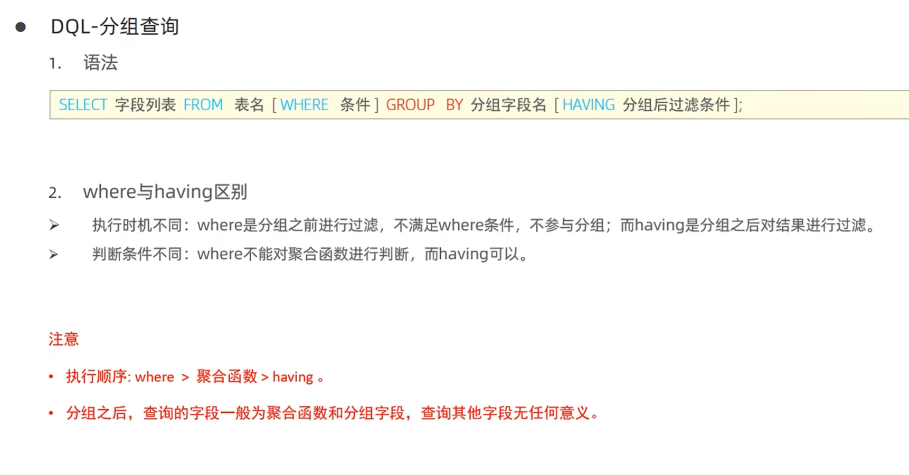

### 排序查询

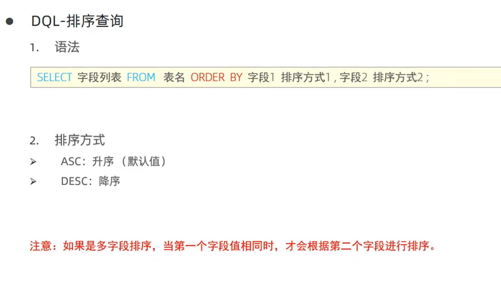

### 分页查询

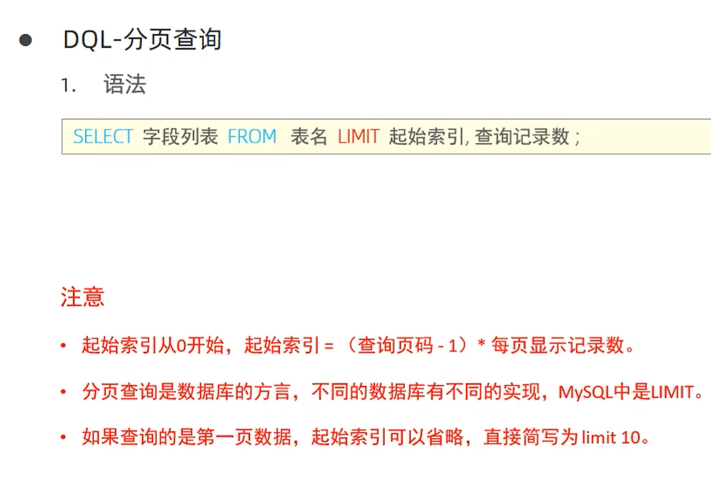

### 执行顺序

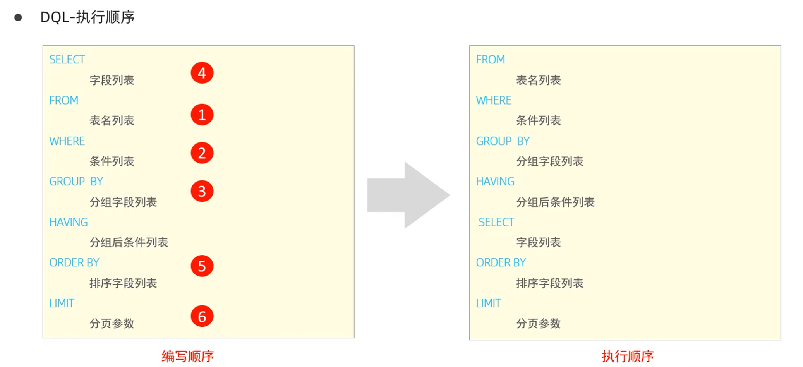

------

# DCL

### 用户管理

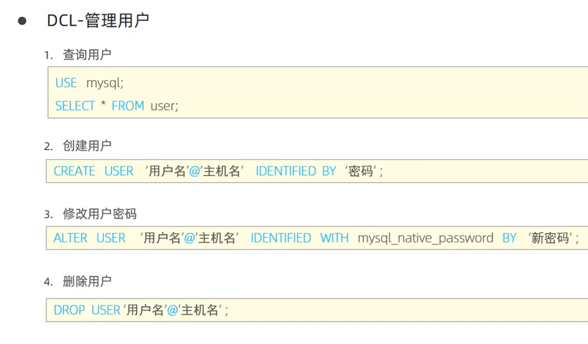

### 权限控制

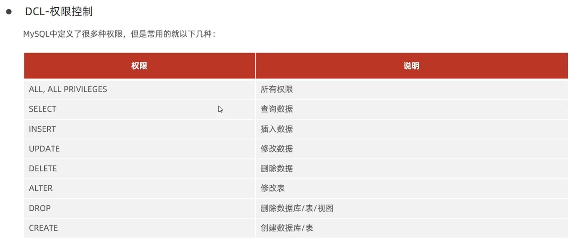

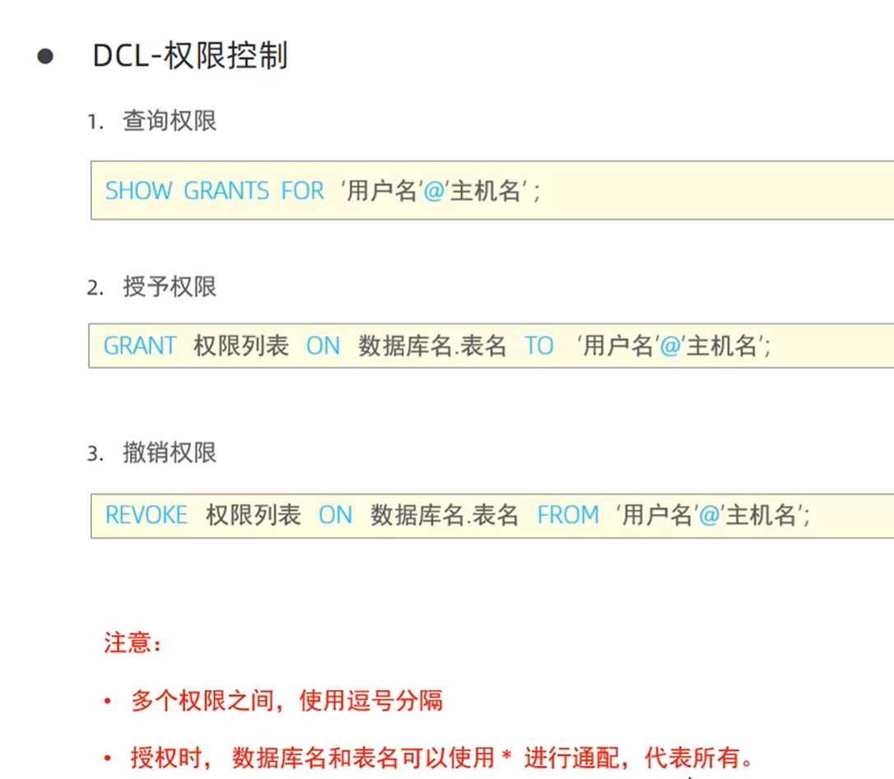

------

