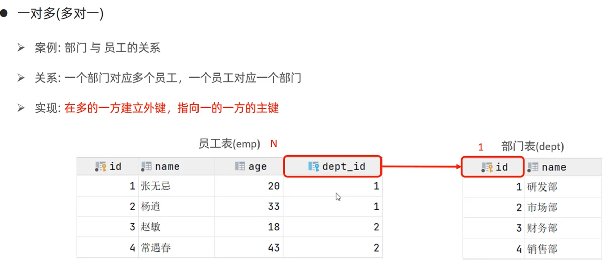
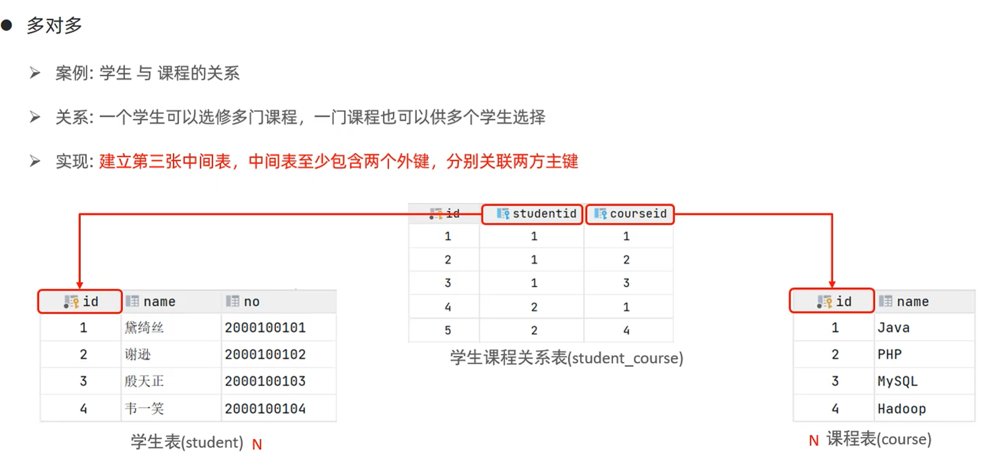
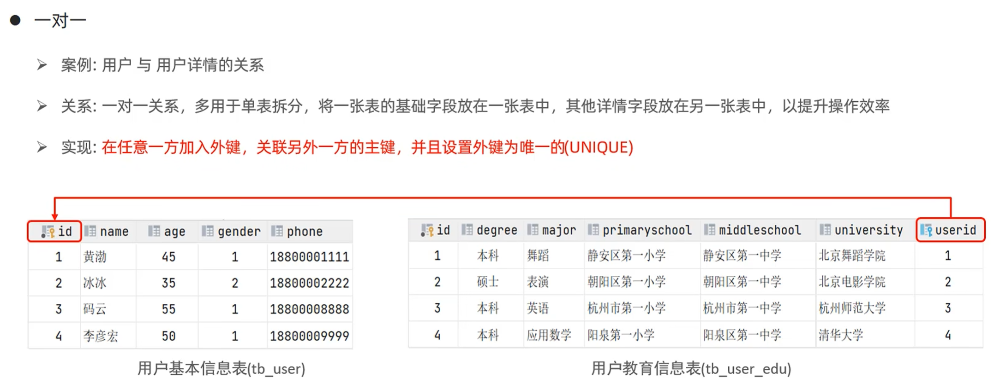
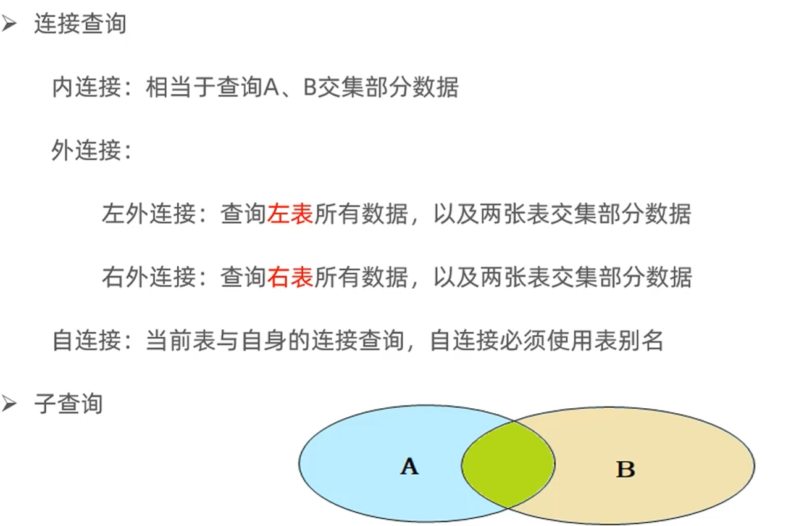
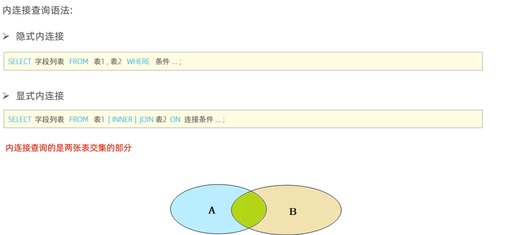
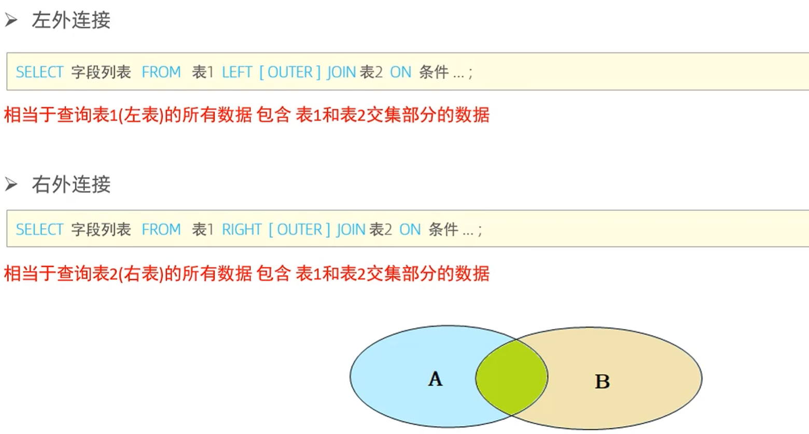
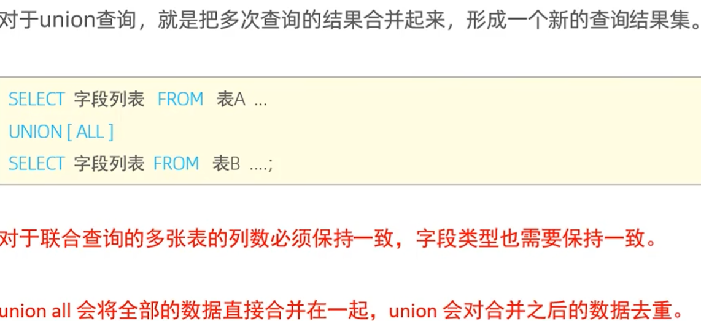
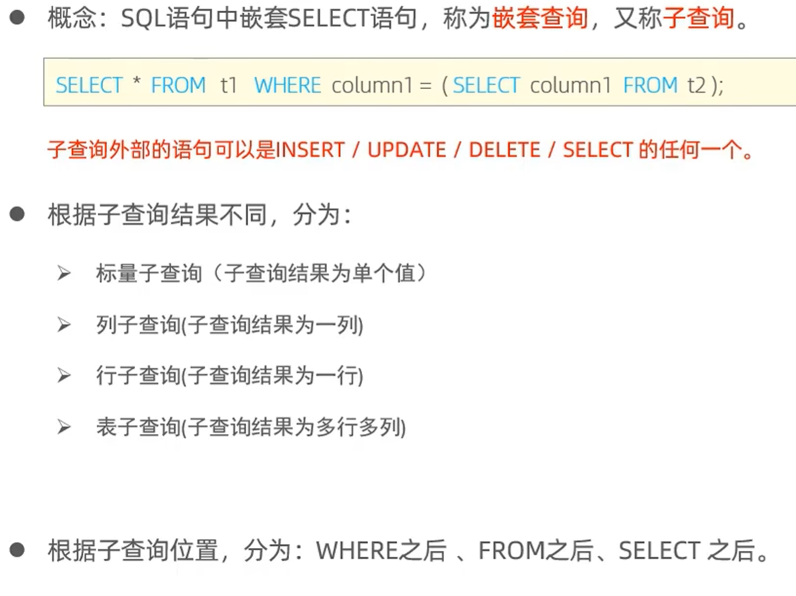
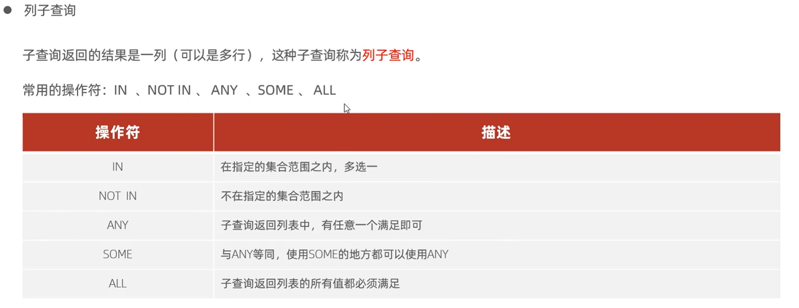

### 多表关系

- **一对多**

  

- **多对多**

  

- **一对一**

  

------

### 多表查询概述

- **笛卡尔积**

  在数学中，两个集合A,B的所有组合情况(多表查询中，需要消除无效的笛卡尔积)

- **多表查询分类**

  

------

### 内连接

------

### 外连接

------

### 自连接

------

### 联合查询

------

### 子查询概述

------

### 标量子查询

------

### 列子查询

------

### 行子查询

------

### 表子查询

------

