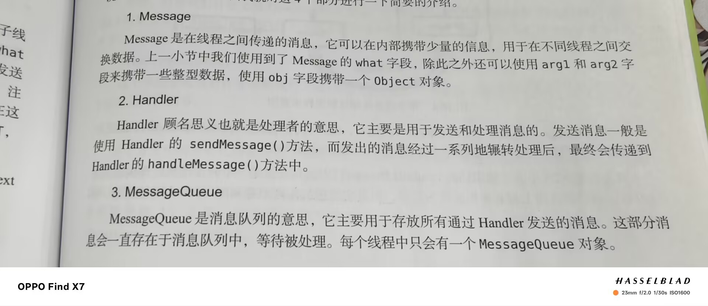

# 多线程编程

### 线程的四种形式

- ```kotlin
  class MyThread:Thread(){
      override fun run(){
          //编写具体逻辑
      }
  }
  //启动
  MyThread.start()
  ```

- ```kotlin
  class MyThread:Runnable{
      override fun run(){
          //编写具体逻辑
      }
  }
  //启动
  val myThread=MyThread()
  Thread(myThread).start()
  ```

- ```kotlin
  Thread{
      //编写具体逻辑
  }.start()
  ```

- ```kotlin
  thread{
      //编写具体逻辑
  }
  ```

  **最后一种是Kotlin内置的顶层函数，更加简单方便**

### 在子线程中更新UI

1. 定义一个整型变量表示更新UI的动作
2. 新增一个Handler对象，重写父类handleMessage()方法，在这里对UI进行具体操作
3. 开启子线程
4. 创建Message对象
5. 指定what字段值
6. 调用sendMessage()方法发送Message

### 解析异步消息处理机制




### 使用AsyncTask

1.创建一个子类去继承它，需要传入三个参数如下

Params：在后台任务中使用

Progress：可以作为进度单位

Result：返回值类型

2.重写父类方法如下：

onPreExecute():界面上的初始化操作

doInBackground(Params…):所有代码都在子线程中运行，在这里处理耗时任务

onProgressUpdate(Progress…):对UI进行操作

onPostExecute(Result):后台任务执行完毕并通过return语句返回时，这个方法被调用

3.启动任务

`DownloadTask().execute()`

------

# Service

### 基本用法

1. 定义service，直接用AndroidStudio系统新建
2. 利用Intent启动和停止Service

```kotlin
class MyService : Service() {

    override fun onBind(intent: Intent): IBinder {
    }

    override fun onCreate() {
        super.onCreate()
        Log.d("MyService", "onCreate: ")    
    }

    override fun onStartCommand(intent: Intent?, flags: Int, startId: Int): Int {
        Log.d("MyService", "onStartCommand: ")
        return super.onStartCommand(intent, flags, startId)
    }

    override fun onDestroy() {
        Log.d("MyService", "onDestroy: ")
        super.onDestroy()
    }
}
```

```kotlin
 		binding.start.setOnClickListener {
            val intent=Intent(this,MyService::class.java)
            //启动服务
            startService(intent)
        }
        binding.stop.setOnClickListener {
            val intent=Intent(this,MyService::class.java)
            //停止服务
            stopService(intent)
        }
```

### Activity和Service进行通信

拿下载功能举例

Service中提供一个下载功能，Activity中可以决定何时开始下载以及随时查看下载进度

```kotlin
 private val mBinder=DownloadBinder()
    class DownloadBinder:Binder(){
        fun startDownload(){
            Log.d("MyService", "startDownload: ")
        }
        fun getProgress():Int{
            Log.d("MyService", "getProgress: ")
            return 0
        }
    }

    override fun onBind(intent: Intent): IBinder {
        return mBinder
    }
```

创建ServiceConnection的匿名类实现

1. 重写父类的两个方法

2. 利用intent和bindService进行绑定

3. 利用unbindService()方法解绑

   ```kotlin
   lateinit var downloadBinder:MyService.DownloadBinder
       private val connection=object :ServiceConnection{
           //成功绑定时使用
           override fun onServiceConnected(name: ComponentName?, service: IBinder?) {
               downloadBinder=service as MyService.DownloadBinder
               downloadBinder.startDownload()
               downloadBinder.getProgress()
           }
           //Service创建进程崩溃或被杀掉时调用
           override fun onServiceDisconnected(name: ComponentName?) {
               TODO("Not yet implemented")
           }
   
       }
   override fun onCreate(savedInstanceState: Bundle?) {
           super.onCreate(savedInstanceState)
           enableEdgeToEdge()
           binding=ActivityMainBinding.inflate(layoutInflater)
           setContentView(binding.root)
           ViewCompat.setOnApplyWindowInsetsListener(findViewById(R.id.main)) { v, insets ->
               val systemBars = insets.getInsets(WindowInsetsCompat.Type.systemBars())
               v.setPadding(systemBars.left, systemBars.top, systemBars.right, systemBars.bottom)
               insets
           }
           binding.bind.setOnClickListener {
               val intent=Intent(this,MyService::class.java)
               //绑定Service
               bindService(intent,connection, Context.BIND_AUTO_CREATE)
           }
           binding.unbind.setOnClickListener {
               //解绑Service
               unbindService(connection)
           }
       }
   ```

------

# Service更多技巧

### 使用前台Service

1. 调用startForeground方法会让一个service变成前台服务

2. 声明权限

   ```kotlin
   override fun onCreate() {
           Log.d("MyService", "onCreate: ")
           val manager=getSystemService(Context.NOTIFICATION_SERVICE) as NotificationManager
           if(Build.VERSION.SDK_INT>=Build.VERSION_CODES.O){
               val channel=NotificationChannel("my_service","前台Service通知",NotificationManager.IMPORTANCE_DEFAULT)
               manager.createNotificationChannel(channel)
           }
           val intent=Intent(this,MainActivity::class.java)
           val pi=PendingIntent.getActivity(this,0,intent, PendingIntent.FLAG_IMMUTABLE)
           val notification=NotificationCompat.Builder(this,"my_service")
               .setContentTitle("This is title")
               .setContentText("This is Context")
               .setSmallIcon(R.drawable.ic_launcher_foreground)
               .setLargeIcon(BitmapFactory.decodeResource(resources,R.drawable.ic_launcher_background))
               .setContentIntent(pi)
               .build()
           startForeground(1,notification)
       }
   ```

   ```kotlin
   <uses-permission android:name="android.permission.FOREGROUND_SERVICE" />
   ```

### IntentService

1. 新建一个类继承IntentService
2. 实现onHandleIntent()抽象方法，这个方法用于处理耗时的逻辑(在子线程中运行li)
3. 利用Intent启动IntentService
4. 注册IntentService

```kotlin
class MyIntentService : IntentService("MyIntentService") {

    override fun onHandleIntent(intent: Intent?) {
        //打印当前线程id
        Log.d("MyIntentService", "Thread id is ${Thread.currentThread().name}")
    }

    override fun onDestroy() {
        super.onDestroy()
        Log.d("MyIntentService", "onDestroy: ")
    }
}
```

```kotlin
 binding.startintent.setOnClickListener {
            //打印主线程id
            Log.d("MainActivity", "Thread id is ${Thread.currentThread().name}")
            val intent=Intent(this,MyIntentService::class.java)
            startService(intent)
        }
```

```kotlin
<service
            android:name=".MyIntentService"
            android:exported="false">
</service>
```

------

