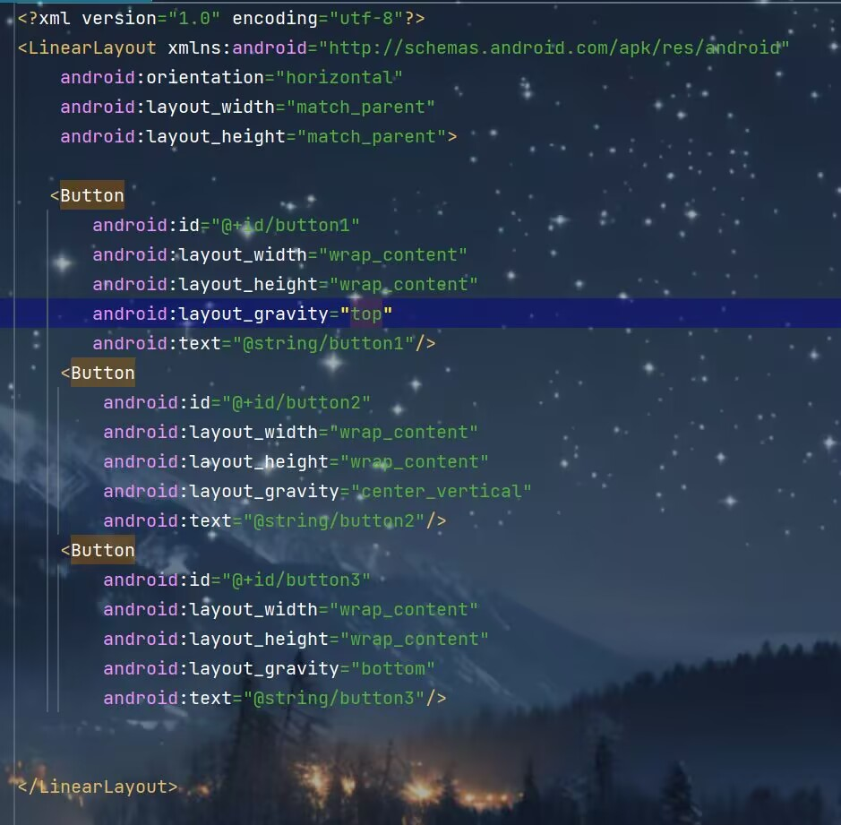

# 常用控件

### TextView

```kotlin
<TextView
        android:id="@+id/textView"//定义唯一标识符
        android:layout_width="match_parent"//控件宽度
        android:layout_height="wrap_content"//控件高度
        android:gravity="center"//文字位置
        android:textColor="@color/red"//文字颜色
        android:textSize="24sp"//文字大小
        android:text="This is TextView"//文字内容
       />
```


### Button

```kotlin
<Button
        android:id="@+id/button"
        android:layout_width="match_parent"
        android:layout_height="wrap_content"
        android:text="Button"/>
```

**点击事件：**

(1)

```kotlin
 myBinding.button.setOnClickListener {
     //代码逻辑
 }
```

(2)接口法

```kotlin
class MainActivity : AppCompatActivity(),View.OnClickListener {
    override fun onCreate(savedInstanceState: Bundle?) {
                   ......
    }
    override fun onClick(v: View?) {
        when(v?.id){
            R.id.button->{
                //在此处添加逻辑
            }
        }
    }
}
```


### EditText

```kotlin
<EditText
        android:id="@+id/editText"
        android:layout_width="match_parent"
        android:layout_height="wrap_content"
        android:textSize="26dp"
        android:hint="Type something here"//提示性文字
        android:maxLines="2"//最大行数
        />
```


### ImageView

```kotlin
<ImageView
        android:id="@+id/imageView"
        android:layout_width="wrap_content"
        android:layout_height="wrap_content"
        android:src="@drawable/ic_launcher_background"/>
```

**动态变化ImageView中图片**

```kotlin
 myBinding.button.setOnClickListener {
            myBinding.imageView.setImageResource(R.drawable.b)
        }
```


### ProgressBar

```kotlin
<ProgressBar
        android:id="@+id/progressBar"
        android:layout_width="match_parent"
        android:layout_height="wrap_content"
        style="?android:attr/progressBarStyleHorizontal"//进度条样式
        android:max="100"/>//进度条最大值
```


### AlertDialog

```kotlin
AlertDialog.Builder(this).apply {
                setTitle("This is Dialog")
                setMessage("Something important")
                setCancelable(false)//点击别的地方是否可以取消弹出框
                setPositiveButton("OK"){
                    dialog,which->
                }
                setNegativeButton("Cancel"){
                    dialog,which->
                }
                show()
            }
```


------

# 布局

### LinearLayout



android:layout_weight这个属性允许我们使用比例的方式来指定控件的大小。使用这个时要把layout_width的值设为“0dp”


### RelativeLayout

**相对父布局**


**相对其他控件**

**注：**引用控件放在前面


**其他定位属性:**
android:layout_alignLeft表示让一个控件的左边缘同另一个控件左边缘对齐
android:layout_alignRight表示让一个控件的右边缘同另一个控件右边缘对齐
android:layout_alignTop
android:layout_alignBottom

### FrameLayout

FrameLayout又叫帧布局，应用场景较少，所有控件都会默认摆在布局左上角，也可以使用android:layout_gravity进行对齐操作，此方法应用场景过少，不做过多赘述

------

# 自定义控件

### 引入布局

1.创建一个子项布局

2.在相应活动布局中引用该布局

```kotlin
<?xml version="1.0" encoding="utf-8"?>
<LinearLayout xmlns:android="http://schemas.android.com/apk/res/android"
    android:orientation="horizontal"
    android:layout_width="match_parent"
    android:layout_height="wrap_content"
    android:background="@drawable/title_bg">
    <Button
        android:id="@+id/titleBack"
        android:layout_width="wrap_content"
        android:layout_height="wrap_content"
        android:text="Back"
        android:layout_gravity="center"
        android:layout_margin="5dp"
        android:textColor="#fff"
        android:background="@drawable/back_bg"/>

    <TextView
        android:id="@+id/titleText"
        android:layout_width="0dp"
        android:layout_height="wrap_content"
        android:layout_weight="1"
        android:text="Title Text"
        android:gravity="center"
        android:layout_gravity="center"
        android:textColor="@color/black"
        android:textSize="24sp"
        />
    <Button
        android:id="@+id/titleEdit"
        android:layout_width="wrap_content"
        android:layout_height="wrap_content"
        android:text="Edit"
        android:layout_gravity="center"
        android:layout_margin="5dp"
        android:textColor="#fff"
        android:background="@drawable/edit_bg"/>
</LinearLayout>
```

```kotlin
<include layout="@layout/title"/>
```

因为建立的是标题栏需要将系统自带的隐藏

```kotlin
supportActionBar?.hind()
```

### 创建自定义控件

1.新建一个自定义类继承LinearLayout作为控件

2.在布局文件中添加这个控件

3.在自定义类中添加点击事件

```kotlin
class TitleLayout(context: Context,attrs:AttributeSet):LinearLayout(context,attrs) {
    init {
        //动态加载标题栏布局
        LayoutInflater.from(context).inflate(R.layout.title,this)
        val titleBack=findViewById<Button>(R.id.titleBack)
        val titleEdit=findViewById<Button>(R.id.titleEdit)
        titleBack.setOnClickListener {
            val activity =context as Activity
            activity.finish()
        }
        titleEdit.setOnClickListener {
            Toast.makeText(context,"You clicked edit button",Toast.LENGTH_SHORT).show()
        }
    }
}
```

```kotlin
 <com.example.uicustomviews.TitleLayout
        android:layout_width="match_parent"
        android:layout_height="wrap_content"
/>
```


------

