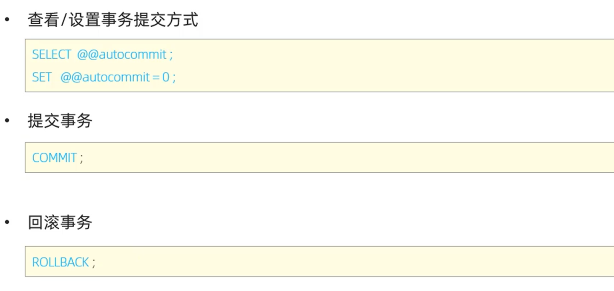
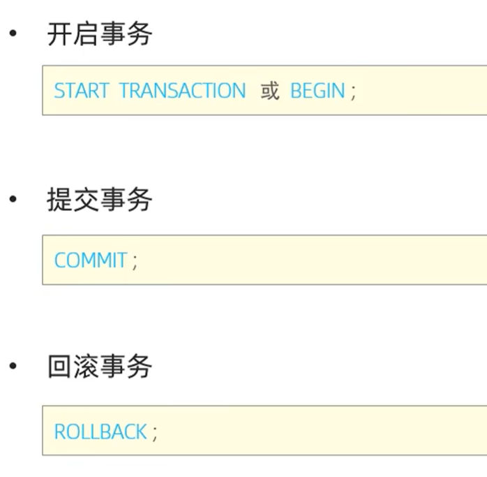
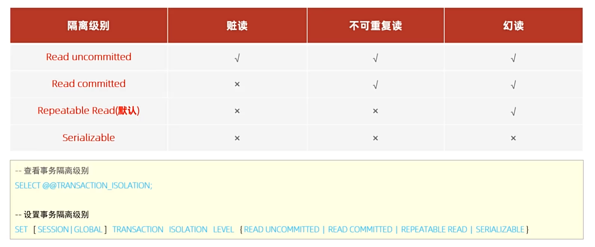

### 简介

- **默认MYSQL事务是自动提交的，所以需要手动开启事务，手动提交事务，有异常手动回滚事务**

------

### 事务操作

- **方法一**

  

- **方法二**

  

------

### 事务四大特性

------

### 并发事务问题

------

### 事务隔离级别

**注意**：事务隔离级别越高，安全性越高，性能越低

------

