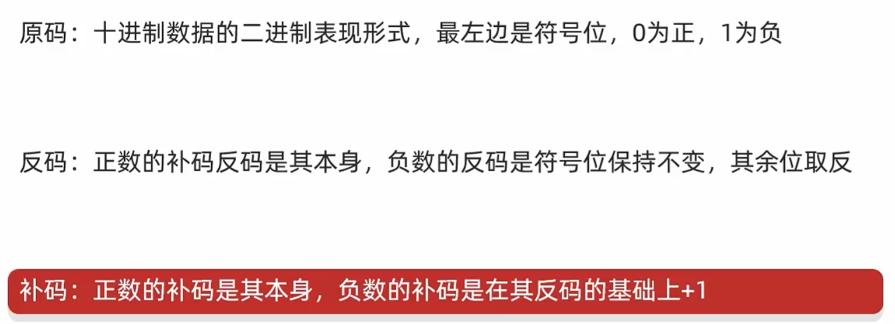
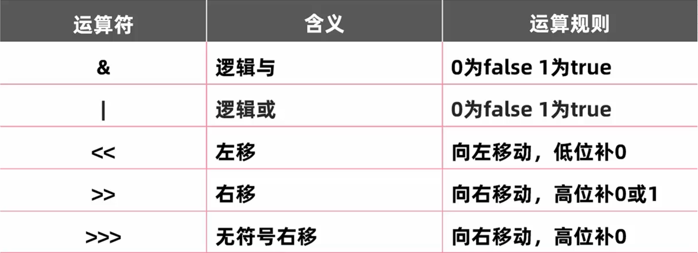

### 三者关系

### 原码的弊端

### 反码出现的目的

解决原码不能计算负数的问题

### 反码的弊端

负数计算时结果不跨0没有任何问题，但是结果跨0会和实际结果有1的偏差

### 补码出现的目的

解决反码计算时的跨0问题

**注意：**

-  **计算机中数据的存储及运算都是以补码的形式进行的，补码完美解决了二进制负数的运算问题**

- **原码反码的范围是-127~+127**

- **补码的范围是-128~+127**

### 运算符

**左移一次相当于乘2**

**右移一次相当于除2**
