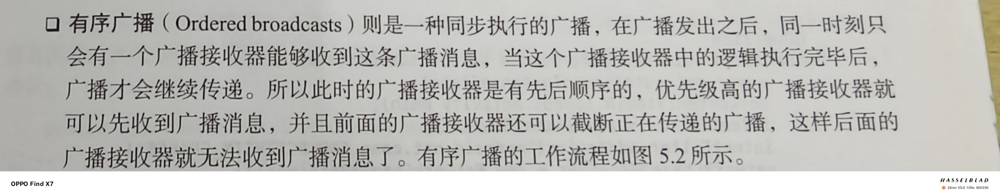

# 广播机制简介

### 标准广播


### 有序广播



------


# 接收系统广播

### 动态注册监听网络变化

#### 简易版

首先先创建一个类，按例子来是建立一个内部类，并在里面重写父类的onReceive()方法。

然后在onCreate()方法中首先创建一个IntentFilter的实例，并给他添加一个值为"android.net.conn.CONNECTIVITY_CHANGE"的action，**为什么添加这个值**，就是因为当网络状态发生变化时，系统发出的正是一条值为"android.net.conn.CONNECTIVITY_CHANGE"的广播，也就是说想监听什么广播就要添加相应的action。接下来创建内部类实例然后调用 registerReceiver()方法进行注册，然后把NetworkChangeReceiver实例和IntentFilter实例都传进去。

最后记的也要取消注册，在onDestroy()中调用 unregisterReceiver实现。


```java
public class MainActivity extends AppCompatActivity {
    private IntentFilter intentFilter;
    private NetworkChangeReceiver networkChangeReceiver;
    @Override
    protected void onCreate(Bundle savedInstanceState) {
        super.onCreate(savedInstanceState);
        intentFilter=new IntentFilter();
        intentFilter.addAction("android.net.conn.CONNECTIVITY_CHANGE");
       networkChangeReceiver=new NetworkChangeReceiver();
        registerReceiver(networkChangeReceiver, intentFilter);
    }

    @Override
    protected void onDestroy() {
        super.onDestroy();
        unregisterReceiver( networkChangeReceiver);
    }
    class NetworkChangeReceiver extends BroadcastReceiver{
        @Override
        public void onReceive(Context context, Intent intent) {
            Toast.makeText(context, "network changes", Toast.LENGTH_SHORT).show();
        }
    }
}
```

#### 优化版

使提醒网络发生变化更人性化，可以进一步修改：

```java
class NetworkChangeReceiver extends BroadcastReceiver {
  @Override
  public void onReceive(Context context, Intent intent) {
   ConnectivityManager connectivityManager=(ConnectivityManager) getSystemService(Context.CONNECTIVITY_SERVICE);
   NetworkInfo networkInfo=connectivityManager.getActiveNetworkInfo();
   if(networkInfo!=null&&networkInfo.isAvailable()){
    Toast.makeText(context, "network is available", Toast.LENGTH_SHORT).show();
   }
   else{
    Toast.makeText(context, "network is unavailable", Toast.LENGTH_SHORT).show();
   }
  }
 }
```

首先通过getSystemService()方法得到ConnectivityManager实例，这是一个系统服务类，专门用于管理网络连接。然后调用他的getActiveNetworkInfo方法得到NetworkInfo实例，然后用它的isAvailable()方法判断是否有网络

[^注意]: 为了保护用户设备的安全和隐私，如果进行敏感操作，需要在配置文件中声明权限，否则程序将会崩溃

`<uses-permission android:name="android.permission.ACCESS_NETWORK_STATE"/>`


### 静态注册实现开机启动

动态注册的广播必须在程序启动之后才能实现，而静态注册的可以实现开机启动。

先用Android Studio提供的快捷方式来创建一个广播接收器<右击包->New->Other->Broadcast Receiver>，然后修改其中代码，作为广播内容。

其次静态注册的广播需要在Androidmanifest.xml中进行注册<快捷方式创建，注册自动完成>，然后在注册的receiver里面添加一条action

`<intent-filter>`
    `<action android:name="android.intent.action.BOOT_COMPLETED" />`
`</intent-filter>`

最后也要添加一项权限

`<uses-permission android:name="android.permission.RECEIVE_BOOT_COMPLETED"/>`

------

# 自定义广播

### 发送标准广播

首先新建一个广播接收器

```java
public class MyBroadcastReceiver extends BroadcastReceiver {

    @Override
    public void onReceive(Context context, Intent intent) {
        Toast.makeText(context, "received in MyBroadcastReceiver", Toast.LENGTH_SHORT).show();
    }
}
```

然后在AndroidManifest中 添加一条action

```java
            <intent-filter>
                <action android:name="com.example.broadcasttest.MY_BROADCAST"/>
            </intent-filter>
```

接着可以定义一个按钮作为触发点

然后修改主活动中的代码，首先构建出来一个Intent对象，并把要发送的广播的值传入，然后调用sendBroadcast()方法将广播消息发送，这样所有监听"com.example.broadcasttest.MY_BROADCAST"这条广播的接收器都会收到消息

```java
  Button button=(Button) findViewById(R.id.button);
  button.setOnClickListener(new View.OnClickListener() {
   @Override
   public void onClick(View view) {
    Intent intent=new Intent("com.example.casttest.MY_BROADCAST");
    intent.setPackage(getPackageName());
    sendBroadcast(intent);
   }
  });
 }
```

[^注意事项]: 自Android8.0以后静态注册需要用setPackage指定包名


### 发送有序广播

先新建一个广播接收器，用于接收自定义广播。并在广播接收器中添加想要显示的内容

```java
public class AnotherBroadcastReceiver extends BroadcastReceiver {

    @Override
    public void onReceive(Context context, Intent intent) {
        Toast.makeText(context, "received in AnotherBroadcastReceiver", Toast.LENGTH_SHORT).show();
    }
}
```

然后在AndroidManifest.xml中对该接收器进行修改添加一条action

```java
<intent-filter>
      <action android:name="com.example.broadcasttest.MY_BROADCAST"/>
 </intent-filter>
```

使用sendOrderedBroadcast()发送有序广播

```java
                Intent intent=new Intent("com.example.broadcasttest.MY_BROADCAST");
                intent.setPackage(getPackageName());
                sendOrderedBroadcast(intent,null);
```

设置优先级(在AndroidManifest中使用android:priority=""设置优先级，优先级大的先执行)并利用abortBroadcast截断广播

`<intent-filter android:priority="100">`

在优先级高的广播接收器中使用abortBroadcast方法

------

# 本地广播

<!--解决了安全性问题-->

<!--无法通过静态注册-->

基本上和之前动态注册广播一样，只是首先通过LocalBroadcastManager的getInstance()方法获取一个他的实例，然后注册的时候调用LocalBroadcastManager的registerReceiver()方法，发送广播的时候调用LocalBroadcastManager的sendBroadcast()方法，仅此而已。

以下是完整的代码展示：

```java
public class MainActivity extends AppCompatActivity {
    private IntentFilter intentFilter;
    private LocalReceiver localReceiver;
    private LocalBroadcastManager localBroadcastManager;

    @Override
    protected void onCreate(Bundle savedInstanceState) {
        super.onCreate(savedInstanceState);
        setContentView(R.layout.activity_main);
        localBroadcastManager = LocalBroadcastManager.getInstance(this);
        Button button = (Button) findViewById(R.id.button);
        button.setOnClickListener(new View.OnClickListener() {
            @Override
            public void onClick(View view) {
                Intent intent = new Intent("com.example.broadcasttest.LOCAL_BROADCAST");
                localBroadcastManager.sendBroadcast(intent);
            }
        });
        intentFilter = new IntentFilter();
        intentFilter.addAction("com.example.broadcasttest.LOCAL_BROADCAST");
        localReceiver = new LocalReceiver();
        localBroadcastManager.registerReceiver(localReceiver, intentFilter);
    }

    @Override
    protected void onDestroy() {
        super.onDestroy();
        localBroadcastManager.unregisterReceiver(localReceiver);
    }

    class LocalReceiver extends BroadcastReceiver {
        @Override
        public void onReceive(Context context, Intent intent) {
            Toast.makeText(context, "received local broadcast", Toast.LENGTH_SHORT).show();
        }
    }
}
```

------

