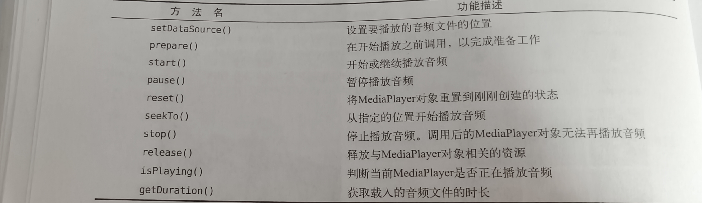
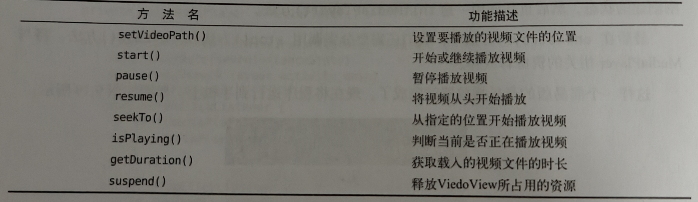

# 通知(进阶)

1. 创建通知渠道

   ```kotlin
    val manager=getSystemService(Context.NOTIFICATION_SERVICE) as NotificationManager
           if(Build.VERSION.SDK_INT >= Build.VERSION_CODES.O){
               /*参数介绍：
               1.渠道id
               2.渠道名称
               3.重要等级
               */
               val channel=NotificationChannel("normal","Normal",NotificationManager.IMPORTANCE_DEFAULT)
               val channel2=NotificationChannel("important","Important",NotificationManager.IMPORTANCE_HIGH)
               //创建通道
               manager.createNotificationChannel(channel2)
               manager.createNotificationChannel(channel)
           }
   ```

   

2. 创建Notification对象

3. 通过连缀设置丰富的Notification对象

   ```kotlin
   val notification=NotificationCompat.Builder(this,"important")
                   .setContentTitle("Title")
                   .setContentText("Text")
                   .setSmallIcon(R.drawable.small_icon)
                   .setLargeIcon(BitmapFactory.decodeResource(resources,R.drawable.large_icon))
                   .setContentIntent(pi)//点击界面跳转
                   .setAutoCancel(true)//点击后图标自动消失
   //富文本
                   .setStyle(NotificationCompat.BigTextStyle().bigText("Learn how to build notifications, send and sync data, and use voice actions. Get the official Android IDE and developer tools to build apps for Android."))    
   //显示图片
   .setStyle(NotificationCompat.BigPictureStyle().bigPicture(BitmapFactory.decodeResource(resources,R.drawable.big_image)))
                   .build()
   ```

   

4. 显示通知

   ```kotlin
   manager.notify(1,notification)
   ```

   

5. 设置点击事件

   ```kotlin
    val intent=Intent(this,NotificationActivity::class.java)
    val pi=PendingIntent.getActivity(this,0,intent,0)
   //在Notification对象中加入setContentIntent连缀
   ```

- 图标消失的两种方法：

  ```kotlin
  //1.在Notification对象后加setAutoCancel连缀
  //2.在界面跳转后的那个界面输入以下代码：
  //val manager=getSystemService(Context.NOTIFICATION_SERVICE) as NotificationManager
  //manager.cancel(1)“1”是指notify方法中传入的那个id
  ```

------

# 调用摄像头和相册

### 用摄像头拍照

1. 首先创建一个File对象，用于存储拍下的照片

2. 接下来通过判断版本进行操作，如果版本低于Android7.0就调用Uri的**fromFile()**方法转换为Uri对象（这个标识着图片的本地真实路径），如果版本高于7.0就调用FileProvider的getUriForFile()方法，将File转换成一个封装过的Uri对象

3. 构建Intent对象，启动相机程序(利用startActivityForResult进行启动)

4. 重写onActivityResult方法

5. 判断图片方向，如果需要旋转并进行旋转

6. 由于用到ContentProvider，故需要注册

   ```kotlin
    <provider
               android:authorities="com.example.cameraalbumtest.fileprovider"
               android:name="androidx.core.content.FileProvider"
               android:exported="false"
               android:grantUriPermissions="true"
               >
               <meta-data
                   android:name="android.support.FILE_PROVIDER_PATHS"
                   android:resource="@xml/file_paths"/>
           </provider>
   ```

   

7. 指定共享路径

   ```kotlin
   <?xml version="1.0" encoding="utf-8"?>
   <paths xmlns:android="http://schemas.android.com/apk/res/android">
       <external-path
           name="my_images"
           path="/"/>
   </paths>
   ```

   

### 从相册中选择

1. 构建一个Intent对象表示打开文件选择器，并设置条件过滤
2. 结果返回到onActivityResult中，调用getBitmapFromUri方法将Uri转换成Bitmap对象
3. 将图片显示出来

```kotlin
class MainActivity : AppCompatActivity() {
    // ViewBinding对象
    private lateinit var binding:ActivityMainBinding
    // 从相册选择照片的请求码
    val fromAlbum=2
    // 拍照请求码
    val takePhoto=1
    // 用于存储拍照后图片的Uri
    lateinit var imageUri:Uri
    // 用于存储拍照后图片的文件
    lateinit var outputImage:File
    @SuppressLint("ObsoleteSdkInt")
    override fun onCreate(savedInstanceState: Bundle?) {
        super.onCreate(savedInstanceState)
        // 启用沉浸式状态栏
        enableEdgeToEdge()
        // 初始化ViewBinding
        binding=ActivityMainBinding.inflate(layoutInflater)
        setContentView(binding.root)
        // 适配系统窗口，防止内容被遮挡
        ViewCompat.setOnApplyWindowInsetsListener(findViewById(R.id.main)) { v, insets ->
            val systemBars = insets.getInsets(WindowInsetsCompat.Type.systemBars())
            v.setPadding(systemBars.left, systemBars.top, systemBars.right, systemBars.bottom)
            insets
        }
        // 拍照按钮点击事件
        binding.takephoto.setOnClickListener {
            // 创建File对象，用于存储照片
            outputImage=File(externalCacheDir,"output_image.jpg")
            if (outputImage.exists()){
                // 如果文件已存在则删除
                outputImage.delete()
            }
            // 创建新文件
            outputImage.createNewFile()
            // 判断Android版本，获取图片Uri
            imageUri=if(Build.VERSION.SDK_INT>=Build.VERSION_CODES.N){
                // 7.0及以上使用FileProvider
                /**
                *第一个参数是Context
                第二个参数是任意的唯一字符串
                第三个是刚创建的File对象
                **/
                FileProvider.getUriForFile(this,"com.example.cameraalbumtest.fileprovider",outputImage)
            }else{
                // 7.0以下直接使用Uri.fromFile
                Uri.fromFile(outputImage)
            }
            // 启动相机程序
            val intent=Intent("android.media.action.IMAGE_CAPTURE")
            // 指定图片输出地址
            intent.putExtra(MediaStore.EXTRA_OUTPUT,imageUri)
            // 启动相机Activity
            startActivityForResult(intent,takePhoto)
        }
        // 从相册选择按钮点击事件
        binding.fromAlbumBtn.setOnClickListener {
            // 打开文件选择器
            val intent=Intent(Intent.ACTION_OPEN_DOCUMENT)
            // 添加可打开的类别，确保文件可以被打开
            intent.addCategory(Intent.CATEGORY_OPENABLE)
            // 指定只显示图片类型的文件
            intent.type="image/*"
            // 启动文件选择器Activity
            startActivityForResult(intent,fromAlbum)
        }
    }
    // 拍照Activity返回结果回调
    override fun onActivityResult(
        requestCode: Int,
        resultCode: Int,
        data: Intent?,
        caller: ComponentCaller
    ) {
        super.onActivityResult(requestCode, resultCode, data, caller)
        when(requestCode){
            takePhoto->{
                if(resultCode== Activity.RESULT_OK){
                    // 将拍摄照片显示出来
                    val bitmap=BitmapFactory.decodeStream(contentResolver.openInputStream(imageUri))
                    // 处理图片旋转问题后显示
                    binding.imageView.setImageBitmap(rotateIfRequired(bitmap))
                }
            }
            // 处理从相册选择照片的返回结果
            fromAlbum->{
                // 检查结果码是否成功且数据不为空
                if(resultCode==Activity.RESULT_OK&&data!=null){
                    // 获取选定图片的Uri
                    data.data?.let { uri->
                        // 根据Uri获取Bitmap对象并显示
                        val bitmap=getBitmapFromUri(uri)
                        binding.imageView.setImageBitmap(bitmap)
                    }
                }
            }
        }
    }

    // 根据Uri获取图片的Bitmap对象
    private fun getBitmapFromUri(uri: Any)=contentResolver.openFileDescriptor(uri as Uri,"r")?.use {
        // 使用文件描述符解码Bitmap
        BitmapFactory.decodeFileDescriptor(it.fileDescriptor)
    }
    // 判断图片是否需要旋转，并进行旋转
    private fun rotateIfRequired(bitmap: Bitmap?): Bitmap? {
         val exif=ExifInterface(outputImage.path)
        // 读取图片的旋转角度
        val orientation=exif.getAttributeInt(ExifInterface.TAG_ORIENTATION,ExifInterface.ORIENTATION_NORMAL)
        return when(orientation){
            ExifInterface.ORIENTATION_ROTATE_90->rotateBitmap(bitmap,90)
            ExifInterface.ORIENTATION_ROTATE_180->rotateBitmap(bitmap,180)
            ExifInterface.ORIENTATION_ROTATE_270->rotateBitmap(bitmap,270)
            else->bitmap
        }
    }

    // 旋转Bitmap图片
    private fun rotateBitmap(bitmap: Bitmap?, i: Int): Bitmap? {
            val matrix=Matrix()
        // 设置旋转角度
        matrix.postRotate(degree.toFloat())
        // 创建旋转后的Bitmap
        val rotatedBitmap=Bitmap.createBitmap(bitmap!!,0,0,bitmap.width,bitmap.height,matrix,true)
        // 将不再需要的Bitmap对象回收，释放内存
        bitmap.recycle()
        return rotatedBitmap
    }
}
```


------

# 播放多媒体

### 播放音频

- **MdeiaPlayer类常用方法**

  

- **过程**

  1. 首先在main文件夹下创建一个assets文件夹，在里面放入要播放的音频

  2. 创建一个MediaPlayer对象

  3. 初始化MdeiaPlayer对象

  4. 利用MediaPlayer中的方法对音频文件状态进行判断并执行相应的操作

     ```kotlin
     class MainActivity : AppCompatActivity() {
         private lateinit var binding:ActivityMainBinding
         //创建对象
         private val mediaPlayer=MediaPlayer()
         override fun onCreate(savedInstanceState: Bundle?) {
             super.onCreate(savedInstanceState)
             enableEdgeToEdge()
             binding=ActivityMainBinding.inflate(layoutInflater)
             setContentView(binding.root)
             ViewCompat.setOnApplyWindowInsetsListener(findViewById(R.id.main)) { v, insets ->
                 val systemBars = insets.getInsets(WindowInsetsCompat.Type.systemBars())
                 v.setPadding(systemBars.left, systemBars.top, systemBars.right, systemBars.bottom)
                 insets
             }
             //初始化
             initMediaPlayer()
             binding.play.setOnClickListener {
                 if(!mediaPlayer.isPlaying){
                     mediaPlayer.start()//开始播放
                 }
             }
             binding.pause.setOnClickListener {
                 if(mediaPlayer.isPlaying){
                     mediaPlayer.pause()//暂停播放
                 }
             }
             binding.stop.setOnClickListener {
                 if(mediaPlayer.isPlaying){
                     //停止播放
                     mediaPlayer.reset()
                     initMediaPlayer()
                 }
             }
         }
         private fun initMediaPlayer() {
             //得到AssetManager实例，读取assets目录下任何资源
             val assetManager=assets
             //将音频文件句柄打开
             val fd=assetManager.openFd("music.mp3")
             //为音频做好播放前准备
             mediaPlayer.setDataSource(fd.fileDescriptor,fd.startOffset,fd.length)
             mediaPlayer.prepare()
         }
         override fun onDestroy() {
             super.onDestroy()
             mediaPlayer.stop()
             mediaPlayer.release()
         }
     }
     ```

     

### 播放视频

- **VideoView常用方法**

  

- **过程**

  1. 利用VideoView控件显示视频

  2. 在res文件夹下新建raw文件夹放置视频文件

  3. 利用VideoView中的方法对音频文件状态进行判断并执行相应的操作

     ```kotlin
     <LinearLayout xmlns:android="http://schemas.android.com/apk/res/android"
         xmlns:app="http://schemas.android.com/apk/res-auto"
         xmlns:tools="http://schemas.android.com/tools"
         android:id="@+id/main"
         android:layout_width="match_parent"
         android:layout_height="match_parent"
         tools:context=".MainActivity"
         android:orientation="vertical">
         <LinearLayout
             android:layout_width="match_parent"
             android:layout_height="wrap_content">
             <Button
                 android:id="@+id/play"
                 android:layout_width="0dp"
                 android:layout_height="wrap_content"
                 android:layout_weight="1"
                 android:text="Play"/>
             <Button
                 android:id="@+id/pause"
                 android:layout_width="0dp"
                 android:layout_height="wrap_content"
                 android:layout_weight="1"
                 android:text="Pause"/>
             <Button
                 android:id="@+id/replay"
                 android:layout_width="0dp"
                 android:layout_height="wrap_content"
                 android:layout_weight="1"
                 android:text="Replay"/>
         </LinearLayout>
         <VideoView
             android:id="@+id/videoView"
             android:layout_width="match_parent"
             android:layout_height="wrap_content"/>
     </LinearLayout>
     ```

     ```kotlin
     class MainActivity : AppCompatActivity() {
         private lateinit var binding:ActivityMainBinding
         override fun onCreate(savedInstanceState: Bundle?) {
             super.onCreate(savedInstanceState)
             enableEdgeToEdge()
             binding=ActivityMainBinding.inflate(layoutInflater)
             setContentView(binding.root)
             ViewCompat.setOnApplyWindowInsetsListener(findViewById(R.id.main)) { v, insets ->
                 val systemBars = insets.getInsets(WindowInsetsCompat.Type.systemBars())
                 v.setPadding(systemBars.left, systemBars.top, systemBars.right, systemBars.bottom)
                 insets
             }
             val uri=Uri.parse("android.resource://$packageName/${R.raw.video}")
             binding.videoView.setVideoURI(uri)
             binding.play.setOnClickListener {
                 if(!binding.videoView.isPlaying){
                     binding.videoView.start()
                 }
             }
             binding.pause.setOnClickListener {
                 if(binding.videoView.isPlaying){
                     binding.videoView.pause()
                 }
             }
             binding.replay.setOnClickListener {
                 if(binding.videoView.isPlaying){
                     binding.videoView.resume()
                 }
             }
         }
     
         override fun onDestroy() {
             super.onDestroy()
             binding.videoView.suspend()
         }
     }
     ```

     

------

