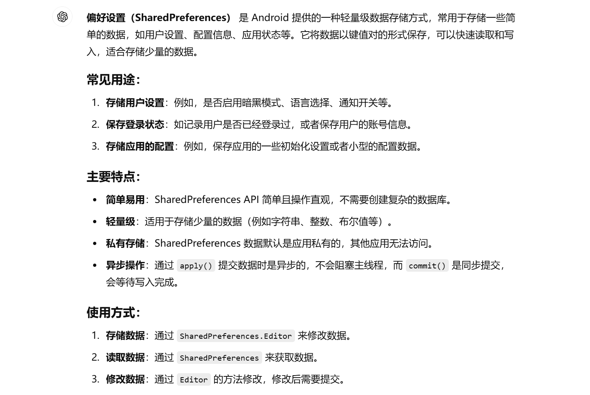

# 文件存储

### 数据存储

1.新建save方法，运用openFileOutput接收(“文件名”，保存模式（强制覆盖：MODE_PRIVATE,增添追加：MODE_APPEND）)，openFileOutput方法返回的是FileOutputStream对象，通过BufferedWriter将其写入到文件中。

2.重写onDestroy()方法，确保销毁前一定会调用save方法。

```java
public class MainActivity extends AppCompatActivity {
private EditText edit;
    @Override
    protected void onCreate(Bundle savedInstanceState) {
        super.onCreate(savedInstanceState);
        setContentView(R.layout.activity_main);
        edit=(EditText) findViewById(R.id.edit_text);
    }
//确保销毁时能够调用save方法
    @Override
    protected void onDestroy() {
        super.onDestroy();
        String inputText=edit.getText().toString();
        save(inputText);
    }
    //保存输入文本到文件中去
    public void save(String inputText){
        FileOutputStream out=null;//声明文件输出流
        BufferedWriter writer=null;//声明缓冲写入流
        try{
            //打开文件输出流，MODE_PRIVATE表示私有模式，文件只能被该应用访问
            out=openFileOutput("data", Context.MODE_PRIVATE);
            //将输出流包装成缓冲写入流，使用UTF-8编码
            writer=new BufferedWriter(new OutputStreamWriter(out));
            //将文本写入文件
            writer.write(inputText);
        }catch (IOException e){
            e.printStackTrace();//捕获并打印异常
        }finally {
            try {
                //关闭writer流
                if (writer!=null){
                    writer.close();
                }

            }catch (IOException e){
                e.printStackTrace();//捕获并打印关闭流时的异常
            }
        }
    }
}
```


### 读取数据

新建load()方法，运用openFileInput接收("文件名"),通过BufferedReader一行行读取对象

```java
public String load(){
        FileInputStream in=null;//声明文件输入流
        BufferedReader reader=null;//声明缓冲读取流
        StringBuilder content=new StringBuilder();//来存储读取的内容
        try{
            //打开文件输入流，读取名为“data”的文件
            in=openFileInput("data");
            //将文件输入流包装成缓冲读取流
            reader=new BufferedReader(new InputStreamReader(in));
            String line="";//用于存储每次读取的一行内容
            while((line=reader.readLine())!=null){
                content.append(line);//将读取的每一行都追加到content中
            }
        }catch (IOException e){
            e.printStackTrace();//捕获并打印异常
        }finally{
            //确保reader流被关闭
            if(reader!=null){
                try{
                    reader.close();//关闭缓冲读取流
                }catch (IOException e){
                    e.printStackTrace();//捕获并打印关闭流时的异常
                }
            }
        }
        return content.toString();//返回读取到的所有内容
    }
```

完整代码：

```java
public class MainActivity extends AppCompatActivity {
private EditText edit;
    @Override
    protected void onCreate(Bundle savedInstanceState) {
        super.onCreate(savedInstanceState);
        setContentView(R.layout.activity_main);
        edit=(EditText) findViewById(R.id.edit_text);
        String inputText=load();
        if(!TextUtils.isEmpty(inputText)){
            edit.setText(inputText);
            edit.setSelection(inputText.length());
            Toast.makeText(this, "Restoring succeeded", Toast.LENGTH_SHORT).show();
        }
    }

    @Override
    protected void onDestroy() {
        super.onDestroy();
        String inputText=edit.getText().toString();
        save(inputText);
    }
    public void save(String inputText){
        FileOutputStream out=null;
        BufferedWriter writer=null;
        try{
            out=openFileOutput("data", Context.MODE_APPEND);
            writer=new BufferedWriter(new OutputStreamWriter(out));
            writer.write(inputText);
        }catch (IOException e){
            e.printStackTrace();
        }finally {
            try {
                if (writer!=null){
                    writer.close();
                }

            }catch (IOException e){
                e.printStackTrace();
            }
        }
    }
    public String load(){
        FileInputStream in=null;
        BufferedReader reader=null;
        StringBuilder content=new StringBuilder();
        try{
            in=openFileInput("data");
            reader=new BufferedReader(new InputStreamReader(in));
            String line="";
            while((line=reader.readLine())!=null){
                content.append(line);
            }
        }catch (IOException e){
            e.printStackTrace();
        }finally{
            if(reader!=null){
                try{
                    reader.close();
                }catch (IOException e){
                    e.printStackTrace();
                }
            }
        }
        return content.toString();
    }
}
```


------

# SharedPreferences存储

### 数据存储

1.用getSharedPreferences设置存放的文件名与模式（唯一）

2.调用edit()方法

3.存入数据并调用apply()方法提交

```java
 @Override
    protected void onCreate(Bundle savedInstanceState) {
        super.onCreate(savedInstanceState);
        setContentView(R.layout.activity_main);
        Button saveData=(Button) findViewById(R.id.save_data);
        saveData.setOnClickListener(new View.OnClickListener() {
            @Override
            public void onClick(View view) {
                //获取SharedPreferences对象，存储在“data”文件中，MODE_PRIVATE表示私有模式
                SharedPreferences.Editor editor=getSharedPreferences("data",MODE_PRIVATE).edit();
                //使用SharedPreferences.Editor存储数据
                editor.putString("name","Tom");//存储字符串
                editor.putInt("age",28);//存储整型数据
                editor.putBoolean("married",false);//存储布尔值数据
                //提交数据（apply()为异步提交不返回结果）
                editor.apply();
            }
        });
    }
```


### 读取数据

```java
 Button restoreData=(Button) findViewById(R.id.restore_data);
        restoreData.setOnClickListener(new View.OnClickListener() {
            @Override
            public void onClick(View view) {
                 //获取SharedPreferences对象，用于读取“data”文件中的数据
                SharedPreferences pref=getSharedPreferences("data",MODE_PRIVATE);
                //从SharedPreferences中读取数据，如果没找到则使用默认值
               String name= pref.getString("name","");
               int age= pref.getInt("age",0);
               boolean married=pref.getBoolean("married",false);
                //输出日志，打印恢复的数据
                Log.d("MainActivity", "name is "+name);
                Log.d("MainActivity", "age is "+age);
                Log.d("MainActivity", "married is "+married);
            }
        });
```

[^注意]: get(键，默认值)：键找不到对应值时会返回默认值



------

# SQLite数据库存储

### SQL语句

整型：integer

浮点型：real

文本型：text

二进制型：blob

创建一个表格：

```java
 1.public static final String CREATE_BOOK="create table Book("//创建一个名为Book的表
            +"id integer primary key autoincrement, "//定义id字段，设为主键，并设为自增
            +"author text, "
            +"price real, "
            +"pages integer, "
            +"name text)";
2.private static final String CREATE_TABLE_SQL="create table"+TABLE_NAME_NOTE+"(id integer primary key autoincrement,title text,content,text,create_time text)";
//两种方法都可以使用
```


### 创建数据库

1.新建帮助类MyDatabaseHelper继承自SQLiteOpenHelper

2.重写构造方法

3.重写onCreate调用execSQL执行建表语句

4.重写onUpgrade

5.之后可以调用getWritableDatabase（）或getReadableDatabase（）获取数据库

```java
//构造方法，初始化数据库
public MyDatabaseHelper(@Nullable Context context, @Nullable String name, @Nullable SQLiteDatabase.CursorFactory factory, int version) {
        super(context, name, factory, version);
    }
//创建数据库表
    @Override
    public void onCreate(SQLiteDatabase db){
        db.execSQL(CREATE_BOOK);
    }
//更新数据库，暂时不操作
    @Override
    public void onUpgrade(SQLiteDatabase db, int i, int i1) {
    }
```


### 升级数据库

如果需要在已经创建好的数据库的基础上还想添加几类数据就需要升级数据库

```java
public class MyDatabaseHelper extends SQLiteOpenHelper {
    public static final String CREATE_BOOK="create table Book("
            +"id integer primary key autoincrement, "
            +"author text, "
            +"price real, "
            +"pages integer, "
            +"name text)";
    public static final String CREATE_CATEGORY="create table Category("
            +"id integer primary key autoincrement, "
            +"category_name text, "
            +"category_code integer)";

    private Context mContext;

    public MyDatabaseHelper(@Nullable Context context, @Nullable String name, @Nullable SQLiteDatabase.CursorFactory factory, int version) {
        super(context, name, factory, version);
                mContext=context;
    }
    @Override
    public void onCreate(SQLiteDatabase db){
        db.execSQL(CREATE_BOOK);
        db.execSQL(CREATE_CATEGORY);
        Toast.makeText(mContext, "Create succeeded", Toast.LENGTH_SHORT).show();
    }
    @Override
    public void onUpgrade(SQLiteDatabase db, int i, int i1) {
        db.execSQL("drop table if exists Book");//如果存在Book表则删除
        db.execSQL("drop table if exists Category");//如果存在Category表则删除
        onCreate(db);//重新创建表格
    }
}

```

**CRUD：Create添加Read查询Update更新Delete删除**

### 添加数据

可以使用insert()方法插入数据

```java
  public long insertData(Note note){             
               SQLiteDatabase db=getWritableDatabase();//获取数据库
                ContentValues values=new ContentValues();//创建ContentValues存储插入数据
                //开始组装第一条数据
                values.put("title",note.getTitle());
                values.put("content",note.getContent());
                values.put("create_time",note.getCreatTime());
              return  db.insert("Note",null,values);//插入数据，返回插入的行号
  }
```


### 更新数据

利用updata()方法更新

```java
public int updateData(Note note){
                SQLiteDatabase db=getWritableDatabase();
                ContentValues values=new ContentValues();
                values.put("title",note.getTitle());
                values.put("content",note.getContent());
                values.put("create_time",note.getCreatTime());
                return db.update("Note",values,"id=?",new String[]{note.getId()});
}
```


### 删除数据

用delete()方法删除

```java
public int deleteData(String id){
                SQLiteDatabase db=getWritableDatabase();
               return db.delete("Note","id=?",new String[]{id});
}
```


### 查询数据

1**.方法：**通过query()方法

2.**基本语法：**public Cursor query(String table, String[] columns, String selection,String[] selectionArgs, String groupBy, String having, String orderBy)

3.**参数说明：**table：要查询的表名。
columns：要返回的列名数组。可以指定要查询的具体列，若为 null，表示查询所有列。
selection：查询条件，相当于 SQL 中的 WHERE 子句。可以为 null，表示没有条件（即返回所有记录）。
selectionArgs：selection 中占位符（?）的实际值，必须与 selection 中的 ? 占位符一一对应。如果没有占位符，传入 null。
groupBy：对查询结果进行分组的列名数组，通常与 GROUP BY 子句结合使用。如果不需要分组，可以传入 null。
having：分组后筛选的条件，相当于 SQL 中的 HAVING 子句。如果不需要筛选分组后的数据，可以传入 null。
orderBy：排序方式，相当于 SQL 中的 ORDER BY 子句。如果为 null，则不进行排序。

4.**返回值：**
query() 方法返回一个 Cursor 对象，它包含了查询的结果。通过 Cursor，你可以逐行遍历查询结果并获取每一行的数据。

```java
               SQLiteDatabase db=dbHelper.getWritableDatabase();
               //查询表中所有数据
                Cursor cursor=db.query("Book",null,null,null,null,null,null);
                if(cursor.moveToFirst()){
                    do{
                        //遍历表中所有数据，并打印
                        @SuppressLint("Range") String name=cursor.getString(cursor.getColumnIndex("name"));
                        @SuppressLint("Range") String author=cursor.getString(cursor.getColumnIndex("author"));
                        @SuppressLint("Range") int pages=cursor.getInt(cursor.getColumnIndex("pages"));
                        @SuppressLint("Range") double price=cursor.getDouble(cursor.getColumnIndex("price"));
                        Log.d("MainActivity", "book name is: "+name);
                        Log.d("MainActivity", "book author is: "+author);
                        Log.d("MainActivity", "book pages is: "+pages);
                        Log.d("MainActivity", "book price is: "+price);
                    }while(cursor.moveToNext());
                }
                cursor.close();;
            }
```


### 使用SQL操作数据库

添加数据：

```java
db.execSQL("insert into Book(name,author,pages,price) values(? ,?, ?, ?)",new String[]{"The Da Vinci Code","Dan Brown","454","16.96"});
```

插入数据：

`db.execSQL("update Book set price=? where name=?",new String[]{"10.99","The Da Vinci Code"});`

删除数据：

`db.execSQL("delete from Book where pages>?",new String[]{"500"});`

查询数据：

`db.rawQuery("select * from Book",null);`

------

