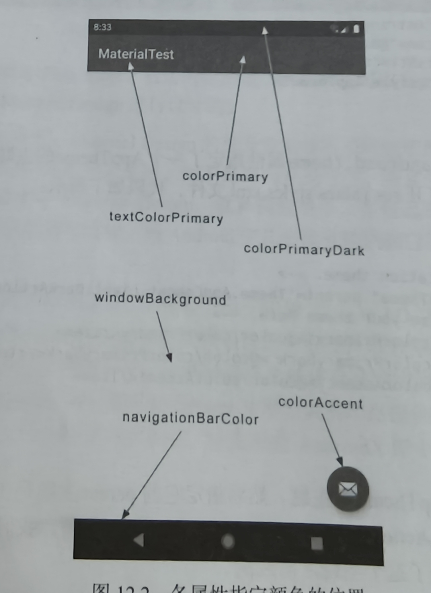

# 各版块颜色的代表标识



------

# Toolbar

- 在布局文件中使用
- 在活动中设置

```kotlin
            <androidx.appcompat.widget.Toolbar
                android:id="@+id/toolbar"
                android:layout_width="match_parent"
                android:layout_height="?attr/actionBarSize"
                android:background="?attr/colorPrimary"
                android:theme="@style/ThemeOverlay.AppCompat.Dark.ActionBar"
                app:popupTheme="@style/ThemeOverlay.AppCompat.Light"//为弹出的菜单项设置主题
                app:layout_scrollFlags="scroll|enterAlways|snap"/>//用于控制Toolbar或其他顶部栏的滚动行为
```

```kotlin
setSupportActionBar(binding.toolbar)
```

------

# DrawerLayout

这是一个布局，允许放入两个直接子控件，第一个是主屏幕显示的内容，第二个是滑动菜单中显示的内容

```kotlin
<androidx.drawerlayout.widget.DrawerLayout
    xmlns:android="http://schemas.android.com/apk/res/android"
    android:id="@+id/drawerLayout"
    android:layout_width="match_parent"
    android:layout_height="match_parent">
    <FrameLayout
        android:layout_width="match_parent"
        android:layout_height="match_parent" >
	    <androidx.appcompat.widget.Toolbar
                android:id="@+id/toolbar"
                android:layout_width="match_parent"
                android:layout_height="?attr/actionBarSize"
                android:background="@color/colorPrimary"
                android:theme="@style/ThemeOverlay.AppCompat.Dark.ActionBar"
                app:popupTheme="@style/ThemeOverlay.AppCompat.Light"
                app:layout_scrollFlags="scroll|enterAlways|snap"/>
    </FrameLayout>
	<TextView
 		android:layout_width="match_parent"
     	android:layout_height="match_parent"
		android:text="This is menu"/>  	
</androidx.drawerlayout.widget.DrawerLayout>
```

```kotlin
//调用getSupportActionBar方法获取ActionBar实例
        supportActionBar?.let {
            //让导航按钮显示
            it.setDisplayHomeAsUpEnabled(true)
            //设置导航图标
            it.setHomeAsUpIndicator(R.drawable.ic_menu)
        }
```

```kotlin
//设置按钮点击事件
    override fun onOptionsItemSelected(item: MenuItem): Boolean {
        when(item.itemId){
            //openDrawer将滑动菜单显示出来
            android.R.id.home->binding.drawerLayout.openDrawer(GravityCompat.START)
            ...
        }
        return true
    }
```

------

# NavigationView

**作用：** NavigationView 用于在侧滑菜单中显示导航菜单项，可方便地配置菜单资源、头部布局等。

- 依赖库
- menu
- headerLayout
- 点击事件

```kotlin
implementation("com.google.android.material:material:1.12.0")
implementation("de.hdodenhof:circleimageview:3.1.0")
```

```kotlin
<?xml version="1.0" encoding="utf-8"?>
<menu xmlns:android="http://schemas.android.com/apk/res/android">
    <group android:checkableBehavior="single">
        <item
            android:id="@+id/navCall"
            android:icon="@drawable/nav_call"
            android:title="Call"/>
        <item
            android:id="@+id/navFriends"
            android:icon="@drawable/nav_friends"
            android:title="Friends"/>
        <item
            android:id="@+id/navLocation"
            android:icon="@drawable/nav_location"
            android:title="Location"/>
        <item
            android:id="@+id/navMail"
            android:icon="@drawable/nav_mail"
            android:title="Mail"/>
        <item
            android:id="@+id/navTask"
            android:icon="@drawable/nav_task"
            android:title="Task"/>

    </group>
</menu>
```

```kotlin
<?xml version="1.0" encoding="utf-8"?>
<RelativeLayout xmlns:android="http://schemas.android.com/apk/res/android"
    android:layout_width="match_parent"
    android:layout_height="180dp"
    android:padding="10dp"
    android:background="@color/colorPrimary">
    <de.hdodenhof.circleimageview.CircleImageView
        android:id="@+id/iconImage"
        android:layout_width="70dp"
        android:layout_height="70dp"
        android:src="@drawable/nav_icon"
        android:layout_centerInParent="true"/>
    <TextView
        android:id="@+id/mailText"
        android:layout_width="wrap_content"
        android:layout_height="wrap_content"
        android:layout_alignParentBottom="true"
        android:text="buyu@qq.com"
        android:textColor="#FFF"
        android:textSize="14sp"/>
    <TextView
        android:id="@+id/userText"
        android:layout_width="wrap_content"
        android:layout_height="wrap_content"
        android:layout_above="@id/mailText"
        android:text="Buyu"
        android:textColor="#FFF"
        android:textSize="14sp"/>


</RelativeLayout>
```

```kotlin
<com.google.android.material.navigation.NavigationView
        android:id="@+id/navView"
        android:layout_width="match_parent"
        android:layout_height="match_parent"
        android:layout_gravity="start"
        app:menu="@menu/nav_menu"
        app:headerLayout="@layout/nav_header"/>
```

```kotlin
 //设置默认选中项
        binding.navView.setCheckedItem(R.id.navCall)
        //设置菜单项选中事件的监听器
        binding.navView.setNavigationItemSelectedListener {
            //将滑动菜单关闭
            binding.main.closeDrawers()
            //true表示事件已处理
            true
        }
```

------

# FloatingActionButton

```kotlin
<com.google.android.material.floatingactionbutton.FloatingActionButton
            android:id="@+id/fab"
            android:layout_width="wrap_content"
            android:layout_height="wrap_content"
            android:layout_gravity="bottom|end"
            android:layout_margin="16dp"
            android:src="@drawable/ic_done"
            app:elevation="8dp"/>//指定高度值
```

------

# Snackbar

**作用：** Snackbar 用于短暂地在屏幕底部显示信息反馈。虽然 Snackbar 主要在代码中调用显示，但其依赖于包含在布局中的 `CoordinatorLayout` 来获得自动动画和交互。

```kotlin
Snackbar.make(findViewById(R.id.coordinator_layout), "这是一个Snackbar", Snackbar.LENGTH_LONG)
    .setAction("Undo") {
        // 处理点击事件
    }
    .show()
```

------

# CoordinatorLayout

加强版的FrameLayout

**作用：** CoordinatorLayout 是一个高级布局容器可以监听内部的所有控件，可以协调其内部子控件的交互,控件自动调整合适的位置

```kotlin
<androidx.coordinatorlayout.widget.CoordinatorLayout
    xmlns:android="http://schemas.android.com/apk/res/android"
    android:id="@+id/coordinator_layout"
    android:layout_width="match_parent"
    android:layout_height="match_parent">
    <!-- 这里可以嵌入 AppBarLayout、FloatingActionButton 等 -->
</androidx.coordinatorlayout.widget.CoordinatorLayout>
```

------

# MaterialCardView

额外提供了圆角阴影等效果的FrameLayout

```kotlin
<com.google.android.material.card.MaterialCardView
    android:id="@+id/material_card"
    android:layout_width="match_parent"
    android:layout_height="wrap_content"
    android:layout_margin="16dp"
    app:cardCornerRadius="8dp"//指定卡片圆角的弧度
    app:elevation="4dp">//指定卡片高度

    <!-- 卡片内部内容 -->
    <TextView
        android:layout_width="match_parent"
        android:layout_height="wrap_content"
        android:padding="16dp"
        android:text="这是一个MaterialCardView" />
        
</com.google.android.material.card.MaterialCardView>
```

------

# AppBarLayout

**作用：** AppBarLayout 是用于实现应用栏（如 Toolbar、Tabs）的容器，它通常配合 CollapsingToolbarLayout 实现折叠效果。例如解决RecyclerView遮挡Toolbar问题

```kotlin
<com.google.android.material.appbar.AppBarLayout
    android:id="@+id/appbar_layout"
    android:layout_width="match_parent"
    android:layout_height="wrap_content"
    android:theme="@style/AppTheme.AppBarOverlay">

     <androidx.appcompat.widget.Toolbar
                android:id="@+id/toolbar"
                android:layout_width="match_parent"
                android:layout_height="?attr/actionBarSize"
                android:background="@color/colorPrimary"
                android:theme="@style/ThemeOverlay.AppCompat.Dark.ActionBar"
                app:popupTheme="@style/ThemeOverlay.AppCompat.Light"
                app:layout_scrollFlags="scroll|enterAlways|snap"/>
        
</com.google.android.material.appbar.AppBarLayout>
```

------

# SwipeRefreshLayout

**作用：** SwipeRefreshLayout 用于实现下拉刷新效果，当用户下拉时可以触发刷新操作。

```kotlin
implementation("androidx.swiperefreshlayout:swiperefreshlayout:1.1.0")
```

```kotlin
<androidx.swiperefreshlayout.widget.SwipeRefreshLayout
    xmlns:android="http://schemas.android.com/apk/res/android"
    android:id="@+id/swipe_refresh"
    android:layout_width="match_parent"
    android:layout_height="match_parent">

    <!-- 包含可刷新的内容区域，例如 RecyclerView -->
    <androidx.recyclerview.widget.RecyclerView
        android:id="@+id/recycler_view"
        android:layout_width="match_parent"
        android:layout_height="match_parent" />

</androidx.swiperefreshlayout.widget.SwipeRefreshLayout>
```

------

# 可折叠式标题栏

### CollapsingToolbarLayout

不能独立存在必须是AppBarLayout子布局，AppBarLayout又必须是CoordinatorLayout子布局

这个高级标题栏就是普通标题栏加上背景图片

```kotlin
<androidx.coordinatorlayout.widget.CoordinatorLayout
    xmlns:android="http://schemas.android.com/apk/res/android"
    xmlns:app="http://schemas.android.com/apk/res-auto"
    android:layout_width="match_parent"
    android:layout_height="match_parent"
    android:fitsSystemWindows="true">

    <com.google.android.material.appbar.AppBarLayout
        android:id="@+id/appBar"
        android:layout_width="match_parent"
        android:layout_height="250dp"
        android:fitsSystemWindows="true">

        <com.google.android.material.appbar.CollapsingToolbarLayout
            android:id="@+id/collapsingToolbar"
            android:layout_width="match_parent"
            android:layout_height="match_parent"
            android:theme="@style/ThemeOverlay.AppCompat.Dark.ActionBar"
            android:fitsSystemWindows="true"
            app:contentScrim="?attr/colorPrimary"
            app:layout_scrollFlags="scroll|exitUntilCollapsed">

            <ImageView
                android:id="@+id/fruitImageView"
                android:layout_width="match_parent"
                android:layout_height="match_parent"
                android:scaleType="centerCrop"
                android:fitsSystemWindows="true"
                app:layout_collapseMode="parallax" />

            <androidx.appcompat.widget.Toolbar
                android:id="@+id/toolbar"
                android:layout_width="match_parent"
                android:layout_height="?attr/actionBarSize"
                app:layout_collapseMode="pin" />

        </com.google.android.material.appbar.CollapsingToolbarLayout>

    </com.google.android.material.appbar.AppBarLayout>

    <androidx.core.widget.NestedScrollView
        android:layout_width="match_parent"
        android:layout_height="match_parent"
        app:layout_behavior="@string/appbar_scrolling_view_behavior">

        <LinearLayout
            android:orientation="vertical"
            android:layout_width="match_parent"
            android:layout_height="wrap_content">

            <com.google.android.material.card.MaterialCardView
                android:layout_width="match_parent"
                android:layout_height="wrap_content"
                android:layout_marginBottom="15dp"
                android:layout_marginLeft="15dp"
                android:layout_marginRight="15dp"
                android:layout_marginTop="35dp"
                app:cardCornerRadius="4dp">

                <TextView
                    android:id="@+id/fruitContentText"
                    android:layout_width="wrap_content"
                    android:layout_height="wrap_content"
                    android:layout_margin="10dp" />

            </com.google.android.material.card.MaterialCardView>

        </LinearLayout>

    </androidx.core.widget.NestedScrollView>

    <com.google.android.material.floatingactionbutton.FloatingActionButton
        android:layout_width="wrap_content"
        android:layout_height="wrap_content"
        android:layout_margin="16dp"
        android:src="@drawable/ic_comment"
        app:layout_anchor="@id/appBar"
        app:layout_anchorGravity="bottom|end" />

</androidx.coordinatorlayout.widget.CoordinatorLayout>
```

### 充分利用系统状态栏空间

1. 将ImageView及其所有父布局使用android:fitsSystemWindows=”true”

2. 使用android:statusBarColor属性将主题状态栏颜色设为透明

3. 在Manifest.xml中对活动主题进行修改

   ```kotlin
   <style name="FruitActivityTheme" parent="AppTheme" >
           <item name="android:statusBarColor">@android:color/transparent</item>
       </style>
   ```

   ```kotlin
   <activity
               android:name=".FruitActivity"
               android:theme="@style/FruitActivityTheme"></activity>
   ```

------

