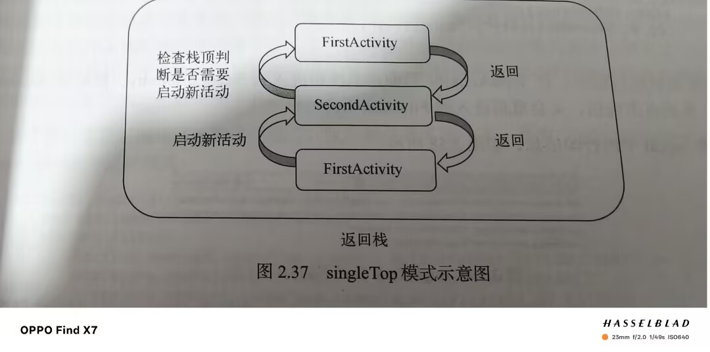
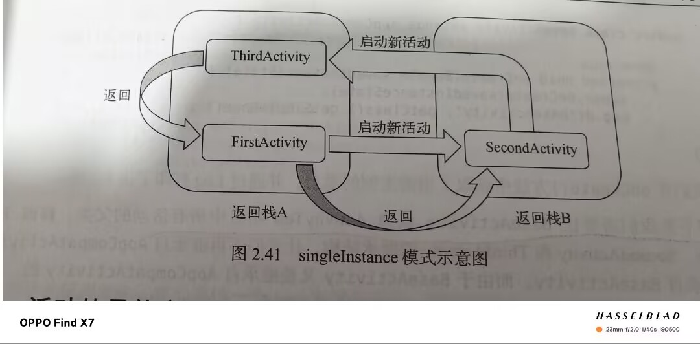

title: 活动(Java)
date: 2025-02-24 21:02:40

categories:
- Android(Java版)
tags:

---

# 手动创建一个活动的全过程

1.创建一个活动
2.创建和加载布局(根元素一般选用LinearLayout的):

```java
<LinearLayout xmlns:android="http://schemas.android.com/apk/res/android"
    android:layout_width="match_parent"
    android:layout_height="match_parent"
    android:orientation="vertical">

    <Button
        android:id="@+id/button_1"
        android:layout_width="match_parent"
        android:layout_height="wrap_content"
        android:text="Button 1" />
</LinearLayout>
```

①添加按钮用Button控件
②利用setContentView()方法加载布局
3.在AndroidManifest中注册
4.配置主活动(也可以用label给活动添加个标题，标题栏显示在最顶部)

---

# Toast

1.定义:一种提醒方式，信息出现一段时间会自己消失，不会占用屏幕空间
2.使用方式:

```java
Toast.makeText(FirstActivity.this, "You clicked Button 1", Toast.LENGTH_SHORT).show();
```

3.利用makeText()创建一个Toast对象，传入三个参数，第一个参数是Context,也就是上下文，第二个参数是文本内容，第三个参数是显示时长

---

# Menu

1.要现在res目录下创建一个新的文件夹menu
2.创建Menu resource file
3.修改其中的代码

```java
<item
    android:id="@+id/add_item"
    android:title="Add"/>
<item
    android:id="@+id/remove_item"
    android:title="Remove"/>
```

其中 **item** 标签就是用来创建具体的某一个菜单项

4.接着重写onCreateOptionsMenu()方法


5.然后利用onOptionsItemSelected()方法定义菜单响应事件

```java
 @Override
    public boolean onOptionsItemSelected(MenuItem item){
        if(item.getItemId()==R.id.add_item){
                Toast.makeText(this, "You clicked Add", Toast.LENGTH_SHORT).show();
        } else if (item.getItemId()==R.id.remove_item) {
            Toast.makeText(this, "You clicked Remove", Toast.LENGTH_SHORT).show();
        }
        return false;
    }
```

---

# Intent

用途:启动活动，启动服务，发送广播

### 显式Intent

```java
Intent intent = new Intent(FirstActivity.this,SecondActivity.class);
startActivity(intent);
```

 Intent构造函数接收两个参数，第一个参数是Context上下文，第二个是想要启动的活动目标 然后通过startActivity()方法执行这个intent 

### 隐式Intent

1.在**activity**下配置**intent-filter**，指定当前活动能响应的**action**和**category**

```java
 <intent-filter>
      <action android:name="com.example.activitytest.ACTION_START" />

      <category android:name="android.intent.category.DEFAULT" />
 </intent-filter>
```

2.只有**action**和**category**能够同时匹配上intent指定的action和category时，活动才能响应该intent

```java
Intent intent = new Intent("com.example.activitytest.ACTION_START");
startActivity(intent);
```

3.每个intent只能指定一个action却可以指定多个category 

4.可以利用addCategory()方法来添加category，在活动中添加一个category同时也需要在**intent-filter**下进行一个声明 

### 更多隐式intent用法

1.通过Intent启动浏览器等:


同时我们还应该在**intent-filter**中配置一**data**标签 


除了浏览器也可以是其他的网址: 


### 向下一个活动传递数据

1.可以利用putExtra()方法，把我们想要传递的数据存在intent中，启动一个活动后，只需要再把数据取出就可以了。
2.putExtra()方法使用需要两个参数，第一个是键用于后面取值，第二个是要传递的数据。

```java
 String data="Hello SecondAcitivity";
 Intent intent=new Intent(FirstActivity.this,SecondActivity.class);
 intent.putExtra("extra_data",data);
 startActivity(intent);
```


3.取值时首先要通过getIntent()方法获取intent，然后调用getStringExtra()方法获取数据

```java
        Intent intent = getIntent();
        String data=intent.getStringExtra("extra_data");
        Log.d("SecondAcitivity",data);
```


### 返回数据给上一个活动

1.利用startActivityForResult()方法来启动活动
2.调用setResult()方法用于向上一个活动返回数据
3.用startActivityForResult()方法启动活动该活动销毁后会调回上一个活动的onActivityResult()方法，所以重写该方法可以得到返回的数据

例子：


4.如果通过back键销毁活动则可以通过重写onBackPressed()方法解决

```
 @Override
    public void onBackPressed() {
       super.onBackPressed();
       Intent intent = new Intent();
       intent.putExtra("data_return", "Hello FirstActivity");
       setResult(RESULT_OK, intent);
       finish();
   }
```

---


# 活动的生命周期


### 返回栈


一个任务就是一组存放在栈里的集合，这个栈也叫返回栈


### 活动状态


1.运行状态:处于栈顶
2.暂停状态:不在栈顶但仍然可见
3.停止状态:不在栈顶且不可见
4.销毁状态:从返回栈中移除


### 生存期


1.七种回调方法:
①·onCreate():初始化操作
②·onStart():活动由不可见变为可见
③·onResume():此时活动一定处于栈顶且运行状态
④·onPause():在准备启动或恢复另一个活动时调用
⑤·onStop():活动完全不可见时用，如果启动的新活动是对话框式的，则会调用onPause(),而onStop()不会执行
⑥·onDestroy():销毁之前调用
⑦·onRestart():活动由停止变为运行状态前调用
完整生存期:①到⑥之间经历的方法
可见生存期:②到⑤之间
前台生存期:③到④之间


  对话框式的主题需要在AndroidManifest中更改配置如下所示:

```java
android:theme="@style/Theme.Appcompat.Light.Dialog.Alert"
```


---

# 活动被回收了怎么办

1.利用onSaveInstanceState()方法回调，这个方法会携带一个Bundle类型参数，该类型提供了一系列方法保存数据
2.例子:


---

# 活动的启动模式

在AndroidManifest中用android:launchMode更改模式
(1)standard:默认启动模式


(2)singleTop:在启动活动时如果发现栈顶已经是该活动，则可以直接使用他，不再创建新活动




(3)singleTask:每次启动活动时会先检查存不存在该活动，如果存在直接调用此活动，并把该活动上面的活动通通出栈


(4)singleInstance:会启用一个新的返回栈来管理活动



---

# 知晓当前在哪一个活动

1.创建一个新的Java类继承AppCompatActivity并重写onCreate方法在该类中获得当前实例的类名

```java

public class BaseActivity extends AppCompatActivity {
    @Override
    protected void onCreate(@Nullable Bundle savedInstanceState) {
        super.onCreate(savedInstanceState);
        Log.d("BaseActivity", getClass().getSimpleName());
    }

}
```


2.让其他的活动都继承新建的类
3.观察logcat中各界面的打印信息即可得出结论

---

# 随时随地的退出程序

1.可以创建一个专门的集合对所有活动进行管理就可以了

```java
public class ActivityCollector {
    public static List<BaseActivity> activities=new ArrayList<>();
    public static void addActivity(BaseActivity activity){
        activities.add(activity);
    }
    public static void removeActivity(BaseActivity activity){
        activities.remove(activity);
    }
    public static void finishAll(){
        for(BaseActivity activity:activities){
            if(!activity.isFinishing()){
                activity.finish();
            }
        }
    }
}

```

2.设计好管理类接下来对BaseActivity类进行修改

```java
public class BaseActivity extends AppCompatActivity {
    @Override
    protected void onCreate(@Nullable Bundle savedInstanceState) {
        super.onCreate(savedInstanceState);
        Log.d("BaseActivity", getClass().getSimpleName());
        ActivityCollector.addActivity(this);
    }

    @Override
    protected void onDestroy() {
        super.onDestroy();
        ActivityCollector.removeActivity(this);
    }
}

```

3.这两步操作完，如果以后想直接退出程序直接使用finishAll()方法即可

------

# 启动活动的最佳写法

利用actionStart()方法

```java
public static void actionStart(Context context,String data1,String data2){
   Intent intent = new Intent(context,SecondActivity.class);
   intent.putExtra("param1",data1);
   intent.putExtra("param2",data2);
   context.startActivity(intent);
}
```

```java
SecondActivity.actionStart(FirstActivity.this,"data1","data2");
```

用上面这句话直接启动
