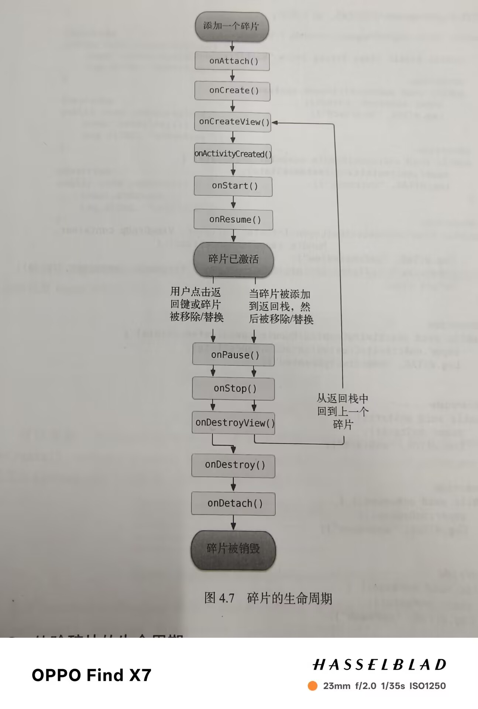
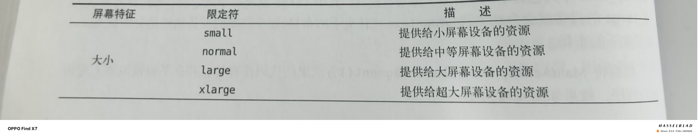
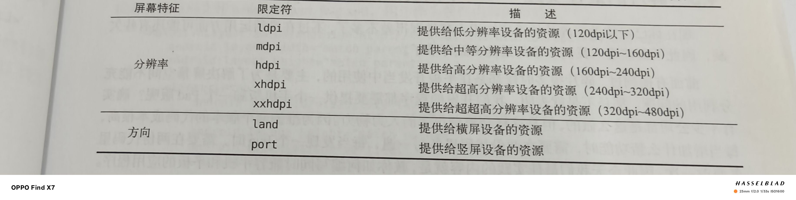

---

title: 碎片(Kotlin)
date: 2025-05-01 14:22:24
categories:
- Android(Kotlin版)
tags:
---

# Fragment使用方式

### 简单用法

1.新建碎片布局

2.新建碎片类继承Fragment并在碎片类中动态加载碎片布局

3.将碎片引入活动布局

```kotlin
//左碎片布局
<LinearLayout xmlns:android="http://schemas.android.com/apk/res/android"
    android:orientation="vertical"
    android:layout_width="match_parent"
    android:layout_height="match_parent">
    <Button
        android:id="@+id/button"
        android:layout_width="wrap_content"
        android:layout_height="wrap_content"
        android:layout_gravity="center_horizontal"
        android:text="Button"/>
</LinearLayout>
```

```kotlin
class LeftFragment: Fragment() {
    override fun onCreateView(
        inflater: LayoutInflater,
        container: ViewGroup?,
        savedInstanceState: Bundle?
    ): View? {
       return inflater.inflate(R.layout.left_fragment,container,false)
    }
}
```

```kotlin
//右碎片布局
<LinearLayout xmlns:android="http://schemas.android.com/apk/res/android"
    android:orientation="vertical"
    android:background="#00ff00"
    android:layout_width="match_parent"
    android:layout_height="match_parent">
    <TextView
        android:layout_width="wrap_content"
        android:layout_height="wrap_content"
        android:layout_gravity="center_horizontal"
        android:textSize="24sp"
        android:text="This is right fragment"/>
</LinearLayout>
```

```kotlin
class RightFragment:Fragment() {
    override fun onCreateView(
        inflater: LayoutInflater,
        container: ViewGroup?,
        savedInstanceState: Bundle?
    ): View? {
        return inflater.inflate(R.layout.right_fragment,container,false)
            }
}
```

```kotlin
//主活动布局
<LinearLayout xmlns:android="http://schemas.android.com/apk/res/android"
    android:orientation="horizontal"
    android:layout_width="match_parent"
    android:layout_height="match_parent">
    <fragment
        android:id="@+id/leftFrag"
        android:name="com.example.fragmenttest.LeftFragment"
        android:layout_width="0dp"
        android:layout_height="match_parent"
        android:layout_weight="1"/>
    <fragment
        android:id="@+id/rightFrag"
        android:name="com.example.fragmenttest.RightFragment"
        android:layout_width="0dp"
        android:layout_height="match_parent"
        android:layout_weight="3"/>
</LinearLayout>
```

### 动态添加Fragment

- 创建待添加的实例
- 获取FragmentManager对象
- 开启一个事务使用beginTransaction()方法开启
- 向容器内添加或替换fragment
- 提交事务，用commit()完成

```kotlin
//新碎片布局
<LinearLayout xmlns:android="http://schemas.android.com/apk/res/android"
    android:orientation="vertical"
    android:background="#00ff00"
    android:layout_width="match_parent"
    android:layout_height="match_parent">
    <TextView
        android:layout_width="wrap_content"
        android:layout_height="wrap_content"
        android:layout_gravity="center_horizontal"
        android:textSize="24sp"
        android:text="This is another right fragment"/>
</LinearLayout>
```

```kotlin
//加载新碎片布局
class AnotherRightFragment:Fragment() {
    override fun onCreateView(
        inflater: LayoutInflater,
        container: ViewGroup?,
        savedInstanceState: Bundle?
    ): View? {
        return inflater.inflate(R.layout.another_right_fragment,container,false)
    }
}
```

```kotlin
//主活动布局
<LinearLayout xmlns:android="http://schemas.android.com/apk/res/android"
    android:layout_width="match_parent"
    android:layout_height="match_parent"
    android:orientation="horizontal"
    >

    <fragment
        android:id="@+id/leftFrag"
        android:name="com.example.fragmenttest.LeftFragment"
        android:layout_width="match_parent"
        android:layout_height="match_parent" />
    <FrameLayout
        android:id="@+id/rightLayout"
        android:layout_width="0dp"
        android:layout_height="match_parent"
        android:layout_weight="1">
        
    </FrameLayout>
</LinearLayout>
```

```kotlin
class MainActivity : AppCompatActivity() {
    private lateinit var binding: ActivityMainBinding
    override fun onCreate(savedInstanceState: Bundle?) {
        super.onCreate(savedInstanceState)
        binding = ActivityMainBinding.inflate(layoutInflater)
        setContentView(binding.root)
        val button:Button=findViewById(R.id.button)
        button.setOnClickListener {
            replaceFragment(AnotherRightFragment())
        }
        replaceFragment(RightFragment())
    }

    private fun replaceFragment(fragment: Fragment) {
        //获取fragmentManager对象
        val fragmentManager = supportFragmentManager
        //开启事务
        val transaction = fragmentManager.beginTransaction()
        //向容器内添加碎片
        transaction.replace(R.id.rightLayout,fragment)
        //将事务添加到返回栈
        transaction.addToBackStack(null)
        //提交事务
        transaction.commit()
    }
}
```

### Fragment和Activity交互

**在活动中调用碎片：**

```kotlin
val fragment=supportFragmentManager.findFragmentById(R.id.leftFrag) as LeftFragment
```

**在碎片中调用活动：**

```kotlin
if(activity!=null){
    val mainActivity = activity as MainActivity
}
```

**不同的碎片之间通信：**

1.在一个碎片中得到与之关联的活动

2.然后在这个Activity中去获取另一个Fragment实例

------

# Fragment的生命周期

### fragment的状态

（1）运行状态：

当一个碎片是可见的，并且它所关联的活动正处于运行状态时，该碎片也处于运行状态

（2）暂停状态：

当一个活动进入暂停状态时(由于另一个未占满屏幕的活动被添加到了栈顶)，与它相关联的可见碎片就会进入到暂停状态。

（3）停止状态：

当一个活动进入到停止状态时，与它相关联的碎片就会进入到停止状态，或者通过调用FragmentTransaction的remove(),replace()方法将碎片从活动中移除，但如果在事务提交之前使用addToBackStack()方法，这时的碎片也会进入到停止状态。总的来说，进入到停止状态的碎片对用户来说完全不可见，有可能被系统回收。

（4）销毁状态：

碎片总是依附于活动而存在，因此当活动被销毁时，与它相关联的碎片就会进入到销毁状态。或者通过调用FragmentTransaction的remove(),replace()方法将碎片从活动中移除，但如果在事务提交之前没有使用addToBackStack()方法，这时碎片也会进入到销毁状态。

### fragment的回调方法

- onAttach().当碎片和活动建立起关联的时候调用

- onCreateView().为碎片加载布局时调用

- onActivityCreated().确保与碎片相关联的活动一定已经创建完毕时使用

- onDestroyView().当与碎片相关联的视图被移除的时候调用

- onDetach().当碎片和活动解除关联时调用


碎片的完整生命周期示意图：



### 体验生命周期

```kotlin
class RightFragment:Fragment() {
    companion object{
        const val TAG="RightFragment"
    }
    
    override fun onAttach(context: Context) {
        super.onAttach(context)
        Log.d(TAG, "onAttach: ")
    }
    override fun onCreate(savedInstanceState: Bundle?) {
        super.onCreate(savedInstanceState)
        Log.d(TAG, "onCreate: ")
    }

    override fun onCreateView(
        inflater: LayoutInflater,
        container: ViewGroup?,
        savedInstanceState: Bundle?
    ): View? {
        Log.d(TAG, "onCreateView: ")
        return inflater.inflate(R.layout.right_fragment,container,false)
            }

    override fun onActivityCreated(savedInstanceState: Bundle?) {
        super.onActivityCreated(savedInstanceState)
        Log.d(TAG, "onActivityCreated: ")
    }       

    override fun onStart() {
        super.onStart()
        Log.d(TAG, "onStart: ")
    }

    override fun onResume() {
        super.onResume()
        Log.d(TAG, "onResume: ")
    }   

    override fun onPause() {
        super.onPause()
        Log.d(TAG, "onPause: ")
    }

    override fun onStop() {
           super.onStop()
        Log.d(TAG, "onStop: ")
    }   

    override fun onDestroyView() {
        super.onDestroyView()
        Log.d(TAG, "onDestroyView: ")
    }

    override fun onDestroy() {
        super.onDestroy()
        Log.d(TAG, "onDestroy: ")
    }
    override fun onDetach(){
        super.onDetach()
        Log.d(TAG, "onDetach: ")
    }

}
```

------

# 限定符

### 使用限定符

- 使用限定符新建一个layout文件夹(layout-large)

- 在里面新建一个活动布局

- 小屏设备加载layout下布局，大屏加载layout-large下布局

  ```kotlin
  //layou-large下布局
  <LinearLayout xmlns:android="http://schemas.android.com/apk/res/android"
  android:orientation="horizontal"
  android:layout_width="match_parent"
  android:layout_height="match_parent">
  <fragment
  android:id="@+id/leftFrag"
  android:name="com.example.fragmenttest.LeftFragment"
  android:layout_width="0dp"
  android:layout_height="match_parent"
  android:layout_weight="1"/>
  <fragment
  android:id="@+id/rightFrag"
  android:name="com.example.fragmenttest.RightFragment"
  android:layout_width="0dp"
  android:layout_height="match_parent"
  android:layout_weight="3"/>
  </LinearLayout>
  ```

  ```kotlin
  //layout下布局
  <LinearLayout xmlns:android="http://schemas.android.com/apk/res/android"
      android:layout_width="match_parent"
      android:layout_height="match_parent"
      android:orientation="horizontal"
      >
  
      <fragment
          android:id="@+id/leftFrag"
          android:name="com.example.fragmenttest.LeftFragment"
          android:layout_width="match_parent"
          android:layout_height="match_parent" />
  </LinearLayout>
  ```

**常见的限定符：**





### 最小宽度限定符

**实例：**layout-sw600dp

**作用：**宽度大于等于600的会加载layout-sw600dp中布局，反之加载layout中布局

------

