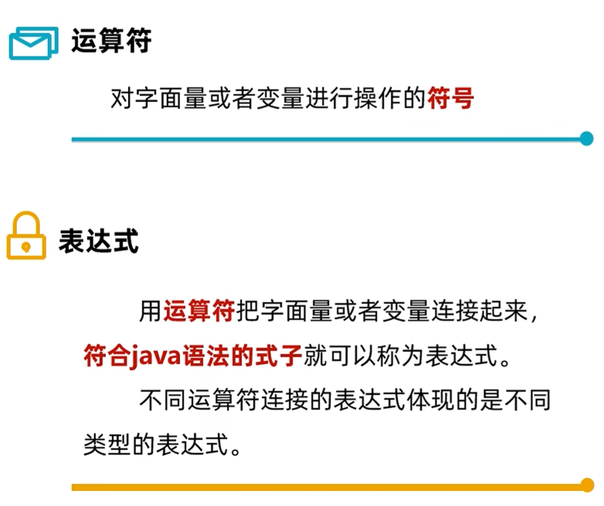
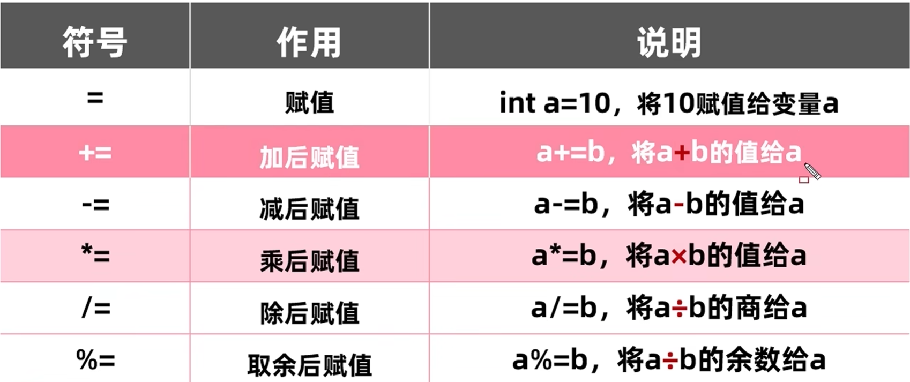
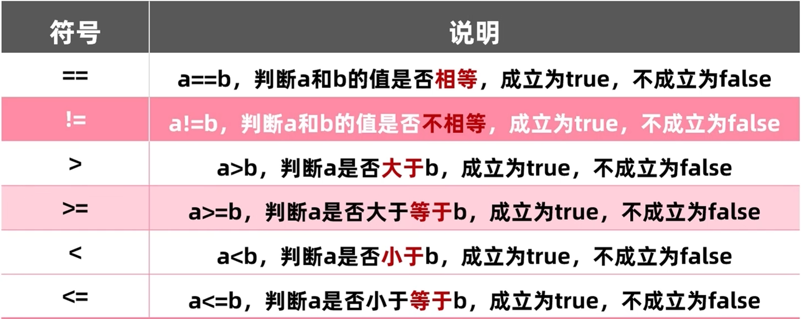
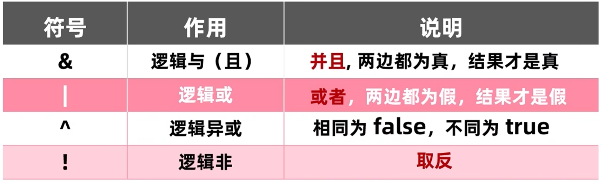
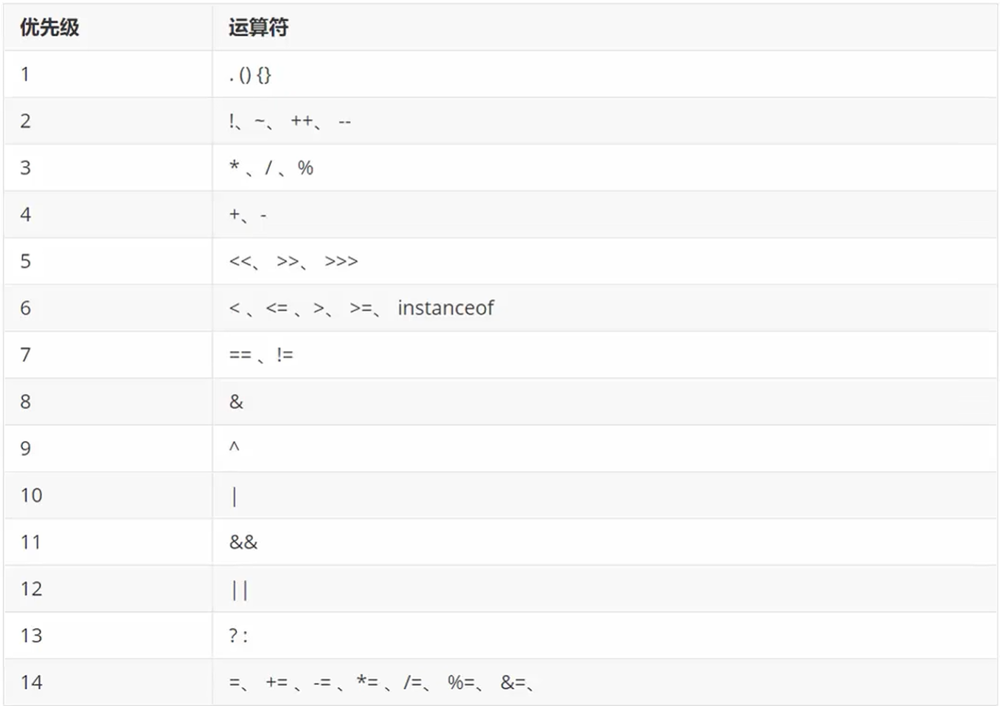

### 运算符与表达式

### 算术运算符

+（加），-（减），*（乘），/（除），%（取模/取余）

**如果有小数参与运算，结果有可能不准确**

### 类型转换

- **隐式转换**（自动类型提升）

  定义：把取值范围小的数据转成取值范围大的数据

  提升规则：

  1. 取值范围小的和取值范围大的进行运算，小的会先转成大的再进行运算
  2. byte，short，char三种类型数据进行运算会优先转成int类型再进行运算

- **强制转换**

  定义：把取值范围大的数据赋值给取值范围小的变量

  格式：目标数据类型 变量=（目标数据类型）被强制转化的数据

### 字符串的”＋“操作

### 字符相加（字符与字符，字符与数字）

字符相加时会先将字符转换成ASCII码表对应的int类型数值再进行计算

### 赋值运算符

扩展的赋值运算符隐含了强制类型转换

### 关系运算符

关系运算符的结果都是boolean类型

### 逻辑运算符

### 短路逻辑运算符

## 三元运算符格式

关系表达式？表达式1：表达式2；

计算规则：

1. 首先计算关系表达式的值
2. 为true返回表达式1
3. 为false返回表达式2

### 运算符的优先级

